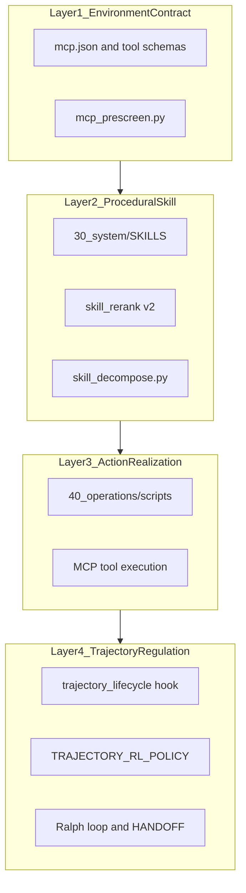

# LifeHarness 4-Layer Model (agent-rules mapping)

Canonical mapping of the LifeHarness runtime interface (model-environment boundary adaptation) to this repository. Source inspiration: NotebookLM notebook *The Geometry of Intelligence*; treat empirical benchmark claims as UNVERIFIED until cross-checked.

**Version:** 1.0 | **Last updated:** 2026-05-29

---

## Overview

LifeHarness argues that most agent failures come from interface mismatch (tool contracts, syntax, loops), not from reasoning deficits. This repo implements harness adaptation through rules, skills, MCP, hooks, and trajectory policy rather than weight fine-tuning.

---

## Layer 1: Environment Contract

**Purpose:** Stable observation and action schemas between agent and tools.

| Artifact | Path |
|----------|------|
| MCP server config | `.cursor/mcp.json` |
| Tool descriptors | Cursor `mcps/<server>/tools/*.json` |
| Prescreen hints | `40_operations/python/harness/mcp_prescreen.py` |
| CLI | `40_operations/scripts/mcp_prescreen.py` |

**Behaviour:** Before retrying a failed MCP call, run prescreen on arguments. Emit deterministic fix hints (JSON parse, empty required fields). Log hints via `trajectory_lifecycle` on `postToolUse` failure.

---

## Layer 2: Procedural Skill

**Purpose:** Repeatable workflows with progressive disclosure and retrieval-augmented execution (SkillRAE-lite).

| Artifact | Path |
|----------|------|
| Skill registry | `30_system/SKILLS/registry.json` |
| Skill files | `30_system/SKILLS/SKILL_*.md` |
| Routing assist | `40_operations/python/brain_assist/skill_rerank.py` |
| Subunit graph | `40_operations/scripts/skill_decompose.py` |
| Auto-detect | `.cursor/rules/skills-auto-detect.mdc` |

**Behaviour:** Rank skills by metadata + optional body text + eval pass-rate bonus. Decompose skills into subunits (triggers, steps, verification, references) for staged loading.

---

## Layer 3: Action Realization

**Purpose:** Execute tools and scripts with reproducible contracts.

| Artifact | Path |
|----------|------|
| Operations scripts | `40_operations/scripts/` |
| Failure analysis stub | `40_operations/scripts/harness_failure_analyze.py` |
| NotebookLM bridge | `40_operations/scripts/notebooklm_bridge.py` |

**Behaviour:** On repeated tool failure, `harness_failure_analyze.py` reads `trajectory.jsonl` and suggests deterministic rule snippets (no auto-apply). Teacher-model loop documented in AGENTIC_ENGINEERING_WORKFLOW.

---

## Layer 4: Trajectory Regulation

**Purpose:** Control loops, handoffs, consolidation, and learning without weight updates.

| Artifact | Path |
|----------|------|
| Trajectory hook | `.cursor/hooks/trajectory_lifecycle.py` |
| Emit module | `40_operations/python/trajectory_rl/emit.py` |
| Policy | `30_system/docs/TRAJECTORY_RL_POLICY.md` |
| Orchestrator HANDOFF | `.cursor/rules/00_orchestrator_agent.mdc` |
| Phase memory threshold | `TRAJECTORY_CONSOLIDATE_THRESHOLD` env (default 25) |

**Behaviour:** Buffer session events; consolidate to `.agent/MEMORY.md` only at density threshold or explicit milestone. **HIP-If folding:** `context_sync.py --fold-lemma` writes `.agent/solved_lemmas.jsonl` and trims verbose `log.md` tail.

---

## Harness SkillTree extensions (2026-06-16)

Notebook: *Agent Harness Memory SkillTree* (`86aaaf0e-…`). External verification: [notebooklm_harness_skilltree_external_verification.json](notebooklm_harness_skilltree_external_verification.json).

| Concept | Layer | Artifact |
|---------|-------|----------|
| Scaffold vs harness | L2 / L3 | `30_system/UBIQUITOUS_LANGUAGE.md` |
| Self-Harness (gated) | L3–L4 | `self_harness_propose.py`, human gate every 3rd iteration |
| HORMA memory hierarchy | L4 | `memory_hierarchy.py`, `.agent/memory_hierarchy/`, `MEMORY_HIERARCHY_SPEC.md` |
| Failure pattern mining | L3 | `failure_patterns_bridge.py` → `outputs/harness/failure_patterns.json` |
| Skill tree intent | L2 | `30_system/SKILLS/reference/intent_template.md` |
| Socratic reward decay | L2 routing | `reward_decay.py`, `record_skill_hint.py`, `--reward-decay` on `skill_rerank` |
| K1 clinical extraction | L1–L2 (spike) | [K1_CLINICAL_RESEARCH_SPIKE.md](K1_CLINICAL_RESEARCH_SPIKE.md) |

**Policy:** No autonomous rewrite of `.cursorrules` or `behavior_rules/`; proposals only.

---

## Research gate (cross-cutting)

Before implementing changes inspired by NotebookLM:

1. Run `notebooklm-research-gate` skill or `notebooklm_bridge.py gate-report`
2. Tag claims VERIFIED / INFERRED / UNVERIFIED
3. Cross-check critical claims via `research-lookup`
4. Apply AI Semantic Gate (`.cursor/docs/AI_SEMANTIC_GATE.md`) before CORE promotion

---

## Related

- [[LifeHarness four-layer model]]
- [[SkillRAE retrieval augmented execution]]
- [[Text-graph RAG synergy]]
- [prd_geometry_incorporation.json](prd_geometry_incorporation.json)
- [NOTEBOOKLM_CONSUMER_INTEGRATION.md](../../docs/NOTEBOOKLM_CONSUMER_INTEGRATION.md)
