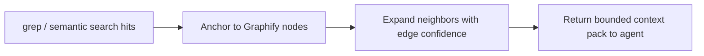

# Relation-Conditioned Map (agent-rules)

**Version:** 1.0 | **Last updated:** 2026-06-08  
**Source:** NotebookLM *Relation-Conditioned Multimodal Learning for Semantic Representations* (`b4be6608-180d-4619-862e-9ddbefa92314`); gate **GO** in [`outputs/notebooklm/relation_conditioned_gate_report.json`](../../outputs/notebooklm/relation_conditioned_gate_report.json).  
**External ledger:** [`notebooklm_relation_conditioned_external_verification.json`](notebooklm_relation_conditioned_external_verification.json)  
**PRD:** [`prd_relation_conditioned_incorporation.json`](prd_relation_conditioned_incorporation.json)

Treat paper benchmark percentages and LARGER 4500× speedup claims as **UNVERIFIED locally** until reproduced. Do not cite exact metrics in `.mdc` rules.

---

## Scope (read first)

| Paper | arXiv | In scope | Out of scope |
|-------|-------|----------|--------------|
| **SkillLens** | [2605.08386](https://arxiv.org/abs/2605.08386) | 4-layer taxonomy, verifier routing, RWR retrieval extension, gap-driven skill updates | Paper benchmark % in rules |
| **LARGER** | [2605.16352](https://arxiv.org/abs/2605.16352) | Grep-anchored Graphify expansion, confidence edges, orchestrator search rule | Full duplicate AST sidecar unless Graphify bridge insufficient |
| **Rcml** | [2508.17497](https://arxiv.org/abs/2508.17497) | `rcml_relation_registry.json` + export JSONL; relation tags in verifier | Model training in this repo |

---

## Disambiguation vs existing slices

| Concept | Geometry / SkillDAG | This notebook | Repo artifact |
|---------|---------------------|---------------|---------------|
| Skill subunits | SkillRAE (`skill_decompose`) | SkillLens **Procedure** layer | Same file; add `granularity` metadata |
| Inter-skill order | SkillDAG `depends_on` | SkillLens graph + verifier | `skill-dag-router` + **new** `skill_verifier` |
| Repo structure graph | Graphify brain map | LARGER lexical anchor | `larger_graph_expand.py` → Graphify MCP |
| Failure → skill update | skill-gap pipeline | SkillLens dual-registry | `verifier_registry.json` + `evolve_dual_registry.py` + REWRITE proposals |

---

## Dual registry (SkillLens v2)

| Registry | Path | Role |
|----------|------|------|
| **Agent registry** | `30_system/SKILLS/registry.json` | SKILL procedures, triggers, `depends_on` |
| **Verifier registry** | `30_system/docs/verifier_registry.json` | Per-skill thresholds, `force_action`, `rewrite_on_gap`, relation boosts |

**Verifier actions:** ACCEPT | DECOMPOSE | **REWRITE** | SKIP

| Action | Behaviour |
|--------|-----------|
| REWRITE | Skill has pending gap proposal; load amendment path from `outputs/skill_rewrites/proposals/` instead of full SKILL body |
| Evolution | `evolve_dual_registry.py from-gap-report` tightens thresholds + creates proposal |

```bash
python 40_operations/scripts/evolve_dual_registry.py from-gap-report --input gap.json
python 40_operations/scripts/evolve_dual_registry.py apply-rewrite --proposal meta-analysis_YYYYMMDD.json
python 40_operations/scripts/skill_gap_ingest.py from-gap-report --input gap.json --evolve-dual
```

---

## Rcml relation registry (training-ready)

| Artifact | Path |
|----------|------|
| Relation catalog | `30_system/docs/rcml_relation_registry.json` |
| Export JSONL | `python 40_operations/scripts/rcml_export_training.py` → `outputs/rcml_training/` |

Harness uses `detect_relation_tag(prompt)` for verifier relation boosts today. Export profiles (`contrastive`, `instruction`) are for **future** fine-tuning, not runtime model weights.

---

## SkillLens four-layer taxonomy (notebook → repo)

| Layer | SkillLens | agent-rules mapping | Artifact |
|-------|-----------|---------------------|----------|
| **Policy** | Global agent behaviour | Non-negotiable laws, orchestrator kernel | `.cursor/rules/core-principles.mdc`, `00_orchestrator_agent.mdc` |
| **Strategy** | Pipeline / plan selection | Named pipelines, subagent routing | `22_pipeline_and_refinement.md`, `skills-auto-detect.mdc` |
| **Procedure** | Step workflows | SKILL files, progressive disclosure | `30_system/SKILLS/SKILL_*.md`, `skill_decompose.py` |
| **Primitive** | Tool calls | MCP schemas, scripts | `.cursor/mcp.json`, `40_operations/scripts/` |

**Acceptance:** `30_system/docs/SKILL_LAYER_TAXONOMY.md` documents the mapping; registry entries may add optional `"granularity": "policy|strategy|procedure|primitive"`.

---

## SkillLens verifier (gap)

**Paper mechanism:** For each visited skill unit, a verifier returns **ACCEPT** | **DECOMPOSE** | **REWRITE** | **SKIP**.

**Current repo:** `skill_rerank.py --dag` ranks and injects prerequisites; no pre-load relevance gate.

**Target:**

```text
skill_rerank --dag  →  skill_verifier (ACCEPT/DECOMPOSE/SKIP)  →  load SKILL body
```

| Action | Repo behaviour |
|--------|----------------|
| ACCEPT | Load full skill (Tier 3 progressive disclosure) |
| DECOMPOSE | Load `skill_decompose` subunits only (steps + verification) |
| SKIP | Do not inject skill; log to trajectory |
| REWRITE | P1 — propose diff via `skill_gap_ingest`; human approve |

Script: `40_operations/scripts/skill_verifier.py` (heuristic gate; eval seed `evals/skill-verifier-gate.json`).  
**Cursor hook:** `.cursor/hooks/relation_conditioned_lifecycle.py` on `beforeSubmitPrompt` injects verifier decisions via `additional_context`. Opt-out: `SKILL_LENS_HOOK_DISABLED=1` / `LARGER_HOOK_DISABLED=1`.

---

## Implemented scripts (2026-06-08)

| Component | Path |
|-----------|------|
| Verifier CLI | `40_operations/scripts/skill_verifier.py` |
| LARGER expand | `40_operations/scripts/larger_graph_expand.py` |
| Gap report | `40_operations/scripts/trajectory_gap_report.py` |
| Gap → eval | `skill_gap_ingest.py from-gap-report` |
| RWR channel | `skill_rerank.py --rwr` |

## LARGER ↔ Graphify bridge (gap)

**Paper mechanism:** Lexical match → align to graph anchor → confidence-filtered neighbor expansion inside existing search loop.

**Current repo:** Graphify MCP (`query_graph`, `graph_path`) + orchestrator "query graph before wide grep" (partial).

**Target flow:**



Script: `40_operations/scripts/larger_graph_expand.py`  
Rule hook: `.cursor/rules/graphify-brain.mdc` — after lexical hit, call expand before repo-wide grep retry.  
**Cursor hook:** `.cursor/hooks/relation_conditioned_lifecycle.py` on `postToolUse` (Grep/Shell) injects LARGER neighbor pack via `additional_context`.

**Confidence weights (v1 defaults, tunable):**

| Edge type | Default weight |
|-----------|----------------|
| import / require | 0.95 |
| calls / invokes | 0.90 |
| same_community | 0.70 |
| fuzzy_name_match | 0.50 |

---

## Rcml prompt analogue (P2 only)

Relation tags for orchestrator classification (not model training):

| Task type | Relation tag | Routing hint |
|-----------|--------------|--------------|
| Bug fix | `causality` | Trace callers/callees, not text similarity alone |
| Refactor | `dependency` | Graphify path before edit |
| Stats / methods | `assumption_chain` | Load methodology skill before analysis skill |
| Writing | `evidence_strength` | research-lookup before strong claims |

Artifact: extend `30_system/behavior_rules/reference/classification_hints.md` (no new skill required).

---

## Repo touchpoints by LifeHarness layer

| Layer | SkillLens | LARGER | Artifact |
|-------|-----------|--------|----------|
| L1 Environment | Primitives = MCP | Sidecar/graph contract | `mcp_prescreen.py`, Graphify MCP |
| L2 Procedural | 4-layer + verifier | — | `registry.json`, `skill_verifier.py` |
| L3 Action | DECOMPOSE → subunits | `larger_graph_expand.py` | `40_operations/scripts/` |
| L4 Trajectory | Gap reports → skill_gap | — | `trajectory_lifecycle.py`, `skill_gap_ingest.py` |

---

## Related

- [[LifeHarness four-layer model]]
- [[SkillDAG]]
- [[Text-graph RAG synergy]]
- [GRAPHIFY_BRAIN_INTEGRATION.md](GRAPHIFY_BRAIN_INTEGRATION.md)
- [SKILLDAG_MAP.md](SKILLDAG_MAP.md)
