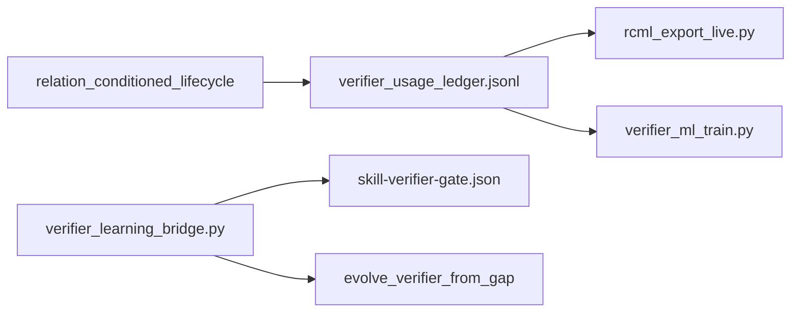

# Verifier learning loop

Closes the SkillLens verifier / LARGER usage → correction → eval → registry evolution cycle without LLM fine-tuning. Canonical DL boundary: [DEEP_LEARNING_POLICY.md](DEEP_LEARNING_POLICY.md).

## Data flow



## Automatic usage pipeline (default ON)

| Trigger | What runs |
|---------|-----------|
| Every `beforeSubmitPrompt` (SkillLens hook) | Ledger append → throttled learning cycle |
| `sessionEnd` / `stop` hooks | Full cycle: `rcml_export_live` + incremental train |
| Progress file | `.agent/memory/verifier_training_progress.json` |

```text
prompt → ledger.jsonl → (throttle) → rcml live export → maybe_incremental_train → .joblib
```

Opt-out: `VERIFIER_LEARNING_CYCLE_DISABLED=1`  
Throttle: `VERIFIER_CYCLE_MIN_INTERVAL_SEC` (default 600), `VERIFIER_CYCLE_MIN_LEDGER_DELTA` (default 5)

## Phase 1 — Usage ledger

| Artifact | Role |
|----------|------|
| `40_operations/python/brain_assist/verifier_usage_ledger.py` | Append-only JSONL writer |
| `.agent/memory/verifier_usage_ledger.jsonl` | Runtime ledger (gitignored) |
| `.cursor/hooks/relation_conditioned_lifecycle.py` | Records `beforeSubmitPrompt` + grep `postToolUse` |
| `.cursor/hooks/verifier_learning_lifecycle.py` | Cycle on session end / stop |
| `40_operations/python/brain_assist/verifier_learning_cycle.py` | Export + train orchestration |

Opt-out: `VERIFIER_USAGE_LEDGER_DISABLED=1`

## Phase 1b — Correction bridge

```bash
python 40_operations/scripts/verifier_learning_bridge.py from-correction \
  --prompt "meta-analysis forest plot" \
  --skill-id meta-analysis \
  --expected-action ACCEPT \
  --failure "Verifier skipped meta-analysis" \
  --correction "Always ACCEPT meta-analysis for MA prompts"
```

- Appends binary case to `30_system/SKILLS/evals/skill-verifier-gate.json` (cap: 1 case/skill/day)
- Optionally calls `evolve_verifier_from_gap` (no auto REWRITE on SKILL body)

Orchestrator ERROR LEARNING: on skill-routing corrections, run bridge or suggest it.

## Phase 2 — Live Rcml export

```bash
python 40_operations/scripts/rcml_export_live.py
python 40_operations/scripts/verifier_registry_validate.py
```

Outputs: `outputs/rcml_training/live_contrastive.jsonl`, `live_instruction.jsonl` (dedup by `prompt_hash`).

Scheduled via `.cursor/skills/daily-update/SKILL.md` Step 6b and `monthly_knowledge_refresh.py` checklist.

## Phase 3 — Sklearn assist (incremental, N ≥ 50)

Rows accumulate automatically from ledger decisions + correction eval cases. Training runs when:

- First time: `labeled_rows >= VERIFIER_ML_MIN_ROWS` (default **50**)
- Retrain: **+5** new rows since last train (`VERIFIER_ML_MIN_NEW_ROWS`)

```bash
python 40_operations/scripts/verifier_learning_cycle.py --force   # manual full cycle
python 40_operations/scripts/verifier_ml_train.py --incremental # same train gate
```

**ML blend auto-enables** when a trained model exists (`train_count >= min_rows`). Opt-out: `VERIFIER_ML_BLEND=0`.

Model: `40_operations/models/verifier_sklearn.joblib` (gitignored). Default blend: 0.7 heuristic / 0.3 ML (`ml_blend_weight` in `verifier_registry.json`). Progress: `.agent/memory/verifier_training_progress.json`.

Gate before auto threshold changes: `skill_gap_optimize_gate.py`.

## Phase 4 — Neural verifier (deferred)

See [VERIFIER_NEURAL_TRAINING_DEFERRED.md](VERIFIER_NEURAL_TRAINING_DEFERRED.md). **User decision 2026-07-01:** collect + learn only until **2026-09-01** (`REMINDER_VERIFIER_IMPLEMENT_2026-09-01.md`). Mini checkpoint **2026-07-08**.

## Related docs

- [SKILL_GAP_PIPELINE.md](SKILL_GAP_PIPELINE.md)
- [TRAJECTORY_RL_POLICY.md](TRAJECTORY_RL_POLICY.md)
- [RELATION_CONDITIONED_MAP.md](RELATION_CONDITIONED_MAP.md)
- [BEYOND_INTELLIGENCE_MAP.md](BEYOND_INTELLIGENCE_MAP.md)

## Smoke

```bash
echo '{"event":"beforeSubmitPrompt","prompt":"meta-analysis forest plot"}' | py .cursor/hooks/relation_conditioned_lifecycle.py
python -m pytest 40_operations/tests/test_verifier_* 40_operations/tests/test_relation_conditioned* -q
```
