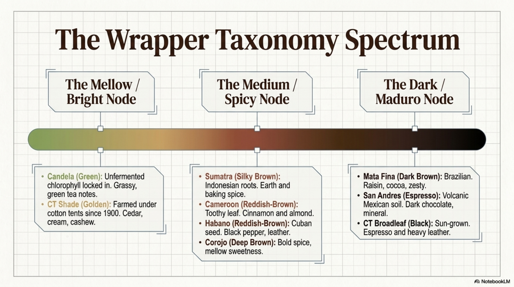
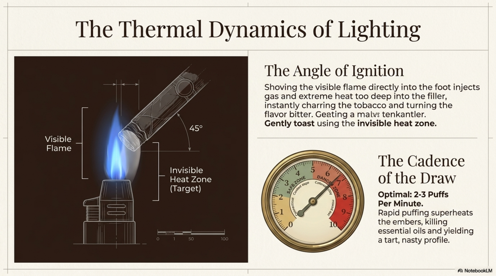

# The Gentleman at the Table

## A Modern Guide to the Cigar, the Glass, and Good Company

*EN manuscript frozen for HR translation · 2026-07-30*

> **Source of truth:** this English file. Parts I–IV are the core; Appendix A/B keep only unique vignettes, checklists, soundbites, and cards for loose typesetting (~100 small-format pages). Chapter craft: miniature beat + precepts; no lecture / brand catalog; anti-overwrite. Do not parallel-edit the HR draft — Phase 2 is a literary translation from this freeze. Proposal / market notes: `docs/bonton/research/notebooklm-grill/5017a44b-PROPOSAL-NOTES.md`. App short canon: `mala-knjiga-pusackog-bontona.md`.

---

### Dedication

To those who know that smoke is only an excuse to sit down — and to those still learning how to sit without making others stand.

---

### Epigraph

> Etiquette is not the police of taste. It is a way for others to breathe more easily while you enjoy yourself.

> A gentleman is a person who makes the lives of others more pleasant. — paraphrase in the spirit of classic courtesy guides (not a verified verbatim quotation)

---

## How to read this book

This is a small handbook, not an exam. There are no grades, no "correct" brand, no penalty for a bad cut.

Its promise is simple: if the evening at the table has ever felt like a test — of brands, of endurance, of who knows more — these pages exist so that others breathe more easily while you enjoy yourself. Keep it within reach. Digest it slowly, bit by bit: one chapter before guests arrive, one vignette when something goes wrong, the three commandments when you only have a minute.

Read it like a conversation at the table: you can stop, go back, skip the chapter on history if you're more interested in what to say when a guest declines a cigar. The form is deliberately loose — short rules balanced with miniature stories — modelled on those little books of etiquette that are remembered far longer than they take to read.

Where it says *gentleman*, it means the figure of courtesy, not a test of sex. The reader we write for is one person at a time: a guest or a host who wants the evening to sit well. A good companion, a good guest, a good host — the same measure.

Where it speaks of technique, it is enough that you don't come off as a snob and don't ruin someone else's evening. The detailed textbook on humidors and strength scales belongs elsewhere. Here the subject is relationships.

If you remember only three things, it will be enough: ask before the flame, leave room, finish cleaner than you found it.

---

## Contents

### Front matter
- Dedication · Epigraph · How to read this book

### I. Spirit and Space
1. What a gentleman at the table is  
2. The golden rule and the modern campfire  
3. Space and consent  
4. Rhythm and presence  
5. Words that save the evening  

### II. Leaf and Flame
6. A short history in five sips  
7. The anatomy of a cigar for the table  
8. Cut, light, ash  
9. Tempo and black ash  
10. The humidor as a space of hospitality  
11. Master's tips a gentleman does not impose  

### III. The Table and the Company
12. Offering and sharing  
13. The glass, water, the order  
14. Pairing without vanity  
15. Host and guest  
16. The lounge and the club  
17. Ten vignettes at the table  

### IV. The World and Memory
18. Outdoors, the terrace, the Adriatic, the passage  
19. The gift, thanks, memory  
20. When the table is not yours  
21. Three commandments and the closing  

### Back matter
- Sources and notes · Glossary of table words · Acknowledgements · Note for the editor  

### Appendix (slim)
- A. Expansions, interludes, checklists, vignettes  
- B. Cards, scenarios, table sentences  

---

# I. Spirit and Space

*First, tidy the air between people. Only then the leaf.*

---

## 1. What a gentleman at the table is

A gentleman is not the one who knows the name of the vitola the loudest. He is the one beside whom others breathe more easily.

Picture the other evening: the box opens, the air fills with leaf and lighter gas, and someone already corrects a guest's cut before the first ash. The table tightens. Nobody says the word *exam*, but everyone feels it. Etiquette exists for that moment — not to win it, but to loosen it.

The etiquette of smoking is not a catalogue of prohibitions. It is hospitality with smoke at the centre — and with the measure that keeps smoke from becoming a means of power.

### Foundations

A gentleman looks at who is sitting next to him before he lights up.

A gentleman keeps a rhythm that neither overheats the tobacco nor overheats the company.

A gentleman has the cutter, the ashtray and water already on the table — without the improvisation that looks like panic.

A gentleman does not turn his favourite maduro into a compulsory exam for a guest.

### What etiquette is not

Etiquette is not a competition in expense.

Etiquette is not a lecture on the origin of the leaf while someone simply wants a quiet hour.

Etiquette is not an excuse to correct someone else's ash as if you were a judge at a fair.

Etiquette is not a moral sermon. If someone doesn't smoke, you don't have to "convert" them. If someone smokes differently from you, you don't have to rescue them — unless they ask.

### A wise thought

*Courtesy is the art of making others forget that you could have been unpleasant.*

---

## 2. The golden rule and the modern campfire

The golden rule of the table is simple: if you would receive a gesture as a kindness, offer it. If you would feel it as pressure, drop it.

To offer a cigar is to offer time. To offer advice without being asked is often to offer pressure in the shape of wisdom.

### The table as a campfire

They say a table with a cigar is the modern version of a campfire: people sit in a circle, status stays at the door, the conversation moves more slowly than an inbox.

A gentleman respects that slower pace. He doesn't have to call it therapy. It's enough that he doesn't rush.

A gentleman knows that behind the leaf stands a craft — many hands, many days, much quiet work. No need for pathos. It's enough that you don't treat someone else's evening as fuel for your ego.

### A table of equals

At a good table there is no "proper" seat for the one who knows more. There is a seat for the one who knows how to listen.

A gentleman does not build a hierarchy out of knowledge. He offers knowledge like water: available, without forcing the swallow.

A gentleman does not use words that exclude. "Brotherhood", "real men", "for the initiated only" — these are bad epigraphs for a good evening.

### Vignette: pressure in the shape of kindness

The host opens the box and says: "You have to try this one, or you haven't really been here." The guest smiles, takes it, and watches the clock for the rest of the evening.

More kindly: "I have a mild one and a medium one — which suits you better tonight? If neither, water and conversation hold the table too."

---

## 3. Space and consent

Smoke travels further than your good intentions. You choose the space before the flame.

### Before lighting

A gentleman asks — especially in someone else's home, on a terrace near passers-by, around children, or in mixed company.

A gentleman respects the ban and the sign. No negotiating "just one puff".

A gentleman moves away from food that isn't his tasting — the kitchen, the buffet, someone else's dessert. Smoke and someone else's cake rarely make peace.

A closed room without ventilation calls for a shorter session or another moment. A gentleman sees this before the guests start coughing out of politeness.

### In company

A single "no, thank you" closes the subject without comment.

A gentleman does not correct someone else's rhythm or choice of drink out loud. Advice only if it is asked for.

If someone says they dislike smoke, a gentleman does not answer with an essay on origin. He answers with space: a window, a terrace, a shorter cigar, or — often best of all — a clean glass and conversation.

### Children, passers-by, neighbours

A gentleman does not treat someone else's terrace as his private lounge.

A gentleman does not blow smoke into the faces of people who were not sitting at his table.

A gentleman knows that "a little won't bother anyone" is a sentence usually spoken by the one whom it doesn't bother — not by the one whom it does.

### Vignette: a single "no"

Guest: "No, thank you, I don't smoke."
Wrong: "But this one is mild, really, just try it."
Kindly: "Of course. Water, or something without smoke?"

The subject is closed. The evening can live.

---

## 4. Rhythm and presence

A gentleman (and a good companion) does not rush the smoke to prove strength. He rushes rarely — and only if he must leave.

### Rhythm

Short draws, pauses in between. Black, hot ash is not a trophy. It is a warning that you have overdone the proving.

It is common to hold a pause on the order of a minute — enough for the leaf to breathe, and for you to hear a sentence to its end. There is no magic number that makes you serious. There is only a rhythm that doesn't turn the table into a race.

Conversation takes priority over "one more pull of smoke" while someone is speaking.

Phone face down or away. The etiquette of centuries is not scrolling a screen.

### Presence

Look people in the eye when you offer a glass or a cigar.

Listen more than you deliver a lecture on XO.

If you must leave in the middle, put it out politely and give thanks. Don't leave a burning stub as a monument to your own importance.

A gentleman has no "never ever". He has an evening. He has a table. He has people. If you must be elsewhere, be elsewhere — but don't fake presence while you stare at notifications.

### Vignette: I'm in no hurry

Someone at the table smokes as if a hunter were chasing the leaf. The ash blackens, the conversation stalls, a guest asks whether everything is all right.

Kindly: slow down, smile, say: "I'm in no hurry — unless you need to be." Then actually slow down.

### The pace of the drink alongside the smoke

The same wisdom holds with the glass: the sip is no proof. They say some count the seconds per year in the barrel — that's a charming anecdote for a tasting, not a law for company. At a table with a cigar it matters more that you don't "pull ahead" while others are still with the aroma.

---

## 5. Words that save the evening

Words at the table weigh more than the name on the band.

### Praise

A gentleman praises someone else's choice without the comparison "mine is better".

"This sits nicely on you" is better than "I'd take something stronger".

"Thank you for this evening" is better than a long monologue about your own collection.

### Questions that open

- "What suits you better tonight — milder or medium?"
- "Do you have time for a longer one, or a shorter one?"
- "Is smoke all right here, or better outside?"
- "Would you like advice, or just company?"

The second question often saves more than the first piece of advice.

### Words that spoil

- "You have to."
- "A real connoisseur would…"
- "That's not how it's done" — said without asking, in front of everyone.
- "Smooth" as the only verdict (more on that later).
- "One more" as an order, not an offer.

### How to say "I've had enough"

A gentleman may say: "Thank you, I'll stop here — that was just enough."

A gentleman doesn't have to pretend he can go three more hours if his body says it's the end.

A good host hears this without a comment about the "waste" of a gift.

### How to say "it's not for me"

"Not my profile tonight" is better than silent suffering.

"I'd rather have water alongside your smoke" is better than false enthusiasm.

A gentleman receives such sentences as information, not as an insult.

### Vignette: a snob in one sentence

Someone says: "A real connoisseur wouldn't have lit it like that." A third person at the table changes the subject: "Tell me, how's it going with that project of yours?" The smoke recedes into the background. The evening survives.

### A wise thought

*The best compliment is not "you know the rules" — but "I enjoyed being with you".*

---

*End of Part One. Next: the leaf, the flame, and a little knowledge without snobbery.*

---

# II. Leaf and Flame

*A little knowledge so you don't look like a snob — and don't ruin someone else's evening.*

---

## 6. A short history in five sips

The history of the cigar is not a geography exam. It is a story of leaf, trade, myth and table. A gentleman knows enough to respect the craft — and little enough not to bore his guests.

### First sip: the leaf before the myth

Tobacco was not invented in a luxury box. The plant lived for a long time in the cultures of the Americas, in rituals and everyday life that European myth often reduces to an anecdote. A gentleman need not give a lecture. It is enough that he knows: before the brand there was the leaf, before the status there was the trade.

When someone says "the cigar has always been a gentleman's thing", it is wise to smile. What is gentlemanly is what we do today with measure — not what we ascribe to the past to make ourselves look more important.

### Second sip: trade and travel

The leaf travelled by ship, through ports, customs and stories. A gentleman need not romanticise empire to enjoy an evening. He can admit that history is more tangled than a label.

It is wise to know that the "Cuban myth" is not the only story at the table. Many tables today live on knowledge and labour from several countries. Respect goes to the people who work the leaf — not to a cliché.

### Third sip: Cuba as legend and as reality

In the imagination Cuba is often larger than the map. Legends love simple sentences; the table loves nuance. A gentleman need not dispute someone else's love for a particular origin. He must only avoid making origin into a moral judgment.

"Real" and "fake" quickly become weapons at the table. Better: "This sits well with me tonight" and "That one is different for me." The difference is not an insult.

A gentleman knows that the same name on the box is sometimes not the same animal — depending on the market and the history of the brands. When he explains this, he does it without snobbery. An explanation is a service, not a victory.

### Fourth sip: the global table

Today a table may hold leaf from several regions, in the hands of people who were not "initiated from childhood" but from curiosity. This is not the fall of civilisation. It is a wider circle.

A gentleman does not measure a guest by how long ago he entered the hobby. He measures him by how he behaves toward others.

They say a great many hands stand behind a single cigar — growing, harvesting, curing, fermenting, rolling, quality control, packing. The number matters less than the dogma. What matters is the memory that the leaf did not "come into being" in your box.

### Fifth sip: myth versus table

Myth loves heroes with cigars in their mouths. The table loves people who put out the ash in time and don't blow smoke into someone else's face.

The Hemingway and Churchill tropes are lovely on a poster. For the evening they are less useful than an ashtray and water. A gentleman may love the myth — and may leave it on the shelf while the guests are seated.

The old smoking room in a house or club was often a withdrawal from mixed company. A gentleman today does the opposite: he stays with the people and manages the smoke, instead of leaving the company behind a door.

### Precepts

A gentleman knows a little history so as to be humbler, not louder.

A gentleman does not use "authenticity" as a cudgel.

A gentleman respects the craft without pathos.

A gentleman distinguishes legend from hospitality.

A gentleman does not use smoke as an excuse to leave the company he came to sit with.

### Vignette: a lecture in the middle of the first smoke

Someone lights up and immediately launches in: five centuries, three islands, two embargoes, one theory of soil. The guest stares at the ash as if at an emergency exit.

More kindly: one sentence about the leaf, then a question — "what do you need from the evening tonight?" History can wait for dessert. Or for next week.

### A wise thought

*Respect for the past is measured by behaviour in the present.*

---

## 7. The anatomy of a cigar for the table

You don't need to be a tobacco expert to be courteous. You need to know three layers and one rule of time.

### Three layers, once and clearly

The wrapper is the leaf you see and which strongly shapes the first impression — colour, aroma, texture.

The binder holds the shape and helps a cigar be a cigar, and not a heap of intentions.

The filler is the heart of the blend — what carries most of the character through the smoke.

A gentleman can say this in three sentences. The fourth is already a lecture.

### The vitola as a gift of time

Format is not just aesthetics. A shorter cigar often means a shorter agreement with the evening. A longer one means a longer sitting. When you offer, say roughly: thirty, sixty, ninety minutes. The guest has the right to know what he is accepting.

A gentleman does not offer a "quick" cigar as if it were a quick coffee — and then disappear for an hour and a half. Honesty about time is part of etiquette.

### Colours and stories, without ranking

Lighter wrappers (often Connecticut in table talk) often carry a milder impression. Darker ones (often Maduro in the same talk) often carry a sweeter, heavier impression. These are preferences, not a scale of value.

A gentleman does not say "Maduro is for real men". He says: "This one is darker and slower — do you want that tonight?"

*Figure: wrapper spectrum (NotebookLM Studio draft; English UI). For print: redraw or hand to visual edit.*

### The draw, not the drama

A good draw makes the evening easier. A bad draw is not a moral failing. It is a technical moment. A gentleman handles it quietly — or asks the host — without a public diagnosis of someone else's cigar.

### Precepts

A gentleman knows the anatomy enough to explain, not to impress.

A gentleman offers a format as time, not as status.

A gentleman does not rank wrappers as if they were people's characters.

A gentleman does not diagnose someone else's draw out loud, unless he is asked.

### Vignette: an exam in colour

The guest takes a lighter one. Someone says: "Ah, a beginner's." A third replies: "A mild one really suits me tonight — is there more water?" The subject returns to the table.

---

## 8. Cut, light, ash

Here etiquette and technique sit side by side — because poor hygiene and bad ash ruin someone else's evening faster than bad taste.

*Figure: technique and measure in one sheet (NotebookLM Studio infographic). Draft English; content aligns with this chapter's precepts.*

### The cut

A gentleman cuts enough to open the cap, not enough to open a debate about a catastrophe.

If you share a cutter, don't wet the cap with your mouth before cutting. That is not a "trick". It is a way of giving someone else's tool your sequence. In the lounge and at home the same rule holds: a shared cutter calls for clean habits.

If you are unsure about someone else's cutter, ask for a clean one or use your own. Quietly. Without announcing an epidemic.

*Figure: cut the cap, not a catastrophe (Studio draft).*

### Lighting

A gentleman lights patiently. He doesn't rush the flame as if proving he knows.

The torch lighter is a useful tool and a potential drama: keep it away from hair, napkins, dry herbs, paper. Outdoors, even more so.

Don't warm brandy over a lighter's flame "because that's how it looks in the film". It looks like a film. The smell often looks like a mistake.

*Figure: patient lighting (Studio draft).*

### The ash

An ashtray with a groove — not a coffee cup, not the rim of a plant pot, not the floor.

Don't flick the ash as if punishing the leaf. Let it fall. Support the cigar when needed.

Ash can be a shield for the fire — while it is stable. When it blackens and overheats, that is not a medal. It is a sign to slow down.

At the end: put it out with dignity. Don't stub the cigar out like a cigarette, into the ash with anger or theatre. A cigar goes out calmly; stubbing is a short road to a bitter smell and an ugly sight.

### The band

There are schools around the band: take it off early, take it off later, leave it on. A gentleman does not settle this with dogma. He settles it with context — and by making sure the band and the cellophane don't end up under the table.

If you are asked what you do, state your practice. Not as a law.

*Figure: the band without dogma (Studio draft).*

### Precepts

A gentleman does not lick the cap before a shared cutter.

A gentleman lights without a performance.

A gentleman does not stub out.

A gentleman does not turn the band into an ideology.

A gentleman does not leave a lighter open in the wind next to paper.

### Vignette: licking the cap

A guest wets the cap and picks up the house cutter. The host does not give a speech. He quietly offers his own clean cutter: "Here, this one's ready." The evening moves on. Hygiene without shame.

### A wise thought

*The ash speaks louder than the name on the band.*

---

## 9. Tempo and black ash

Tempo is etiquette turned into the rhythm of breathing.

*Figure: "noob" moves versus calm practice (Studio draft; US lounge tone, not our house diction).*

### Pauses

Short draws. Pauses in between. It is common to aim for about a minute — not as a metronome, but as a reminder that you are not in a race.

A gentleman does not count out loud. He counts with his body: if the ash blackens and glows too much, slow down.

Black, hot ash is not proof of strength. It is a warning that you have turned the leaf into a furnace.

### Conversation first

While someone is speaking, the smoke waits. Not the other way round.

A gentleman does not interrupt someone else's sentence with smoke as if it were a commercial break.

If you must answer a message, say: "Thirty seconds" and step out — or leave the phone alone. A speakerphone at the table is a special kind of rudeness: it imposes someone else's voice on the whole circle.

### No hurry anywhere

The best evenings are held by the feeling that you have nowhere to be. If you do, say so at the start. People will adjust the format and the tempo. False infinity is as tiring as false intimacy.

### Precepts

A gentleman slows down when the ash blackens.

A gentleman does not rush to prove he "knows how to smoke".

A gentleman gives priority to conversation.

A gentleman does not run a conversation on speakerphone in the middle of the table.

A gentleman announces his departure, not a sudden disappearance.

### Vignette: the metronome

Someone smokes in jerks. The ash falls black. The host does not say "wrong". He says: "Let's slow down — this one likes to breathe." And he slows down himself. Mentorship without a lectern.

---

## 10. The humidor as a space of hospitality

The humidor is not a display case for vanity. It is a pantry of trust.

*Figure: storage rules (Studio draft). Etiquette here is the boundary of hands, not a humidity textbook.*

### Sacred space (without pathos)

A gentleman does not rummage through someone else's humidor like a flea market.

A gentleman does not "check" freshness by squeezing someone else's cigars. If you're curious about their condition, ask the host or the staff. Look. Don't pinch.

In a shop or a club: ask before you open a drawer. Hands that wander without asking look like a theft of trust, even when they are not a theft of an object.

### At home

If a guest brings his own box, you don't have to cram it in among yours right away. It can stand apart until the evening. Order and clarity are also hospitality.

If you offer from your own humidor, offer a choice — not "take whatever you find while I talk".

### What this is not

This is not a manual on humidity percentages. The numbers live in the 101. Here lives the relationship: someone else's leaf is not your field for research without permission.

### Precepts

A gentleman asks before the drawer.

A gentleman does not pinch someone else's cigars.

A gentleman does not rummage.

A gentleman treats a humidor like someone else's wardrobe — with the same respect.

### Vignette: pinching

A guest in a shop squeezes the cigars "to see". The salesman smiles stiffly. A more courteous guest asks: "May I look at this box — and what would you recommend for an hour in the evening?" The hands go still. The advice begins.

---

## 11. Master's tips a gentleman does not impose

These are tips for your own practice — five core, then two more on pace and stomach. They are offered only if you are asked. Otherwise they stay silent.

*Figure: myths (plume, colour, relight, price). Studio draft; in the book only what serves courtesy stays.*

### 1. Cut a little less than you think

Most dramas begin with an excessive cut. A smaller hole, less regret. If needed, you can widen it a little. The reverse is harder.

### 2. Light evenly, then let it rest

A ring of flame, a gentle rotation, patience. Then let the smoke settle. A gentleman does not "kill" the first centimetre with haste.

### 3. Water is a tool

Thirst, strong nicotine, a heavy peaty sip — water saves more evenings than wise sentences. It is no shame. It is the standard.

### 4. Cutting the last third short is not a defeat

When the leaf grows heavy and the body says enough, put it out. Measure is a master's virtue, not a weakness. A good host understands this without a comment about the price.

### 5. Note down what sat well

Vitola, drink, bridge, company, time. Tomorrow you'll be wiser without having been a snob yesterday. Memory is part of the craft — and part of gratitude.

### 6. Pace is courtesy

One or two slower draws a minute often keeps both leaf and conversation. Too fast heats the tobacco and the room.

### 7. Easier on a settled stomach

A strong leaf on an empty stomach spoils more evenings than taste does. Water, a little food, no heroics. The author is a physician; this is still not medical advice — only table measure.

### How to offer these tips

Only on request. Briefly. Without an audience. Without "a real connoisseur".

If you are not asked, smoke your own and be pleasant. That is the hardest master's trick.

### Precepts

A gentleman keeps his tricks for the moment they are asked for.

A gentleman does not hold a seminar between two draws.

A gentleman knows that the best trick is to be easy to sit with.

### A wise thought

*A mastery that imposes itself stops being mastery and becomes a performance.*

---

*End of Part Two. Next: the table, the glass, the lounge and the vignettes.*

---

# III. The Table and the Company

*Here etiquette stops being theory and becomes an evening.*

---

## 12. Offering and sharing

To offer a cigar is to offer time — not just a leaf.

### How to offer

A gentleman offers a choice: a mild one and a medium one, not only his strongest "so everyone can see".

A gentleman states the rough length — thirty, sixty, ninety minutes — so the guest knows what he is accepting.

The cutter and lighter come with the offer. The guest shouldn't have to hunt for a tool as if in someone else's kitchen at night.

If the guest declines, set the cigar down calmly. No persuading. No "just a little". No offended face.

A gentleman looks people in the eye when he offers. An offer is not throwing an object across the table.

### What not to do

Don't light someone else's cigar without asking — unless they said "light it for me".

Don't grade someone else's draw or ash out loud.

Don't take the last one from the host's box without an offer.

Don't turn a refusal into a debate about character.

### Sharing the bottle

Pour for the guest first.

Say what's in the decanter. Mystery is good in a novel, not in a sip when someone has an allergy or a limit.

Water on the table is not an option. It is the standard.

If you bring your own bottle, share what you brought. A bottle that stands only in front of you looks like a shop window, not a gift to the table.

### Returning a gifted cigar

If someone gave you a good box, it is wise to return the attention later — not necessarily with the same brand, but with the same measure of hospitality. Etiquette is a circle, not accounting.

### Milder cigars and beginners

For a guest just entering the world of the leaf, a milder and shorter one often holds the table better than a "real" heavy one. A gentleman offers this without belittling. "For relaxing" sounds better than "for beginners" — though the meaning is the same: don't throw someone into the deep end just so you look brave.

### Precepts

A gentleman offers time, not just a leaf.

A gentleman offers a choice, not an entrance exam.

A gentleman does not persuade.

A gentleman shares what he brings.

A gentleman does not take the last one without a word.

### Vignette: only the strongest

The host opens a box of full, dark, long ones. The guest quietly asks whether there's a shorter one. The host takes offence. A more courteous host says: "I have a shorter mild one too — take what suits you tonight." The ego sits down. The guest stays.

### More precepts on offering

A gentleman does not offer a cigar as a reward for good conversation. He offers it as part of the evening — or he doesn't.

A gentleman does not place a cigar in front of someone who has already said no, "just in case".

A gentleman, if he offers from a pricier box, does not announce the price. Price is not a seasoning.

A gentleman, when he receives a cigar, gives thanks and lights it with care — or honestly sets it aside for another time if he must go. He doesn't smother the gift with haste.

A gentleman does not ask for a puff of someone else's cigar. That is not a tasting. It is entering someone else's rhythm without an invitation.

A gentleman, if he wants someone to try "the same one", offers another of the same — not half of theirs.

### A wise thought

*A gift that has to be explained for too long stops being a gift and becomes a lesson.*

---

## 13. The glass, water, the order

Pairing at the table is a small ritual — not a stage for vanity.

### The setting

A glass suited to the drink — snifter, Glencairn, copita — is not snobbery if it makes the aroma easier. If you don't have the "right" one, have a clean one. Cleanliness beats the brand of the glass.

Water. Ashtray. Cutter. That is the basic kit of table sense.

Don't warm brandy over the flame. Choose ice consciously, not out of habit. Ice is no sin and no dogma — a conscious decision is etiquette toward your own palate and toward the company.

Pour in moderation. Top up when the guest's glass runs low, without interrogating why he drinks slowly.

### The order

Smell the drink → sip → smoke → sip. Look for a bridge, not a victory.

Milder first, then stronger — in both the cigar and the glass, when you're leading the evening. If you start with a smoke bomb and a full maduro, the rest of the evening may be only recovery.

If the guest is falling behind, slow your own rhythm. Don't "pull" ahead alone as if in a time capsule.

### Don't dip

A gentleman does not dip a cigar in the drink to "soften" it. That's film and forum. At the table it usually leaves the glass smelling strange and the leaf sorry for itself.

If someone does that at home, alone, let them. In company — ask yourself whether you'd like to watch that in your own glass.

### The quiet pour

In a circle that listens for aroma and silence, a loud, noisy pour sounds like a warning that the ego has entered the room. Pour calmly. It is not surgery. Nor is it a performance.

### Water as a tool

Water cleans the palate, softens the hit, brings back the conversation. A gentleman does not mock water. A gentleman pours it.

If a guest doesn't drink alcohol, the ritual doesn't fall apart. Smoke, water, conversation — the table still stands. An empty glass "for form's sake" is not compulsory. Respect is.

### Precepts

A gentleman sets out water before wisdom.

A gentleman does not dip the leaf in the glass.

A gentleman does not warm the drink over a lighter.

A gentleman pours quietly.

A gentleman: mild first, then stronger — when he leads.

A gentleman does not interrogate why someone drinks slowly.

### Vignette: a loud pour

In a quiet whiskey circle someone pours from a height, with a flourish. Everyone flinches. More kindly: the bottle close to the glass, a thin stream, no performance. The aroma remains the main character.

### More on the glass

A gentleman does not swirl the glass as if mixing concrete — unless it's part of his quiet habit and he doesn't splash the table.

A gentleman does not sniff so loudly that it looks like a medical examination. A fragrant moment is enough.

A gentleman does not comment on someone else's ice as a crime against civilisation. He may offer it without ice. He need not hold a judgment.

A gentleman, when he switches drinks, gives the palate a short rest with water. Bridges are built, not torn down in haste.

### A wise thought

*The glass is the frame. The smoke is the colour. The conversation is the picture.*

---

## 14. Pairing without vanity

Pairing is not a contest in which the drink "beats" the smoke. It is a search for a bridge.

### A bridge, not a victory

A gentleman wants things to complement one another. If they fight, slow down, change the sip, or admit it: "This doesn't sit tonight — it's no tragedy."

Praise of someone else's pairing is better than ranking of your own.

### Intensity

A milder smoke often likes milder company in the glass. A fuller smoke often holds more alcohol and heavier notes. That is a guideline, not a law of physics for your table.

A high alcohol percentage sometimes "holds" a fuller smoke better than a thin sip that vanishes. Again: a guideline. Try, note, don't preach.

### Sweetness and caution

Sweeter profiles sometimes like darker wrappers. Lighter wrappers sometimes like cleaner, drier lines. A declaration of additives in rums — where it exists — is worth more than marketing fog. A gentleman does not moralise about additives as if they were a sin; he speaks clearly when he knows, and stays quiet when he doesn't.

### The word "smooth"

In more expert company "smooth" often says little — and sometimes signals exactly what you'd want to describe more precisely: vanilla, oak, caramel, leather, pepper. A gentleman may say "it goes down nicely for me". Better still if he says what he feels. He does not correct someone else's "smooth" like a vocabulary policeman — unless he is asked for words.

### Peat and the warning

A heavily peated drink in a small room needs a warning or a way out to the terrace. Smoke plus peat can be a wedding or a collision. A gentleman gives warning. He doesn't surprise the room like a fire drill.

### Coffee

Coffee with a smoke can be a splendid bridge — and a double hit if everything is heavy. A gentleman does not force an espresso alongside the strongest leaf as proof of endurance.

### An inner scale

Offer what you would drink yourself. A bottle that stays on the shelf "for Instagram" while something else goes in the glass is not generosity. Open and share, or leave the trophy case alone.

Five or six things on the table is enough. Smell from a distance, water between sips. A parade of bottles tires the palate and the talk.

### Precepts

A gentleman looks for a bridge.

A gentleman does not declare a winner of the evening.

A gentleman describes more than he judges.

A gentleman gives warning of heavy peat.

A gentleman does not mock someone else's vocabulary.

A gentleman offers what he would drink himself.

A gentleman does not make a parade of fifteen bottles.

### Vignette: "smooth"

A guest says: "This rum is really smooth." Someone bristles to correct him. More kindly: "I get vanilla and oak — do you feel that, or does it read more as soft to you?" The conversation stays a conversation.

### More on pairing

A gentleman does not claim that "the cigar is always the protagonist". On some evenings the glass leads. On some, the conversation. The smoke is a guest, not a dictator.

A gentleman does not impose his favourite pairing as the only correct one.

A gentleman, if something doesn't fit, changes it quietly — he doesn't give a speech about a crime against civilisation.

A gentleman notes his successes more than he remembers others' misses for anecdotes.

### A wise thought

*A good pairing does not ask for applause. It asks for one more, slower sip.*

---

## 15. Host and guest

A good host offers a ladder. A good guest knows how to step down from it without shame.

### The host

Ask about strength, smokiness and time before you open the box.

Keep a mild and a medium cigar and an approachable drink at the start. The peat bomb and the full maduro can come later — if ever.

Show where the ashtray and the toilet are. Small things save the evening.

Don't push "one more" when the guest is full.

Keep a mentoring tone only when it's asked for. Otherwise keep to hospitality.

Now and then, gently, check that everyone is well — without turning the table into a clinic. A glass of water, a window, a shorter session: tools, not drama.

### The guest

Bring a small gift if it's the custom — a bottle, a small box, nothing excessive.

Respect the order in the humidor. Don't rummage.

Give thanks concretely: "That amontillado with the Connecticut…" is better than a general "great time".

Cutting the last third short is not weakness. It is measure.

If you're running late, let them know. The host is not obliged to keep the first smoke in a state of suspension like an eternal flame — but a good host and a good guest agree on the rhythm.

### When something goes wrong

Uneven burn, a spill, a bad cut — smile, fix it quietly, carry on with the conversation.

A gentleman does not turn a mistake into a performance. Nor into someone else's shame.

### Nicotine discomfort — without shame

If a guest goes pale, sweats, falls silent: water, a little something sweet if it helps, air, a shorter session. No jokes about "weakness". No heroic tale of how you "hold it".

A host who quietly saves the evening is a greater master of the table than one who lectures about nicotine.

### Precepts

A good host offers a ladder and an exit.

A good guest knows when to stop.

A gentleman handles mistakes quietly.

A gentleman does not shame a body that says enough.

A gentleman gives thanks concretely.

### Vignette: nicotine discomfort

A guest falls silent, the face pales. The host does not ask in front of everyone "is it getting to you?" He nudges the water closer, suggests a short walk to the window, lowers the tempo of the evening. The next day there is no meme. There is a thank-you.

### More on the roles

A gentleman as host does not vanish into the kitchen for twenty minutes without a word while guests sit with a lit leaf and no ashtray.

A gentleman as guest does not criticise the host's choice in front of the other guests.

A gentleman as the third at the table knows when to enter the conversation to save someone from a snob — and when to stay silent.

A gentleman does not photograph someone else's weakness. Never.

---

## 16. The lounge and the club

A cigar lounge is not your living room. A private terrace is not a lounge with a price list. Tell them apart.

### Ten precepts of the lounge

1. **Entering.** Greet the room briefly. Ask whether a seat is free — an ashtray or glass may be holding a place while someone stepped out. Don't sit down as if you'd bought the air.

2. **Cutter hygiene.** Never lick the cap on a shared tool. Your own cutter or a clean house one — ask.

3. **The place.** In a cigar lounge and a specialist shop, supporting the place by buying or following its rules is part of courtesy. On a private terrace you are a guest at a friend's home, not a customer: a foreign lounge cut fee is not a local custom here. Don't carry someone else's tipping over as local law. Don't camp for hours as if the seat were a free office.

4. **Smoke.** Away from faces. Upward. Not into the neighbouring table as if you were sharing an opinion.

5. **Phone.** Briefly or outside. No speakerphone. No video calls in the middle of the aroma.

6. **Ash.** With dignity. Don't stub out. The ashtray is not a bin: cellophane, band and gum go in the rubbish. If ash falls, clean it without drama.

7. **Someone else's leaf.** Don't ask for a puff of someone else's cigar. Advice only on request. "Smoke your own" is not coldness — it is respect.

8. **Your own bottle.** If you're allowed to bring one, share it. If you're not allowed, you're not.

9. **Perfume.** In measure. Other people's palates are tasting too. Conversation: don't turn every story into your bigger one; listen to the room's pace first.

10. **Cigars only.** A cigarette or a vape in a cigar lounge often breaks the spirit of the place — even when the rule isn't spelled out in capital letters. Ask. Respect. Read the house rules at the door.

### What not to import blindly

In some countries there are rigid rules about tipping, dress, and those who only sponge off others. In the Croatian context: the local club, the local shop, the local terrace. Look at what the host expects. Don't playact someone else's etiquette to look worldly.

### Contradictions without dogma

Some lounges are stricter than church. Some are as relaxed as a terrace. A gentleman reads the room. He doesn't impose Davidoff rigidity on a friendly evening — nor friendly chaos on a place that lives by silence.

### Precepts

A gentleman in a lounge pays with respect for the space.

A gentleman in a club does not treat the staff as servants of his ego.

A gentleman on a private terrace does not quote foreign price lists.

A gentleman stubs out nowhere.

### Vignette: a speakerphone on the mobile

A speakerphone in the middle of the lounge. Kindly: get up, say "I'm stepping out for thirty seconds", finish outside. Come back. The table breathes again.

### Vignette: "mine was bigger"

Every story in the lounge gets an answer that is longer, dearer, rarer.
Wrong: a contest.
Kindly: ask one thing, listen, let the room breathe. A gentleman need not win by anecdote.

### Vignette: smelling the cellophane

Someone sniffs a wrapped stick at length as proof of expertise.
Wrong: a public lesson.
Kindly: "Flavour comes with the flame — shall we light and compare." Cellophane is not a palate.

### Phrases that save a lounge

- "Is this seat free?"
- A brief greeting without theatre
- "I'm stepping out for thirty seconds."
- "Thanks — I'm enjoying it this way; I'll ask if I need help."
- "Here's my cutter, if you like."

---

## 17. Ten vignettes at the table

*Situation → wrong → kindly.*

### 1. Licking the cap

A guest wets the cap — a dark smear on the leaf — and reaches for the house cutter still warm from the last hand.
Wrong: a public lesson on hygiene.
Kindly: quietly offer your own clean cutter or ask for a disinfected house one.

### 2. A speakerphone on the mobile

A call on speaker while everyone is with the aroma.
Wrong: ignoring it or sarcasm.
Kindly: "I'm stepping out for thirty seconds." And actually step out.

### 3. The snob

Someone corrects another's lighting without being asked.
Wrong: an even fiercer counter-snob.
Kindly: a third changes the subject; the host, later and in private if needed, says one mild sentence.

### 4. The photocopy of a bottle

A bottle kept for years until the taste goes flat, "for a special occasion".
Wrong: moralising about waste.
Kindly: "Open it tonight — the special occasion is that we're here." Share the last quarter while it's alive.

### 5. "Smooth"

A compliment that says little in an expert circle.
Wrong: "That just means it has additives."
Kindly: ask what he feels; offer your own description (vanilla, oak) without the vocabulary police.

### 6. The photograph

The phone goes up, faces in the frame.
Wrong: post first, ask later.
Kindly: ask first. Smoke and glasses can be anonymous; faces need consent.

### 7. A loud pour

A loud pour in a quiet circle.
Wrong: mockery.
Kindly: a quiet pour next time — and, if you're the host, model the rhythm.

### 8. Nicotine discomfort

A guest goes pale.
Wrong: "Just keep smoking, it'll pass."
Kindly: water, air, something sweet, a shorter session, without shame.

### 9. Pinching in the humidor

A guest squeezes the cigars.
Wrong: shouting.
Kindly: "Better ask the staff — they know what's ready." Look, don't squeeze.

### 10. Same name, different animal

A debate about Montecristo — one name, different stories across markets.
Wrong: "That's not even the real one."
Kindly: "Same name, different history — here's what I usually expect from this box." An explanation without snobbery.

### Additional mini-vignettes

**A late guest.** The host is already smoking. Wrong: a cold rebuke. Kindly: "Welcome — I've just started, take the rhythm that suits you."

**The last one in the box.** A guest reaches for it. Wrong: a silence full of tension. Kindly: the host offers it himself or says "I'm saving this one, here's a kindred one".

**A non-smoker at the table.** Wrong: forcing "the atmosphere". Kindly: smoke moved aside, the wind taken into account, the conversation the same.

**Too much perfume.** Wrong: a public remark. Kindly: more air, a shorter format, tomorrow in private if you're close.

**An uneven burn.** Wrong: a lecture. Kindly: "Turn it a little — or here's another." Carry on with the story.

### A wise thought

*A vignette is not for shaming the hero. A vignette is for saving the next evening.*

---

*End of Part Three. Next: outdoors, the gift, other people's tables, the last word.*

---

# IV. The World and Memory

*Etiquette does not live only under a roof. It lives in the wind, in the gift, in the leaving.*

---

## 18. Outdoors, the terrace, the Adriatic, the passage

Wind and passers-by change the rules faster than a humidor.

### Outdoors

A gentleman puts his back to the wind. He does not send smoke into the faces at the table.

The torch lighter carefully — away from hair, napkins, dry herbs, paper, dry shrubbery.

A travel ashtray or a tin. Ash not on the restaurant's lawn. Ash not in the neighbour's flowerbed. Ash is not confetti.

A panatela in the wind calls for shelter. Don't blame the format — adjust the place. Or the format.

### The terrace and the Adriatic

Picture one evening: salt on the lip, ash cooling faster in the bura than it did indoors, someone's laundry on the line below catching what your first draw sends upward. That is the terrace test — not the name on the band.

On the Adriatic, a wind off the sea and a wind off the land are not the same evening. A gentleman feels this in the first five minutes. Move the table, take shelter, shorten the format — all of it is more courteous than stubbornness.

A terrace above someone else's balcony: smoke goes up. Choose the hour and the direction. "Just a little" often isn't little to the person below you.

At a café with outdoor tables: if there's an ashtray on the table, that's a signal — not a blank permit for a cigar bomb next to the family table beside you. Ask the staff when you're unsure. Measure holds even where it's allowed.

### In the passage

On the street: a wide arc around building doorways and queues that are waiting. Don't smoke in the faces of people coming out of a shop.

In a taxi and in someone else's car — only with clear consent. The seat remembers the smell longer than your anecdote.

Balconies, windows, hotel corridors: the house rules count for more than your habit.

### Public space

Where smoking is allowed, measure still holds. Where it isn't — that's the end of it. A gentleman does not negotiate with a sign.

### Precepts

A gentleman outdoors reads the wind before the ego.

A gentleman does not ash someone else's lawn.

A gentleman on a balcony remembers that smoke travels up.

A gentleman in a passage does not take up someone else's air.

A gentleman at a café asks when the line is unclear.

### Vignette: the neighbour below

Smoke drifts onto the lower terrace. The neighbour coughs out of politeness. Wrong: "I'm smoking legally." Kindly: move, put it out, or agree on an hour. Legality is not the same as kindness.

### More on outdoors

A gentleman does not leave butts — cigars or otherwise — as a trace of civilisation.

A gentleman does not light up next to children at a playground "because it's outside".

A gentleman on a boat or ferry respects the marked zones without a philosophy of freedom.

A gentleman camping does not treat the forest as an ashtray.

A gentleman at a wedding or a funeral reads the room twice as carefully. Smoke is not a neutral gesture at every gathering.

### A wise thought

*The wind is an impartial judge: it shows who thinks only of himself.*

---

## 19. The gift, thanks, memory

A good gift opens a conversation; it does not close it with a price.

### Giving

Cigars: a few sticks in a tube or a small box — with a note on the format and strength. A guest who receives a "surprise without context" may light the wrong one at the wrong moment.

Drink: a bottle you'd drink yourself. Avoid "the most expensive with no context". Expensive without thought looks like insecurity, not generosity.

Accessories: a cutter or a glass they'll use, not an ornament that gathers dust.

In the Croatian context: a small box from a specialist shop often says more than an excessive duty-free haul. Measure is the message.

### Thanks

A message the next day — short, concrete.

Return the favour with an invitation when you can. Etiquette is a circle, not an account.

### The last quarter of the bottle

Don't keep a bottle until the taste is a "photocopy". Share it while it's alive. The special occasion often is that you're at the same table today.

### Memory

Note down what sat well: vitola, drink, bridge, people, time. A collection in a notebook or an app also serves gratitude — so that tomorrow you don't offer the same person the same thing that didn't sit with them.

Don't expose someone else's weaknesses at the table as an anecdote elsewhere. That is not humour. That is a betrayal of the table.

### Precepts

A gentleman gives with context.

A gentleman gives thanks concretely.

A gentleman shares the bottle while it lives.

A gentleman notes bridges, not other people's falls.

A gentleman does not turn a price into a message.

### Vignette: the gift-price

Someone brings a bottle and immediately says how much it costs. The table falls silent. More kindly: "I think it'll sit nicely with what we're smoking." The price stays in the shop.

### More on gifts

A gentleman does not give what he wouldn't accept himself.

A gentleman does not expect a gifted cigar to be lit that very moment "as proof of love".

A gentleman, when he receives a gift, does not grade it in front of the giver like a judge.

A gentleman does not use a gift to get into someone else's humidor "on the principle of a return" without an invitation.

### A wise thought

*The best gift is remembered by the evening, not by the receipt.*

---

## 20. When the table is not yours

Someone else's space calls for a double measure.

### Restaurant

Where you may, ask how far. Where you may not, you may not. The staff are not there to run your philosophical debate about freedom.

Don't take up the space of someone else's dessert at the neighbouring table with your ashtray.

### Hotel

Corridors, rooms with detectors, shared terraces — the house rules. A gentleman reads the house rules before lighting up "just on the balcony" in the direction of someone else's window.

### Business and business balconies

Business smoke is not an excuse for hierarchy. A boss who offers a cigar as an entrance exam is a poor host. A colleague who smokes only to be closer to the boss is a poor guest of his own character. If you smoke, smoke like people — not as a strategy.

### Someone else's home

Ask at the door or earlier by message. "May we go out on the terrace?" is better than an assumption. If smoking is banned in the flat, the terrace is not automatically your stage — agree on it.

### Car, taxi, boat

Consent. Air. The smell that lingers. A gentleman would rather wait for a stop than "conquer" the cabin.

### Precepts

A gentleman asks more at someone else's table.

A gentleman does not wage war with signs.

A gentleman does not use smoke as a business tool of power.

A gentleman leaves someone else's space cleaner.

### Vignette: the hotel balcony

Smoke drifts into the curtains of the neighbouring room. Wrong: "The balcony is mine." Kindly: put it out, move, or go to a designated spot. A hotel remembers smells better than its guests.

---

## 21. Three commandments and the closing

If you remember only three things, let it be these.

### The three commandments of the table

1. **Ask before the flame.**
2. **Leave room** — in the smoke, in the glass, in the conversation.
3. **Finish cleaner than you found it:** the ash, the glass, the thanks.

### What remains

Etiquette is learned like pairing: by note-taking, by repetition, without pretence.

The best compliment is not "you know the rules". The best is: "I enjoyed being with you."

A gentleman is not perfect. A gentleman is fixable — and fixes himself quietly.

If you've reached the end of this book, you don't have to quote it at the table. It's enough that someone beside you breathes more easily.

### The last precepts

A gentleman goes home on time.

A gentleman does not leave a burning stub as a monument.

A gentleman sends a short thank-you the next day.

A gentleman does not turn the evening into content without consent.

A gentleman knows that silence, too, is hospitality.

### A wise thought at the close

*Courtesy is when others forget that you could have been difficult — and remember only that things were easy with you.*

---

# Appendix A: expansions, checklists and vignettes

*(Print: margins, cards, or after the matching chapters. Kept only where there is a new scene, checklist, or soundbite — not a restatement of Parts I–IV.)*

## Expansion to Part I — more on the spirit of the table

### More on attention

A gentleman notices who arrived tired, who is in a hurry, who is celebrating. The same box is not the same gift in three different moods.

A gentleman does not light up first if it was agreed that a guest would be waited for — unless the guest let them know he was late and said "go ahead". An agreement is courtesy. An assumption is a risk.

A gentleman does not use smoke to "claim" space in the room the way an animal claims territory. Smoke is a guest. Guests don't mark the walls.

A gentleman, if he sees that someone isn't enjoying himself, does not raise the volume of the talk about the leaf. He lowers the demands of the evening.

### More on moderation

Moderation is not poverty of spirit. Moderation is room for tomorrow.

A gentleman doesn't have to "empty out the evening" to prove he knows how to live. The one who leaves on time also knows how to live.

A gentleman does not measure success by the number of cigars lit. He measures it by the number of people who would sit with him again.

A gentleman drinks water even when "there's no need". The habit saves more than a heroic thirst.

### More on resourcefulness

Resourcefulness is when the ashtray arrives before the first ash.

Resourcefulness is when you have a spare lighter, not when you give a speech about the brand of your lighter.

Resourcefulness is when you know where the toilet is before a guest has to ask in a whisper.

Resourcefulness is when there's enough room on the table for glasses and elbows — not just for your box as a central altar.

### More on humility

Humility is when your favourite box is not the only language you speak.

Humility is when you admit: "I don't know this." That sentence often opens a better conversation than false expertise.

Humility is when you let another be more expert than you without competing.

Humility is when you don't photograph your own ash as if it were an art performance — unless everyone agrees to the joke.

### Situations: spirit in practice

**Two couples, one smokes.** The ashtray goes so that it doesn't split the table into "clean" and "unclean". The smoke moves aside. The conversation stays shared.

**Someone offers a third.** The host says: "We have time for a shorter one — or we stop here and leave room for tomorrow." The ladder goes down, without insult.

**A guest asks for advice.** The host gives two details, not twenty. Then asks: "Do you want more, or shall we let the leaf do its work?"

**Only a strong vitola in the house.** Honestly: "I don't have a milder one, but here's a shorter one — or let's just open a glass." Better than silent improvisation that ends in awkwardness.

**A cigar and a cigarette at the same table.** The first to ask for a window was no nuisance. He was the steward of the air.

**The host's phone.** If he must take it, he puts it out or leaves it in the ashtray with a word. He doesn't vanish into the hall with a burning stub as if he alone will guard the house.

**A guest cuts the last third short.** The host doesn't count centimetres. The host says: "Whatever suits you."

**A guest brings his own without warning.** Often it's a kindness. Sometimes it's clumsiness. The host receives the gift, doesn't hold a judgment on protocol — unless it repeats as a rule without agreement.

**A guest doesn't drink alcohol.** The ritual is shortened to smoke, water, conversation. Not to an empty glass "for the atmosphere" if it's a bother.

### Mini-epigrams for Part I

- *He who must be the smartest at the table is rarely the most beloved.*
- *Smoke is a poor substitute for character.*
- *Courtesy shows when no one is looking at the brand.*
- *The shortest road to a good evening: less proving.*
- *If you have to explain why you're being kind, perhaps you aren't.*

### Archetype of the evening: the quiet solo

Sometimes a gentleman smokes alone. Even then, measure holds: space, ash, a clean departure. Solo is not an excuse for mess. Solo is a practice of attention without an audience.

### Archetype of the evening: the mentoring table

The host knows more. That's why he talks less. He offers a ladder. He corrects in private. Guests leave wiser — and more relaxed. If they leave only wiser, the mentorship was an exam.

### Archetype of the evening: the celebration

Louder, more glasses, more risk of going overboard. The gentleman then guards the room: water, tempo, signs of fatigue. A celebration that ends in shame did not succeed.

---

## Expansion to Part II — more on leaf and flame

### History: five more short notes

**Craft, not magic.** The leaf is cured, fermented, selected, rolled. A gentleman respects this when he doesn't snap a cigar like a pencil and doesn't throw ash around as if it were free.

**Names travel.** The same word on the box can mean different things in different markets. A gentleman explains without humiliating the buyer who "didn't know".

**Collecting vs the evening.** Keeping boxes can be a passion. Keeping them until the taste dies "for one day" is often a fear of living. A gentleman knows how to open them.

**The myth of the genius with a cigar.** The poster loves smoke in the mouth of a great man. The table loves the small man who doesn't blow smoke into someone else's eyes.

**The craft today.** Family stories, factories, clubs — all of it can be lovely context. It need not be a lecture between the first and second draw.

### Anatomy: more for the table

A gentleman need not know every leaf name in Spanish to be courteous. He must know how to ask: "What's the strength?" and to respect the answer.

A gentleman, when he chooses a format for outdoors, chooses shorter and stronger in the wind for a reason — or chooses shelter. He doesn't blame the world.

A gentleman does not open five boxes "to show off the riches". He opens one thought: what the company needs tonight.

A gentleman treats cellophane, tube and box as practical questions, not as ranks.

### Cut and light: more precepts

A gentleman does not cut with his teeth at someone else's table. That is no rustic charm. It is a bad film.

A gentleman does not "check" the cut by blowing ash into someone else's face.

A gentleman does not hold a flame in the middle of the room like a torch.

A gentleman, if he uses matches, does not toss the head into the ashtray while it still lives as a little act of revenge.

A gentleman does not light three cigars at once "for the guests" without asking whether they want them at all.

A gentleman does not demonstrate the lighting so long that the leaf dies of the performance.

### Ash: more

A gentleman does not build the ash into a tower to earn applause. If it falls — it fell. Carry on.

A gentleman does not shake ash into someone else's glass. It sounds impossible until it happens.

A gentleman, at the end of the evening, empties the ashtray if that's the role of the guest who stays to the end — or he asks. He doesn't leave the ash as a monument.

A gentleman does not put it out in a plant, in the soil of a pot, in bread. Civilisation has ashtrays.

### Tempo: more

A gentleman does not smoke "to keep up" while others are only just sitting down.

A gentleman does not use smoke as a way of not speaking all evening — unless it was agreed that silence is wanted. Even then, ash and space still hold.

A gentleman does not look at his watch with every draw. He looks at the people.

A gentleman, if he must catch a train, says so at the start and chooses a shorter format. Better than fleeing in the middle of the third.

### Humidor: more

A gentleman does not open someone else's humidor "just to smell" without asking. A smell, too, is an entry.

A gentleman does not move someone else's boxes to "arrange them more nicely". The order is theirs.

A gentleman in a shop does not treat the staff as Google with legs. He asks a question, listens, gives thanks.

A gentleman does not buy "for the strength of the ego" and then leave the guest what he wouldn't light himself.

### Five master's tips — expanded to ten (and still not imposed)

6. **Turn the problem before you declare the cigar dead.** An uneven burn often calls for patience, not drama.

7. **Don't pair the heaviest leaf with the heaviest sip at the start.** A ladder exists because morning exists.

8. **If your mouth burns, slow down.** It's not courage. It's a signal.

9. **Keep the lighter full.** Resourcefulness again.

10. **Learn the names you need for gratitude, not for the ego.** "That shorter mild one from last time" is human enough.

### Mini-epigrams for Part II

- *The leaf doesn't need your CV.*
- *The flame loves patience more than talent.*
- *Ash is the truth the ego cannot redraft.*
- *A humidor remembers the hands that entered it without asking.*
- *A trick that imposes itself becomes a trick at someone else's expense.*

---

## Expansion to Part III — more on the table

### Offering: more scenes

A gentleman does not offer a cigar to children "as a joke". A joke is not a universal currency.

A gentleman does not offer a cigar as consolation for someone's grief without a feel for the moment. Sometimes silence is the better gift.

A gentleman does not offer "the same one the star smokes". He offers what suits the evening.

A gentleman, when he shares a box, does not count out loud who took "the more expensive one".

A gentleman does not ask for a gifted cigar to be returned "preserved". A gift is a gift.

### The glass: more

A gentleman does not compete over who can "sniff" harder.

A gentleman does not explain every ester as if he were in a laboratory — unless the audience wants it.

A gentleman does not leave a bottle open all night "because it must breathe" if that spoils tomorrow's guests. Again: measure.

A gentleman does not mix other people's leftovers into one glass "so it's not wasted". Ask.

A gentleman does not use someone else's glass "just for a sip".

### Pairing: more bridges (without dogma)

A gentleman knows that coffee can illuminate a heavy leaf — and that it can overdo it.

A gentleman knows that sweetness sometimes softens the hit — and that it is not a cure for everything.

A gentleman knows that peat can be a classic or a collision. A warning is a kindness.

A gentleman does not claim that "everything goes with everything" to avoid a thought — nor that "nothing goes" to look strict.

A gentleman notes his own bridges. Other people's are their own.

### Host/guest: more

A gentleman as host does not vanish into his phone while guests light up for the first time.

A gentleman as guest does not criticise the furniture, the humidity, the choice of music and the choice of leaf all in one sentence.

A gentleman as the third knows how to be a bridge: pour the water, change the subject, suggest the terrace.

A gentleman does not "rescue" someone else's evening by taking it over.

A gentleman, when the ladder is set too high, lowers it without saying "you people don't know".

### The lounge: more

A gentleman does not reserve five armchairs for one friend who "might come".

A gentleman does not haggle loudly over prices as if he were at a market — unless that's the local tone of the place. Read the room.

A gentleman does not film other people's faces for content.

A gentleman does not hold a monologue about how "a real lounge" looked in 1998.

A gentleman does not bring a cigarette "because it's similar". It is not similar to those for whom the place is meant.

A gentleman does not demand a free cut as a human right. He asks for clarity on the house rules — and respects it.

A gentleman does not sit at the edge of someone else's conversation and enter with a correction.

A gentleman thanks the staff. A small thing. A large one.

### Vignettes — expanded versions

**Licking the cap (longer).** In the club there's one cutter on the table. A new guest, nervous, wets the cap. The older member doesn't raise an eyebrow for the audience. He nudges his clean pocket cutter over: "Here, this one's mine — go ahead." Later, if needed, the club host quietly explains hygiene to the newcomers. Order: save face, then teach.

**A speakerphone on the phone (longer).** A business call intrudes into the aroma. Courtesy is not "everyone hold on". Courtesy is to step out. If you can't step out, you can't take the call. The table is not your switchboard.

**The snob (longer).** A correction of the lighting in front of a girlfriend / friend / colleague. Shame. A third says: "Tell me about that film." The snob is left without a stage. Later, if you're close to the snob: "You used to think well — just out loud."

**The photocopy of a bottle (longer).** A bottle from "a special day" stands open too many times, too many years. The taste is a shadow. A gentleman does not moralise about money. He says: "Let's drink it while it still has something to say." And he pours for the guests first.

**"Smooth" (longer).** In mixed company the word is fine. In a narrower, more curious circle, a gentleman offers more precise language as a gift, not as a punishment. "For me this is closer to caramel than pepper — you?"

**The photograph (longer).** The table looks lovely. The phone goes up. One face isn't ready. Ask. Or photograph the hands, the ash, the glasses — without faces. Social media is not more important than trust.

**A loud pour (longer).** In a whiskey circle, silence is part of the ritual. A loud pour breaks it. It is no crime. It is clumsiness. Model a quiet pour. Most people copy the rhythm, not the speech.

**Nicotine discomfort (longer).** The symptoms are not a subject for betting. Water. Sit down. Air. Maybe something sweet. Maybe the end of the smoke. Tomorrow there's no "remember when you…".

**Pinching (longer).** In a humidor cabinet, hands that squeeze send a message: "I don't trust the house." Ask what's ready for tonight. Buy. Give thanks. Leave someone else's leaves alone.

**Same name (longer).** The debate escalates into "real/fake". A gentleman lowers the temperature: "Different stories, different expectations — here's what I expect from this one tonight." Then he lets the guest love what he loves.

### Mini-epigrams for Part III

- *An offer without a way out is not an offer.*
- *A glass without water is often an ego without tools.*
- *A bridge is not built with a monologue.*
- *A host is measured by the exits he offers.*
- *A lounge remembers those who think they own it.*

---

## Expansion to Part IV — more on the world

### Outdoors: more

A gentleman does not smoke next to a line of people waiting for the bus "because it's free out here".

A gentleman does not ash into a fountain, a river, the sea as if nature were a service.

A gentleman on a restaurant terrace does not take the best corner "for the smoke" if that drives smoke into non-smokers with no alternative.

A gentleman on the Adriatic does not underestimate the bura or the jugo. Format and shelter — or postponement.

A gentleman does not leave a tin ashtray behind as litter.

### The gift: more

A gentleman does not give away half a smoked cigar. That is not romantic. It is confusing.

A gentleman does not give something that immediately requires expensive gear the recipient doesn't have — without helping.

A gentleman does not expect public thanks on social media.

A gentleman, when he gives thanks, does not compare gifts.

### Someone else's table: more

A gentleman in a foreign country reads the local rules before quoting his own.

A gentleman at a festival / fair does not block the passage with smoke and a chair.

A gentleman in someone else's office does not assume the terrace is free for everyone.

A gentleman does not light up near the food at a buffet.

### Closing: more sentences you may carry with you

- Ask.
- Slow down.
- Share.
- Put it out.
- Give thanks.
- Don't stub out.
- Don't shame.
- Don't film without consent.
- Don't impose advice.
- Leave room.

### A guest's letter to the host (template)

"Thank you for the evening. That [drink] with [short description of the cigar] really sat well with me. Come to us whenever you can."

Short. Concrete. Without an essay.

### A letter from a host who must decline the smoke

"We're glad you're coming. Ours is a smoke-free flat — the terrace if the weather allows, let us know how it suits you."

Clarity before arrival is better than awkwardness at the door.

### Mini-epigrams for Part IV

- *The wind exposes the ego faster than conversation.*
- *A gift with its price spoken aloud is already paid off in attention.*
- *Someone else's space is not your theory of freedom.*
- *Leaving is part of etiquette, not the end of etiquette.*
- *Thanks are the ash that doesn't stink.*

---

## Interlude: words for the table (a little handbook)

### How to praise

- "This goes nicely with the conversation."
- "Thank you, just the right measure for tonight."
- "This bridge is new to me — I like it."

### How to ask

- "Is smoke all right here?"
- "Would you like advice or company?"
- "Shorter or longer?"

### How to decline

- "No, thank you — no smoke tonight."
- "I'll stop here, that was enough."
- "I'd rather just have a glass."

### How to suggest a way out

- "Shall we get some air for five minutes?"
- "Shall we switch to a shorter one?"
- "More water?"

### What to steer clear of

- "You have to."
- "A real connoisseur…"
- "That's not done."
- "One more" as an order.
- The price out loud.
- The comparison "mine is better".

---

## Interlude: what a gentleman does not bring to the table

A gentleman does not bring the need to win.

A gentleman does not bring the phone as a third eye of the evening.

A gentleman does not bring perfume as a weapon.

A gentleman does not bring the box as a stamp of status.

A gentleman does not bring a ready lesson for every ash.

A gentleman does not bring an insult when someone says no.

A gentleman does not bring a camera without asking.

A gentleman does not bring a ledger in his head of who owes whom a smoke.

---

## Interlude: a small ethics of strength

The strength of the leaf is not the strength of character.

He who forces the strongest often forces the room too.

He who offers a way out holds real strength: trust.

Nicotine is not a competition. He who turns it into one loses his guests.

A gentleman knows how to stop. That is harder than to continue.

---

## Ten evenings — archetypes (in brief)

1. **The quiet solo** — measure without an audience.
2. **Two friends** — the conversation leads; the smoke follows.
3. **The mentoring table** — a ladder and a way out.
4. **The celebration** — water and boundaries.
5. **The business balcony** — no hierarchical smoke.
6. **The Adriatic terrace** — the wind first.
7. **The lounge** — the house rules.
8. **The family compromise** — the smoke moved aside, respect stronger.
9. **The gift evening** — a gift with context.
10. **The last evening before a trip** — a shorter format, a clean departure.

For each: ask, slow down, give thanks.

---

## More on offering — protocols without rigidity

If you offer, offer while seated or with a small gesture — not like a waiter tossing bread.

If you receive, receive with two hands of attention: thanks and measure. Not with three: thanks, comparison, price.

If you share a bottle, share it to the end of the evening or agree about the rest. Don't hide the rest as if it were a pension fund.

If you bring your own bottle to a place that doesn't like it, don't bring it. The house rule > your habit.

If someone declines, don't offer another of the same five times. Offer an alternative without smoke.

---

## More on the glass — small courtesies

Pour for the guest before yourself.

Don't fill to the brim as if proving generosity. Moderation drinks more easily.

Don't swirl someone else's glass.

Don't sniff someone else's glass.

Don't comment on someone else's sip as "wrong".

Don't force a tasting order on people who only want company.

A tasting is an agreement. Company is an agreement. Don't mix them without a word.

---

## More on pairing — what to say when it doesn't fit

"This doesn't sit with me tonight — let's try differently."
"Let's carry on with water."
"This glass on its own, this smoke on its own — that's fine too."

Three sentences that save more than the theory of bridges.

---

## More on the host — a checklist before the guests arrive

- Ashtray.
- Cutter.
- Lighter.
- Water.
- A mild and a medium option.
- An approachable drink.
- An agreement about the space (terrace/flat).
- Knowledge of the guests: who doesn't smoke, who's in a hurry, who's celebrating.
- An exit: a shorter session without shame.

If you have this, you're already ahead of egomania.

---

## More on the guest — a checklist

- Let them know if you're late.
- Ask about the smoke in advance if you're unsure.
- A small gift, by custom.
- Don't rummage.
- Give thanks concretely.
- You're allowed to stop.
- Don't post faces without asking.

---

## The lounge — an extended catechism

Entering: a greeting.
Sitting down: a question.
Cutting: hygiene.
Lighting: measure.
Smoking: away from faces.
Talking: no speakerphone.
Advising: only on request.
Sharing: what you bring.
Paying: with respect for the house.
Leaving: the ash and the thanks.

If you remember only this sequence, the lounge won't hate you.

---

## Twenty small vignettes (one sentence + the fix)

1. A guest taps ash into a coffee cup → bring an ashtray, not a comment.
2. Someone stubs out → next time model a calm ending.
3. Someone smokes in a face → change places, don't escalate.
4. Someone rates a brand out loud by its price → change the subject.
5. Someone forces a third → offer a way out.
6. Someone disappears onto the phone → come back with an apology, not an ego.
7. Someone photographs without asking → "wait, ask X".
8. Someone corrects a cut → "shall I show you in private?"
9. Someone offers a puff → "thanks, I have my own".
10. Someone squeezes the leaf → "let's ask what's ready".
11. Someone moralises about additives → "say what you feel in the glass".
12. Someone warms brandy over the flame → offer a glass without the show.
13. Someone dips the leaf → "I'll keep mine separate".
14. Someone is late and expects everyone to wait with a lit cigar → agree in advance.
15. Someone brings a vape into the lounge → ask the host, respect the answer.
16. Someone talks over a toast → wait for the ash and the silence.
17. Someone leaves ash on the rim of a pot → move it to the ashtray quietly.
18. Someone brags about the tower → don't applaud.
19. Someone shames the one who felt unwell → break off the joke, bring water.
20. Someone says "real/fake" about a name → "different story, let's just enjoy tonight".

---

## The gift — five bad and five good

**Bad:** the most expensive with no context; half a smoked cigar; a gift with its price spoken aloud; a gift that shames; a gift as an entrance exam.

**Good:** a small box with a note; a bottle you'd drink; a cutter that works; a message the next day; an invitation to return the favour.

---

## When the table is not yours — a quick compass

Restaurant: ask.
Hotel: house rules.
Car: consent.
Work: no hierarchical smoke.
Someone else's home: a message in advance.
Street: an arc around people.
Nature: not an ashtray.

---

## A closing series — a hundred short commandments of the table (a selection to remember)

Ask. Slow down. Listen. Pour. Share. Put it out. Give thanks. Don't stub out. Don't lick. Don't pinch. Don't shame. Don't film. Don't impose. Don't rank. Don't rummage. Don't shout. Don't speakerphone. Don't dip. Don't warm. No ash in a plant. No cellophane under the table. No price out loud. No "you have to". No "a real connoisseur". Don't pull on someone else's. Don't correct without asking. Leave room. Leave water. Leave a way out. Leave the room cleaner.

(The rest is elaboration. This is the bone.)

---

## A note on humour

Humour at the table laughs at the situation, not at the person who is learning.

Humour does not use someone else's discomfort as fuel.

Humour may strike the ego — especially your own.

A gentleman who laughs at himself bears someone else's ash more easily.

---

## A note on inclusion

"The gentleman" in this book is not a club by sex. It is a figure: whoever makes the evening easier.

Whoever doesn't smoke can be a perfect host of the table, with a glass and water.

Whoever smokes can be a bad guest.

Measure does not ask which brand you smoke. Measure asks how you sit.

---

## A note on what the book is not

It is not a textbook on RH.
It is not a scale.
It is not a health treatise.
It is not a translation of someone else's lounge rulebook.
It is not an exam.

It is a guide so that others breathe more easily while you enjoy yourself.

---

## Longer vignettes — evenings you remember

### Evening one: the terrace above the neighbours

The three of you came. Water on the table. The box open. The smoke begins. Below, a window closes louder than it needs to. Someone says: "It's legal." Someone else stands up, moves the chairs closer to the building's wall, turns his back to the wind so the smoke goes into the night, not into the laundry. The neighbour does not applaud. But he does not call the police of courtesy. That is a terrace's victory.

A gentleman does not wait for a complaint to be kind. He reads the direction of the smoke the way he reads the direction of the conversation.

### Evening two: a guest's first cigar

The guest, for the first time. Unsteady hands. The cutter heavy. The host does not hold up a camera. Nor does he hold a lecture. He says: "Cut a little less than you think. If needed, we'll widen it." Then he talks about something else — work, the sea, a film — while the leaf finds its rhythm. The guest forgets he's taking an exam. That's why he passes it.

### Evening three: the lounge and someone else's rhythm

In the lounge, someone smokes fast, someone slow. Someone wants advice. Someone wants headphones and quiet. A gentleman does not force the rhythms into line. He looks for a spot. Smoke away from faces. The phone outside. When he leaves, the ashtray is not a battlefield.

### Evening four: the bottle "for one day"

For years it stands. The label in the head: special. Today the people are here. The host opens it. Pours for the guests. The taste isn't perfect as in the imagination — but it's alive. The conversation opens up. A box "for one day" sometimes kills more evenings than it saves.

### Evening five: nicotine discomfort and silence

The middle of the third. A guest falls silent. The smile grows thin. The host doesn't ask in front of everyone. He nudges the water. Suggests air. Lowers the tempo of the evening like someone who knows tomorrow matters more than a heroic third. No one becomes an anecdote.

### Evening six: the business balcony

The boss offers "a real" cigar as an entrance. The younger one takes it because he must. A gentleman — if he has rank — offers a choice and a way out: "There's a milder one here, or just coffee." If he doesn't have rank, he may say: "Tonight I'll just have a glass." Character is not a bonus point.

### Evening seven: the Adriatic and the bura

The bura snaps a panatela. Someone gets angry at the format. Someone else sets the table behind a wall, shortens the selection, laughs. The evening lasts. The ego doesn't.

### Evening eight: the photograph

The table lovely. The light good. The phone up. One face: "Not tonight." The photograph is made without that face — or it isn't made. The trust remains. The post can wait.

### Evening nine: the snob and the third

A correction. Shame. A third changes the subject like a good goalkeeper. Later, in private, a mild sentence to the snob. The table need not be a courtroom. It can be a repair shop.

### Evening ten: the departure

Wednesday, work tomorrow. A gentleman says early: "I'm going until eleven." He chooses a shorter one. Puts it out. Gives thanks. Doesn't playact infinity. People value a boundary more than a false eternity.

---

## A conversation with a non-smoker at the table

A gentleman does not preach.
A gentleman does not hide the smoke "a little".
A gentleman asks about the space.
A gentleman keeps the same conversation — not a different, smaller one.
A gentleman does not make the non-smoker "a nuisance to the atmosphere". The atmosphere is the people.

If the non-smoker says it bothers him, the smoke is reduced or moves. That is not a defeat of cigar culture. That is the culture of the table.

---

## A conversation with an impatient enthusiast

He asks everything at once: RH, fermentation, brand, price, history, pairing.
A gentleman chooses one: "What do you want from the evening tonight — quiet, learning or celebration?"
The answer decides the length of the lecture. Without an answer, a lecture is ego.

---

## A conversation with a collector

A collector loves boxes. The table loves open evenings.
A gentleman respects the passion. He need not share it.
A gentleman does not open someone else's rarity without a clear invitation.
A gentleman does not shame the keeping — nor romanticise the rotting of the taste.

---

## A small tribute to tools (without a catalogue of brands)

A good cutter is one that cuts cleanly and doesn't live in other people's mouths.
A good lighter is one that works when the bura blows.
A good ashtray is one that exists.
A good glass is a clean one.
Good water is water within reach.

Everything else is ornament. Ornament may exist. It must not rule.

---

## On music, light and the room

Music too loud makes people shout. The smoke then becomes a smaller problem than the throat.
Light too dark hides the ash on the trousers.
A room too warm heats the leaf and the nerves.
A gentleman as host arranges the room before the box. The box will not fix a bad room.

---

## On duration

Thirty minutes is an evening.
Ninety minutes is an evening.
Three hours can be an evening — or proof that no one knew how to stop.
A gentleman agrees on the expectation. An unexpected marathon tires even those who love the smoke.

---

## On the morning after

The smell on the jacket. Ash in the pocket. A message you didn't send.
A gentleman sends the thanks.
A gentleman airs the room.
A gentleman does not turn the morning into regret or into myth. Only into order.

---

## On mistakes that are forgiven

Stubbing out once because you were nervous.
One pour too loud.
One tempo too fast.
One forgotten water.

It is forgiven if you see it, fix it, don't repeat it as a style.

Shaming is not forgiven. Filming without consent is not forgiven. Persistent forcing is not forgiven.

---

## On learning without an exam

Watch. Ask. Note. Repeat.
Don't collect rules to strike with them.
Collect rules to ease things with them.

This book wants to be in the second category.

---

## An extended glossary — more terms

**Plug** — the end of the cigar; don't stub it out like a cigarette.
**Cap** — the leaf cap at the mouth; the cut speaks about it.
**Foot** — the end you light.
**Tunneling** — a tunnel in the burn; a quiet fix.
**Hot burn** — too high a temperature; slow down.
**Retrohale** — a technique; not a demonstration for every audience.
**Humidor** — storage; someone else's is theirs.
**Travel humidor** — a travel measure, not an excuse for mess.
**Ashtray** — the ashtray; a civilisational minimum.
**Cut fee** — in some lounges a charge for the cut/service; here, look to the local house, don't import the dogma.
**Golf stick** — colloquially a milder/approachable one for relaxing; offer it without belittling.
**Campfire table** — a metaphor for egalitarian seating; status stays outside.

---

## More sources — how to read them

Guides to lounge etiquette are useful as an inventory of others' customs.
Not as a law for your terrace.
Debrett and Post are useful as a school of the short precept.
Not as an authority on maduro.
Bridges is a model of the loose book of courtesy.
Not a template to copy.

A gentleman reads the sources like a guest: he takes what is courteous, leaves what is someone else's.

---

## A last monologue (short)

If you light up tomorrow and remember only this — ask before the flame, leave room, finish cleaner — this book has done its job.

If you light up and quote a whole chapter while someone simply wants quiet — go back to the beginning.

Etiquette is not the police of taste.
It is a way for others to breathe more easily while you enjoy yourself.

Go to the table.
Be easy.
Put it out in time.

---

## One more page of epigrams

- *He who rushes the ash rushes the people too.*
- *He who asks is already halfway to courtesy.*
- *He who doesn't stub out respects the ending.*
- *He who doesn't shame deserves a tomorrow.*
- *He who shares has a table. He who hoards has a shop window.*
- *He who learns in private learns. He who learns out loud, unasked, performs.*
- *Let him who loves the myth love it. Let him who loves the table sit down.*
- *He who measures strength by the leaf measures short.*
- *He who measures the evening by the ease of others measures well.*
- *He who leaves on time leaves room for a return.*

---

## A closing note from the draft's author

This text is deliberately loose and preceptive — modelled on the little books of courtesy that are read in one sitting. Mechanically duplicated repetitions have been reduced to their unique content; what remains is the rhythm of short precepts. In print, white space, vignettes and epigrams will carry part of the page's length. Let the editor not compress the typesetting into a textbook: the rhythm is part of the content.

---

## Essay: Why etiquette is not snobbery

Snobbery measures people. Etiquette measures the space between them.

Snobbery asks: do you know the name? Etiquette asks: do you breathe more easily with me?

Snobbery loves a ladder. Etiquette loves the way off the ladder.

That's why this book repeats the same wisdom several times in different words. Not because there's nothing to say. Because the ego forgets quickly, and the ash remembers.

A gentleman may know a great deal. He may know little. He must not make a cudgel out of knowledge.

If someone tells you that etiquette is "old-fashioned", ask them what exactly bothers them: the measure, the consent, or the fact that they can no longer smoke in others' faces without a word. Often it's the third. Then it's not etiquette that's old-fashioned. What's old-fashioned is a discourteous ego.

---

## Essay: The modern campfire

They say a table with a cigar is a modern campfire. The metaphor is useful until it becomes a cliché.

A campfire gathers. It doesn't rank. It doesn't ask for a CV. It asks that you not push people into the fire.

At the table this means: status outside, the phone silenced, advice on request, smoke away from faces. When someone must leave, no stub burns as a monument. When someone says no, the subject closes.

Therapeutic slowness — as a cultural metaphor, not medical advice — here means only this: you may sit down without keeping up with the inbox. If you can't, perhaps you need a shorter format, not a stronger leaf.

A gentleman need not call the evening a "ritual". It's enough that he doesn't turn it into a race.

---

## Essay: The Croatian terrace, the Adriatic, the neighbour

Here, smoke often lives on the terrace. A wind off the sea is not a wind off the land. Smoke goes up. The neighbour below is not a theory.

Legality is not kindness. A "smoking permitted" sign is not a blank cheque for a cigar bomb next to the family table.

At a café, ask when the line is unclear. In a building, choose the hour and the direction. On the Adriatic, don't underestimate the bura. On a lawn, don't ash. In a passage, don't take up someone else's air.

A gentleman outdoors reads the wind before the ego.

---

## Ten letters (templates)

1. Guest's thanks: "Thank you for the evening. That [drink] with [short] really sat well with me. Come to us."
2. Host's thanks: "We're glad you came. Tomorrow we'll open the terrace again if the weather allows."
3. Announcing the smoke: "Ours is a smoke-free flat — the terrace if it suits, let us know."
4. Postponement: "It's raining — we're switching to a glass indoors, all right?"
5. An invitation to return the favour: "Next week at ours? I have a mild and a medium one."
6. An apology for the phone: "Yesterday I had to step out for a call — thanks for your patience."
7. Declining a third: "I'll stop here — that was enough, thank you."
8. A question for the lounge: "Do you have a rule about an outside bottle / the cut?"
9. Consent for a photo: "May I photograph the table without faces?"
10. Making peace after being a snob: "Yesterday I was too loud with the advice — my apologies."

---

# Appendix B: cards and scenarios for the loose layout

*(Bridges-style white space: short cards and wrong→kindly scenarios. Catalogue series thinned to one card-set per theme.)*

## Catalogue series — attention

- A gentleman does not light up while someone is still choosing a seat.
- A gentleman does not take the best corner just for the wind if it drives others into the smoke.
- A gentleman checks whether the glasses are empty before offering more smoke.
- A gentleman hears "no" the first time.
- A gentleman notices who's in a hurry before he opens the box.

---

## Catalogue series — measure

- A gentleman does not force a third out of egomania.
- A gentleman keeps water as an ally.
- A gentleman shortens the format when the room asks.
- A gentleman does not measure success by the number of butts.
- A gentleman knows how to stop in the middle of the third.

---

## Catalogue series — hospitality

- A gentleman shows the toilet without a joke.
- A gentleman keeps the ashtray within reach.
- A gentleman does not vanish into the phone.
- A gentleman sends thanks the next day.
- A gentleman offers a choice, not an exam.

---

## Catalogue series — the lounge

- A gentleman does not lick the cap before a shared cutter.
- A gentleman does not switch on a speakerphone.
- A gentleman does not ask for a puff of someone else's cigar.
- A gentleman supports the house without importing someone else's tipping as dogma.
- A gentleman asks whether a seat is free.

---

## Catalogue series — outdoors

- A gentleman does not ash the lawn.
- A gentleman does not smoke into people's faces in a queue.
- A gentleman on a balcony remembers that smoke goes up.
- A gentleman on the Adriatic does not underestimate the bura.
- A gentleman reads the wind.

---

## Scenarios — situation, wrong, kindly

### The last one in the box

**Situation:** A guest reaches for it without a word.

**Wrong:** A silence full of tension.

**Kindly:** The host offers it himself or suggests a kindred one.

### A child nearby

**Situation:** A terrace next to play.

**Wrong:** "Just a little, it's outside."

**Kindly:** Move, shorten or put it out — measure first.

### Music too loud

**Situation:** No one can hear anyone.

**Wrong:** Shouting over the smoke.

**Kindly:** Turn down the music before you raise the ego.

### Too much perfume

**Situation:** The palate disappears.

**Wrong:** A public remark.

**Kindly:** More air, a shorter format, later in private if needed.

### An uneven burn

**Situation:** The leaf burns crooked.

**Wrong:** A lecture in front of everyone.

**Kindly:** Turn it, fix it, carry on with the story.

### An empty ashtray

**Situation:** The ash needs a home.

**Wrong:** The rim of a pot.

**Kindly:** Bring an ashtray before the comment.

### Someone else's car

**Situation:** A short drive.

**Wrong:** Lighting up because it's close.

**Kindly:** Ask; the smell lingers longer than the drive.

### A hotel corridor

**Situation:** A detector and rules.

**Wrong:** "Just a little, to the lift."

**Kindly:** The house rules; designated places.

### The buffet

**Situation:** The food is open.

**Wrong:** Smoke by the salad.

**Kindly:** Step away from someone else's meal.

### A late guest

**Situation:** The host has already lit up.

**Wrong:** A cold rebuke at the door.

**Kindly:** "Welcome — take the rhythm that suits you."

---

## Table sentences — a workbook

Instead of "A real connoisseur would…" say "Is smoke all right here?"

Instead of "That's not done." say "Would you like advice or company?"

Instead of "One more — now." say "Shorter or longer?"

Instead of "How much did this cost you?" say "More water?"

Instead of "Mine is better." say "Shall we get some air?"

Instead of "Just a little, it doesn't bother anyone." say "I'll stop here — thanks."

Instead of "Don't be so sensitive." say "No, thank you, no smoke tonight."

Instead of "Women don't get this." say "Thank you, just the right measure."

Instead of "A man must." say "This bridge is new to me."

Instead of "You have to." say "What suits you better tonight?"

---

# Back matter

## Sources

The popular literature behind this text: public guides, articles, videos and podcasts. The emphasis is written for the Croatian context — the local club, shop and terrace set the tone.

The form of short rules owes a debt to the tradition of courtesy guides — John Bridges's *How to Be a Gentleman* (Leo-commerce, 2001), along with Debrett and Emily Post as schools of form, not sources to copy. The content about the cigar and the table is original to this manuscript. Poster myths (Churchill, Hemingway, and the like) appear only as contrast with table manners — not as verified anecdotes or epigraphs.

- Beyond the Humidor (podcast) — https://podcasts.apple.com/us/podcast/beyond-the-humidor-a-cigar-podcast-for-the-rest-of-us/id1480171817
- Casa de Montecristo — https://www.casademontecristo.com
- Cigar Aficionado — https://www.cigaraficionado.com
- CigarLounges — https://www.cigarlounges.co
- cigars.com — https://www.cigars.com
- Gentleman’s Gazette — https://www.gentlemansgazette.com
- Holt’s Clubhouse — https://www.holts.com/clubhouse
- JR Cigars — https://www.jrcigars.com
- La Aurora — https://www.laaurora.com
- The Manual — https://www.themanual.com
- VDG Cigars — https://vdg-cigars.com
- Whisky.com — https://www.whisky.com
- Wikipedia — cigar etiquette — https://en.wikipedia.org/wiki/Cigar_etiquette
- Wine-Searcher (spirits) — https://www.wine-searcher.com/spirits
- Drinkology — https://www.drinkology.de

The same list appears at the foot of Club in the app. Articles for the 2026-08-18 pass are dumped on branch `book/gospodin-uz-cigaru` under `docs/bonton/research/scraped/`. The author is a physician; notes on pace and nicotine are part of the etiquette, not medical advice.

---

## A glossary of table words

**Vitola** — the format of a cigar (shape and size); at the table it often also means the agreed length of the session.

**Draw** — the resistance when drawing the smoke; a "good draw" makes the evening easier, a bad one is no moral failing.

**Canoeing** — an uneven burn (like a canoe); fixed quietly, without a show.

**Wrapper** — the outer leaf; it strongly shapes the first impression.

**Binder** — the leaf that holds the shape.

**Filler** — the blend at the core.

**Maduro** — in table talk often a mark of a darker, often sweeter wrapper impression; not a "higher rank".

**Connecticut** — in talk often a mark of a lighter, often milder impression; not a "lower rank".

**Cut** — the opening of the cap; less is often more.

**Torch** — the jet lighter; useful and dangerous at the wrong moment.

**Ash as a shield** — stable ash can protect the burn; black, hot ash is a sign to slow down.

**RH** — relative humidity in storage; the details belong to the 101, not to etiquette.

**Pairing** — the matching of glass and smoke; a bridge, not a victory.

**BYOB** — bring your own bottle; if you bring it, share it.

**Cigar lounge** — a lounge / club; someone else's space with its own expectations.

**Band** — the paper ring on the cigar; the schools of removal differ — without dogma, without litter under the table.

**Nic-sick** — nicotine discomfort; water, air, measure, without shame.

---

## Acknowledgements

Thanks go to the tables at which one learned more than brands: to the friends who said "no" without shame, to the hosts who kept water on the table, to the guests who slowed down when it was needed. Thanks too to the short *Little Book of Smoking Etiquette*, which held the canon while this one grew into a fuller breath.

---

## A note for copy-editing

Let the copy-editor / editor pay particular attention to:

- spelling and typography (dashes, quotation marks, loanwords: *wrapper*, *draw*, *lounge*)
- consistency of "the gentleman" as a figure of courtesy (inclusion)
- quotations and paraphrases — nothing presented as a verbatim quote without verification; epigraph line two is labelled paraphrase
- local Croatian customs versus American lounge protocols (tipping, cut fees) — never import US tip/cut-fee as local law
- remaining repetition of "the gentleman" is a deliberate Bridges rhythm, not an error; thin only where empty
- target ~100 pages small format: appendix already cut of layout-filler and mechanical essay stacks; prefer further appendix cuts over padding the core
- keep history/technique facts cautious
- read chapters 1, 2, 16, 17, 21 aloud for cadence before locking print
- **EN is the frozen source of truth** after the freeze line at the top of this file; do not parallel-edit the HR draft — Phase 2 is a literary translation from EN
- proposal, market comps, and platform stats stay out of the book body (see `docs/bonton/research/notebooklm-grill/5017a44b-PROPOSAL-NOTES.md`)
- **Handbook craft:** each core chapter one job; vignettes And–But–Therefore with a concrete beat where the page feels abstract; no brand rankings; no medical advice; no AI fluff

*End of the English manuscript.*
