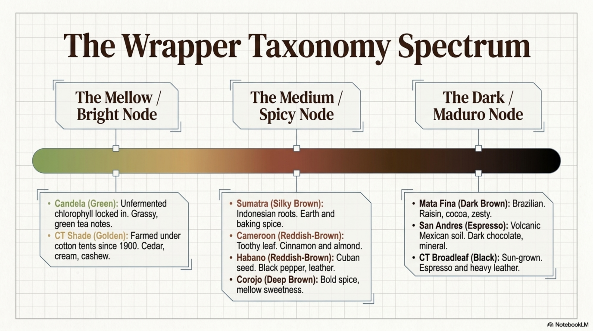
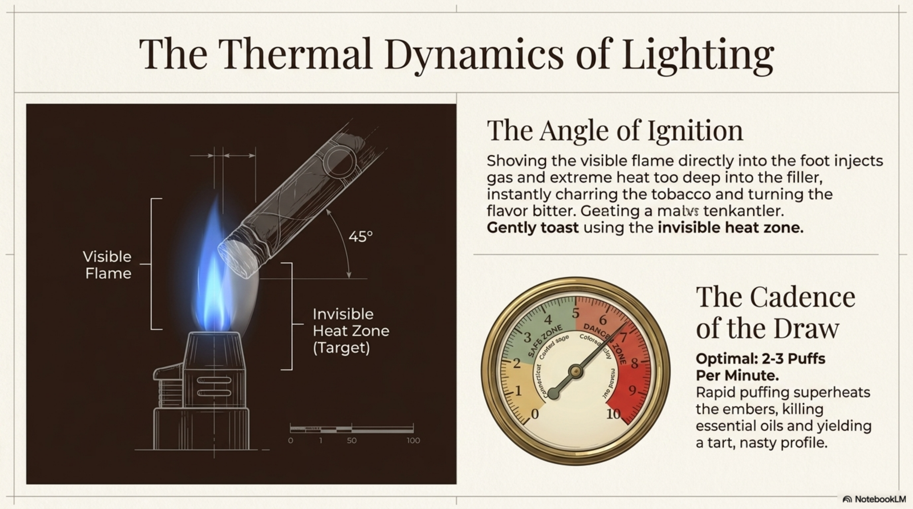

# Gospodin za stolom

## Suvremeni vodič kroz cigaru, čašu i društvo

*Radni draft za lekturu i tisak · 2026*

> **Napomena uz draft (za lekturu):** cjeloviti rukopis oko 32 000 riječi. Jezgra su dijelovi I–IV; Dodatak drži Bridgesov rahli slog (kartice, epigrami, vinjete) za otprilike 100 tiskanih strana u malom formatu. Strojno umnožene serije u dodacima (kartice, scenariji, vježbe, eseji) svedene su na jedinstveni sadržaj; preostalo ponavljanje figure „gospodin” namjeran je Bridgesov ritam, ne pogreška. Datoteka `mala-knjiga-pusackog-bontona.md` ostaje kratki kanon aplikacije.

---

### Posveta

Onima koji znaju da je dim samo izgovor da se sjedne — i onima koji još uče kako sjesti bez da drugi ustanu.

---

### Epigraf

> Bonton nije policija ukusa. To je način da drugi udišu lakše dok ti uživaš.

> Gospodin je osoba koja život drugih čini ugodnijim. — parafrazirano iz duha klasičnih vodiča uljudnosti

---

## Kako čitati ovu knjigu

Ovo nije ispit. Nema ocjena, nema „prave” marke, nema kazne za krivi rez.

Čitaj je kao razgovor za stolom: možeš stati, vratiti se, preskočiti poglavlje o povijesti ako te više zanima što reći kad gost odbije cigaru. Forma je namjerno rahla — kratka pravila, poneka vinjeta, poneka izreka — po uzoru na one male knjige bontona koje se čitaju u jednom dahu, a pamte se duže.

Gdje piše *gospodin*, misli se na figuru uljudnosti, ne na spolni ispit. Dobra družbenica, dobar gost, dobar domaćin — ista mjera.

Gdje piše o tehnici, to je dovoljno da ne izgledaš kao snob i da ne uništiš tuđu večer. Detaljni udžbenik o humidorima i ljestvicama snage ostaje drugdje. Ovdje je riječ o odnosima.

Ako zapamtiš samo troje, bit će dovoljno: pitaj prije plamena, ostavi prostor, završi čistije nego si zatekao.

---

## Sadržaj

### Prednji materijal
- Posveta · Epigraf · Kako čitati ovu knjigu

### I. Duh i prostor
1. Što je gospodin za stolom  
2. Zlatno pravilo i moderni logorski plamen  
3. Prostor i suglasnost  
4. Ritam i prisutnost  
5. Riječi koje spašavaju večer  

### II. List i plamen
6. Mala povijest u pet gutljaja  
7. Anatomija cigare za stol  
8. Rez, paljenje, pepeo  
9. Tempo i crni pepeo  
10. Humidor kao prostor gostoprimstva  
11. Pet maherskih savjeta koje gospodin ne nameće  

### III. Stol i društvo
12. Nuditi i dijeliti  
13. Čaša, voda, redoslijed  
14. Uparivanje bez taštine  
15. Domaćin i gost  
16. Salon i klub  
17. Deset vinjeta za stolom  

### IV. Svijet i sjećanje
18. Vani, terasa, Jadran, prolaz  
19. Poklon, zahvala, sjećanje  
20. Kad stol nije tvoj  
21. Tri zapovijedi i zatvaranje  

### Stražnji materijal
- Izvori i napomene · Rječnik stolnih riječi · Zahvale · Napomena za lekturu  

---

# I. Duh i prostor

*Prvo se uredi zrak između ljudi. Tek onda list.*

---

## 1. Što je gospodin za stolom

Gospodin nije onaj tko najglasnije zna ime vitole. To je onaj uz kojega drugi dišu lakše.

Bonton pušenja nije katalog zabrana. To je gostoprimstvo s dimom u sredini — i s mjerom da dim ne postane sredstvo vlasti.

### Temelji

Gospodin gleda tko sjedi pokraj njega prije nego zapali.

Gospodin drži ritam koji ne grije duhan i ne grije društvo.

Gospodin ima rezač, pepeljaru i vodu već na stolu — bez improvizacije koja izgleda kao panika.

Gospodin ne pretvara svoju najdražu maduro u obvezan ispit za gosta.

### Što bonton nije

Bonton nije natjecanje u skupoći.

Bonton nije predavanje o podrijetlu lista dok netko samo želi miran sat.

Bonton nije izgovor da ispravljaš tuđi pepeo kao da si sudac na sajmu.

Bonton nije moralna propovijed. Ako netko ne puši, ne moraš ga „obratiti”. Ako netko puši drugačije od tebe, ne moraš ga spašavati — osim ako te pita.

### Mudra misao

*Uljudnost je umijeće da drugi zaborave da si mogao biti neugodan.*

---

## 2. Zlatno pravilo i moderni logorski plamen

Zlatno pravilo stola glasi jednostavno: ako bi gestu primio kao ljubaznost, ponudi je. Ako bi je osjetio kao pritisak, odustani.

Nuditi cigaru znači nuditi vrijeme. Nuditi savjet bez pitanja često znači nuditi pritisak u obliku mudrosti.

### Stol kao logorska vatra

Kažu da je stol s cigarom moderna inačica logorske vatre: ljudi sjede u krugu, status ostaje na vratima, razgovor ide sporije nego u sandučiću poruka.

Gospodin poštuje taj sporiji tempo. Ne mora ga nazivati terapijom. Dovoljno je da ne žuri.

Gospodin zna da iza lista stoji zanat — mnogo ruku, mnogo dana, mnogo tihog rada. Ne treba patetika. Treba samo da ne tretiraš tuđu večer kao potrošni materijal za svoj ego.

### Ravnopravan stol

Na dobrom stolu nema „pravog” mjesta za onoga tko zna više. Ima mjesta za onoga tko zna slušati.

Gospodin ne gradi hijerarhiju od znanja. Znanje nudi kao vodu: dostupno, bez forsiranja gutljaja.

Gospodin ne koristi riječi koje isključuju. „Bratstvo”, „pravi muškarci”, „samo za upućene” — to su loši epigrafi za dobru večer.

### Vinjeta: pritisak u obliku ljubaznosti

Domaćin otvara kutiju i kaže: „Moraš probati ovu, inače nisi bio.” Gost se smiješi, uzima, i ostatak večeri gleda sat.

Ljubaznije: „Imam blagu i srednju — što ti više paše večeras? Ako ništa, voda i razgovor također drže stol.”

---

## 3. Prostor i suglasnost

Dim putuje dalje od tvoje dobre namjere. Prostor biraš prije plamena.

### Prije paljenja

Gospodin pita — osobito u tuđem domu, na terasi blizu prolaznika, uz djecu ili u miješanom društvu.

Gospodin poštuje zabranu i znak. Bez pregovora „samo jedan dim”.

Gospodin odmiče se od hrane koja nije njegova degustacija — kuhinja, švedski stol, tuđi desert. Dim i tuđi kolač rijetko sklapaju mir.

Zatvorena soba bez ventilacije traži kraću sesiju ili drugi trenutak. Gospodin to vidi prije nego što gosti počnu kašljati iz uljudnosti.

### U društvu

Jedno „ne, hvala” zatvara temu bez komentara.

Gospodin ne ispravlja tuđi ritam ili izbor pića naglas. Savjet tek ako ga traže.

Ako netko kaže da ne voli dim, gospodin ne odgovara eseju o podrijetlu. Odgovara prostorom: prozor, terasa, kraća cigara, ili — često najbolje — čista čaša i razgovor.

### Djeca, prolaznici, susjedi

Gospodin ne tretira tuđu terasu kao privatni salon.

Gospodin ne pušta dim u lica ljudi koji nisu sjedili za njegovim stolom.

Gospodin zna da je „malo ne smeta” rečenica koju često izgovara onaj kojemu ne smeta — a ne onaj kojemu smeta.

### Vinjeta: jedan „ne”

Gost: „Ne, hvala, ne pušim.” 
Krivo: „Ali ova je blaga, stvarno, samo probaš.” 
Ljubazno: „Naravno. Voda ili nešto bez dima?”

Tema je zatvorena. Večer može živjeti.

---

## 4. Ritam i prisutnost

Gospodin (i dobra družbenica) ne žuri dimom da dokaže snagu. Žuri rijetko — i samo ako mora otići.

### Ritam

Kratka povlačenja, pauze između. Crni, vrući pepeo nije trofej. To je upozorenje da si pretjerao s dokazivanjem.

Uobičajeno je držati pauzu u redu veličine minute — dovoljno da list diše, a ti da čuješ rečenicu do kraja. Nema magičnog broja koji te čini ozbiljnim. Ima samo ritam koji ne pretvara stol u utrku.

Razgovor ima prednost pred „još jednim gutljajem dima” dok netko priča.

Mobitel licem dolje ili dalje. Bonton stoljeća nije listanje ekrana.

### Prisutnost

Gledaj u oči kad nudiš čašu ili cigaru.

Slušaj više nego što predaješ lekciju o XO-u.

Ako moraš otići sredinom, ugasi učtivo i zahvali. Ne ostavljaj goreći stub kao spomenik vlastitoj važnosti.

Gospodin nema „nikad nije”. Ima večer. Ima stol. Ima ljude. Ako moraš biti drugdje, budi drugdje — ali ne glumi prisutnost dok gledaš u obavijesti.

### Vinjeta: nigdje mi se ne žuri

Netko za stolom puše kao da lovac juri list. Pepeo pocrni, razgovor stane, gost pita je li sve u redu.

Ljubazno: uspori, nasmiješi se, reci: „Nigdje mi se ne žuri — osim ako tebi treba.” Zatim stvarno uspori.

### Tempo pića uz dim

I uz čašu vrijedi ista mudrost: gutljaj nije dokaz. Kažu da neki broje sekunde po godini u bačvi — to je simpatična anegdota za degustaciju, ne zakon za druženje. Za stolom s cigarom važnije je da ne „vučeš” naprijed dok drugi još mirisu.

---

## 5. Riječi koje spašavaju večer

Riječi za stolom teže više od imena na prstenu.

### Pohvala

Gospodin hvali tuđi izbor bez usporedbe „moje je bolje”.

„Ovo ti lijepo sjeda” bolje je od „ja bih uzeo jače”.

„Hvala na ovoj večeri” bolje je od dugog monologa o vlastitoj kolekciji.

### Pitanja koja otvaraju

- „Što ti više paše večeras — blaže ili srednje?”
- „Imaš li vremena za dulju, ili kraću?”
- „Smije li dim ovdje, ili bolje vani?”
- „Želiš li savjet, ili samo druženje?”

Drugo pitanje često spašava više od prvog savjeta.

### Riječi koje kvare

- „Moraš.”
- „Pravi znalac bi…”
- „To se ne radi tako” — izrečeno bez pitanja, pred svima.
- „Glatko” kao jedina ocjena (o tome kasnije).
- „Još jednu” kao naredba, ne kao ponuda.

### Kako reći „dosta mi je”

Gospodin smije reći: „Hvala, stajem ovdje — bilo je baš dovoljno.”

Gospodin ne mora glumiti da može još tri sata ako mu tijelo kaže da je kraj.

Dobar domaćin čuje to bez komentara o „potrošnji” poklona.

### Kako reći „ne paše mi”

„Nije moj profil večeras” bolje je od tihe patnje.

„Radije bih vodu uz tvoj dim” bolje je od lažnog oduševljenja.

Gospodin prima takve rečenice kao informaciju, ne kao uvredu.

### Vinjeta: snob u jednoj rečenici

Netko kaže: „Pravi znalac ne bi to tako zapalio.” Treći za stolom mijenja temu: „Reci, kako ti je posao s onim projektom?” Dim se vrati u pozadinu. Večer preživi.

### Mudra misao

*Najbolji kompliment nije „znaš pravila” — nego „ugodno mi je bilo s tobom”.*

---

*Kraj prvog dijela. Dalje: list, plamen, i malo znanja bez snobizma.*

---

# II. List i plamen

*Malo znanja da ne izgledaš kao snob — i da ne uništiš tuđu večer.*

---

## 6. Mala povijest u pet gutljaja

Povijest cigare nije ispit iz geografije. To je priča o listu, trgovini, mitu i stolu. Gospodin zna dovoljno da poštuje zanat — i dovoljno malo da ne dosadi gostima.

### Prvi gutljaj: list prije mita

Duhan nije izumljen u luksuznoj kutiji. Biljka je dugo živjela u kulturama Amerike, u ritualima i svakodnevici koje europski mit često svede na anegdotu. Gospodin ne mora držati predavanje. Dovoljno je da zna: prije marke bio je list, prije statusa bio je obrt.

Kad netko kaže „cigara je oduvijek bila gospodska”, mudro je nasmiješiti se. Gospodsko je ono što danas radimo s mjerom — ne ono što pripisujemo prošlosti da bismo izgledali važnije.

### Drugi gutljaj: trgovina i putovanja

List je putovao brodovima, lukama, carinama i pričama. Uobičajeno je reći da su kolonijalni putevi oblikovali i okus i mit. Gospodin ne mora romantizirati carstvo da bi uživao u večeri. Može priznati da je povijest zamršenija od naljepnice.

Mudro je znati da „kubanski mit” nije jedina priča na stolu. Mnogi stolovi danas žive od znanja i rada iz više zemalja. Poštovanje ide prema ljudima koji rade list — ne prema floskuli.

### Treći gutljaj: Kuba kao legenda i kao stvarnost

Kuba je u mašti često veća od karte. Legende vole jednostavne rečenice; stol voli nijanse. Gospodin ne mora osporavati tuđu ljubav prema određenom podrijetlu. Mora samo izbjeći da od podrijetla napravi moralni sud.

„Pravo” i „lažno” za stolom brzo postaju oružje. Bolje: „Ovo mi večeras sjeda” i „Ono mi je drugačije”. Razlika nije uvreda.

Gospodin zna da isto ime na kutiji ponekad nije ista životinja — ovisno o tržištu i povijesti marki. Kad to objašnjava, radi to bez snobizma. Objašnjenje je usluga, ne pobjeda.

### Četvrti gutljaj: globalni stol

Danas stol može držati list iz više krajeva, u rukama ljudi koji nisu „upućeni od djetinjstva”, nego od znatiželje. To nije pad civilizacije. To je širi krug.

Gospodin ne mjeri gosta po tome koliko davno je ušao u hobij. Mjeri ga po tome kako se ponaša prema drugima.

Kažu da iza jedne cigare stoji mnoštvo ruku — uzgoj, berba, sušenje, fermentacija, valjanje, kontrola, pakiranje. Brojka nije bitna kao dogme. Bitno je sjećanje da list nije „nastao” u tvojoj kutiji.

### Peti gutljaj: mit naspram stola

Mit voli heroje s cigarama u ustima. Stol voli ljude koji gase pepeo na vrijeme i ne puštaju dim u tuđe lice.

Hemingwayjevski i churchillovski tropeovi lijepi su za poster. Za večer su manje korisni od pepeljare i vode. Gospodin smije voljeti mit — i smije ga ostaviti na polici dok gosti sjede.

### Precepti

Gospodin zna kratku povijest da bi bio skromniji, ne da bi bio glasniji.

Gospodin ne koristi „autentičnost” kao batinu.

Gospodin poštuje zanat bez patetike.

Gospodin razlikuje legendu od gostoprimstva.

### Vinjeta: predavanje usred prvog dima

Netko zapali i odmah krene: pet stoljeća, tri otoka, dva embarga, jedna teorija o tlu. Gost gleda u pepeo kao u izlaz za nuždu.

Ljubaznije: jedna rečenica o listu, pa pitanje — „što ti večeras treba od večeri?” Povijest može pričekati desert. Ili sljedeći tjedan.

### Mudra misao

*Poštovanje prema prošlosti mjeri se ponašanjem u sadašnjosti.*

---

## 7. Anatomija cigare za stol

Ne trebaš biti stručnjak za duhan da budeš uljudan. Trebaš znati tri sloja i jedno pravilo vremena.

### Tri sloja, jednom i jasno

Omot je list koji vidiš i koji snažno utječe na prvi dojam — boja, miris, tekstura.

Vezivo drži oblik i pomaže da cigara bude cigara, a ne hrpa namjera.

Punilo je srce mješavine — ono što nosi veći dio karaktera kroz dim.

Gospodin može ovo reći u tri rečenice. Četvrta je već predavanje.

### Vitola kao dar vremena

Format nije samo estetika. Kraća cigara često znači kraći dogovor s večeri. Dulja znači dulje sjedenje. Kad nudiš, reci otprilike: trideset, šezdeset, devedeset minuta. Gost ima pravo znati što prihvaća.

Gospodin ne nudi „brzu” cigaru kao da je brza kava — pa onda nestane na sat i pol. Iskrenost o vremenu dio je bontona.

### Boje i priče bez rangiranja

Svjetliji omoti (često Connecticut u razgovoru za stolom) često nose blaži dojam. Tamniji (često Maduro u istom razgovoru) često nose slađi, teži dojam. To su sklonosti, ne ljestvica vrijednosti.

Gospodin ne kaže „Maduro je za prave”. Kaže: „Ova je tamnija i sporija — želiš li to večeras?”

*Slika: spektrum omota (NotebookLM Studio nacrt; engleski tekst). Za tisak: prerisati ili prepustiti lekturi vizuala.*

### Povlačenje, ne drama

Dobro povlačenje olakšava večer. Loše povlačenje nije moralni pad. To je tehnički trenutak. Gospodin to rješava tiho — ili pita domaćina — bez javne dijagnoze tuđe cigare.

### Precepti

Gospodin zna anatomiju dovoljno da objasni, ne da impresionira.

Gospodin nudi format kao vrijeme, ne kao status.

Gospodin ne rangira omote kao karaktere ljudi.

Gospodin ne dijagnosticira tuđe povlačenje naglas, osim ako ga pitaju.

### Vinjeta: ispit iz boje

Gost uzme svjetliju. Netko kaže: „Ah, početnička.” Treći odgovori: „Večeras mi baš paše blago — ima li još vode?” Tema se vrati na stol.

---

## 8. Rez, paljenje, pepeo

Ovdje bonton i tehnika sjede jedno uz drugo — jer loša higijena i loš pepeo kvare tuđu večer brže od lošeg ukusa.

*Slika: sažetak tehnike i mjere (NotebookLM Studio infografika). Engleski nacrt; sadržaj se slaže s preceptima ovog poglavlja.*

### Rez

Gospodin reže dovoljno da otvori kapu, ne dovoljno da otvori raspravu o katastrofi.

Ako dijeliš rezač, ne vlaži kapu ustima prije reza. To nije „trik”. To je način da tuđi alat dobije tvoj slijed. U salonu i kod kuće isto pravilo: zajednički rezač traži čiste navike.

Ako nisi siguran u tuđi rezač, pitaj za čisti ili koristi svoj. Tiho. Bez najave epidemije.

*Slika: rez kape, ne „cijela katastrofa” (Studio nacrt).*

### Paljenje

Gospodin pali strpljivo. Ne žuri plamenom kao da dokazuje da zna.

Mlazni upaljač je koristan alat i potencijalna drama: daleko od kose, salveta, suhog bilja, papira. Vani još više.

Ne grij brandy nad plamenom upaljača „jer tako izgleda u filmu”. Izgleda kao film. Miris često izgleda kao pogreška.

*Slika: strpljivo paljenje (Studio nacrt).*

### Pepeo

Pepeljara s utorom — ne šalica za kavu, ne rub biljke, ne pod.

Ne treperi pepeo kao da kažnjavaš list. Pusti ga da padne. Podrži cigaru kad treba.

Pepeo može biti štit vatri — dok je stabilan. Kad pocrni i pregrije, to nije medalja. To je znak da usporiš.

Na kraju: ugasi dostojanstveno. Ne stubaj cigaru kao cigaretu u pepeo s bijesom ili teatralnošću. Cigara se gasi mirno; stubanje je kratak put do gorkog mirisa i ružnog prizora.

### Prsten

Oko prstena postoje škole: skidati rano, skidati kasnije, ostaviti. Gospodin ne rješava to dogmom. Rješava to kontekstom — i time da prsten i celofan ne završe pod stolom.

Ako te pitaju što radiš ti, reci svoju praksu. Ne kao zakon.

*Slika: prsten bez dogme (Studio nacrt).*

### Precepti

Gospodin ne liže kapu prije zajedničkog rezača.

Gospodin pali bez predstave.

Gospodin ne stuba.

Gospodin ne pretvara prsten u ideologiju.

Gospodin ne ostavlja alat otvoren na vjetru uz papir.

### Vinjeta: lizanje kape

Gost navlaži kapu, uzme kućni rezač. Domaćin ne drži govor. Tiho nudi svoj čisti rezač: „Evo, ovaj je spreman.” Večer ide dalje. Higijena bez sramote.

### Mudra misao

*Pepeo govori glasnije od imena na prstenu.*

---

## 9. Tempo i crni pepeo

Tempo je bonton pretvoren u ritam disanja.

*Slika: „noob” potezi naspram mirne prakse (Studio nacrt; ton je američki lounge, ne naš rječnik).*

### Pauze

Kratka povlačenja. Pauze između. Uobičajeno je ciljati otprilike minutu — ne kao metronom, nego kao podsjetnik da nisi u utrci.

Gospodin ne broji naglas. Broji tijelom: ako pepeo pocrni i užari se previše, uspori.

Crni vrući pepeo nije dokaz snage. To je upozorenje da si list pretvorio u peć.

### Razgovor prvi

Dok netko priča, dim čeka. Ne obrnuto.

Gospodin ne prekida tuđu rečenicu dimom kao da je stanka u emisiji.

Ako moraš odgovoriti na poruku, reci: „Trideset sekundi” i izađi — ili ostavi mobitel na miru. Zvučnik za stolom je posebna vrsta neuljudnosti: nameće tuđi glas cijelom krugu.

### Nikud se ne žuri

Najbolje večeri drži osjećaj da nigdje ne moraš biti. Ako moraš, reci to na početku. Ljudi će prilagoditi format i tempo. Lažna beskrajnost zamorna je kao lažna bliskost.

### Precepti

Gospodin usporava kad pepeo pocrni.

Gospodin ne žuri da dokaže da „zna pušiti”.

Gospodin daje prednost razgovoru.

Gospodin ne drži razgovor na zvučniku usred stola.

Gospodin najavljuje odlazak, ne iznenadni nestanak.

### Vinjeta: metronom

Netko puše u trzajima. Pepeo pada crn. Domaćin ne kaže „krivo”. Kaže: „Usporimo — ova voli dah.” I sam uspori. Mentorstvo bez katedre.

---

## 10. Humidor kao prostor gostoprimstva

Humidor nije vitrina za taštinu. To je ostava povjerenja.

*Slika: pravila spremanja (Studio nacrt). Bonton ovdje je granica ruku, ne udžbenik RH.*

### Sveti prostor (bez patetike)

Gospodin ne prekapa tuđi humidor kao buvljak.

Gospodin ne „provjerava” svježinu stiskanjem tuđih cigara. Ako te zanima stanje, pitaj domaćina ili osoblje. Gledaj. Ne štipaj.

U trgovini ili klubu: pitaj prije nego otvoriš ladicu. Ruke koje lutaju bez pitanja izgledaju kao krađa povjerenja, čak i kad nisu krađa predmeta.

### Kod kuće

Ako gost donese vlastitu kutiju, ne moraš je odmah utrpati među svoje. Može stajati odvojeno do večeri. Red i jasnoća također su gostoprimstvo.

Ako nudiš iz svog humidora, nudi izbor — ne „uzmi što nađeš dok ja pričam”.

### Što ovo nije

Ovo nije priručnik o postotcima vlage. Brojke žive u 101. Ovdje živi odnos: tuđi list nije tvoj teren za istraživanje bez dozvole.

### Precepti

Gospodin pita prije ladice.

Gospodin ne štipa tuđe cigare.

Gospodin ne prekapa.

Gospodin tretira humidor kao tuđi ormar — s istim poštovanjem.

### Vinjeta: štipanje

Gost u trgovini cijedi cigare „da vidi”. Prodavač se smiješi ukočeno. Ljubazniji gost pita: „Smijem li pogledati ovu kutiju — i što mi preporučate za sat vremena navečer?” Ruke miruju. Savjet kreće.

---

## 11. Pet maherskih savjeta koje gospodin ne nameće

Ovo su savjeti za vlastitu praksu. Nude se samo ako te pitaju. Inače su tihi.

*Slika: mitovi (plume, boja, ponovno paljenje, cijena). Studio nacrt; u knjizi vrijedi samo što služi uljudnosti.*

### 1. Rez malo manje nego misliš

Većina drama počne pretjeranim rezom. Manje rupe, manje žaljenja. Ako treba, možeš malo proširiti. Obrnuto je teže.

### 2. Zapali ravnomjerno, pa pusti

Krug plamena, lagano okretanje, strpljenje. Zatim pusti da se dim namjesti. Gospodin ne „ubija” prvi centimetar žurbom.

### 3. Voda je alat

Žeđ, jak nikotin, težak tresetni gutljaj — voda spašava više večeri nego mudre rečenice. Nije sramota. Standard je.

### 4. Skraćivanje zadnje trećine nije poraz

Kad list oteža, a tijelo kaže dosta, ugasi. Mjera je maherska vrlina, ne slabost. Dobar domaćin to razumije bez komentara o cijeni.

### 5. Bilježi što je sjelo

Vitola, piće, most, društvo, vrijeme. Sutradan ćeš biti pametniji bez da si bio snob jučer. Sjećanje je dio zanata — i dio zahvale.

### 6. Tempo je uljudnost

Jedno do dva sporija povlačenja u minuti često drži list i razgovor. Prebrzo zagrijava duhan i sobu.

### 7. Lakše na mirnom želucu

Jak list na prazan želudac češće kvari večer nego ukus. Voda, malo hrane, bez heroizma. Autor je liječnik; ovo ipak nije medicinski savjet — samo stolna mjera.

### Kako nuditi ove savjete

Samo na upit. Kratko. Bez publike. Bez „pravi znalac”.

Ako te ne pitaju, puši svoje i budi ugodan. To je najteži maherski trik.

### Precepti

Gospodin čuva trikove za trenutak kad su traženi.

Gospodin ne drži seminar između dva povlačenja.

Gospodin zna da je najbolji trik — biti lak za sjedenje.

### Mudra misao

*Majstorija koja se nameće prestaje biti majstorija i postaje nastup.*

---

*Kraj drugog dijela. Dalje: stol, čaša, salon i vinjete.*

---

# III. Stol i društvo

*Ovdje bonton prestaje biti teorija i postaje večer.*

---

## 12. Nuditi i dijeliti

Nuditi cigaru znači nuditi vrijeme — ne samo list.

### Kako nuditi

Gospodin nudi izbor: blagu i srednju, ne samo svoju najjaču „da svi vide”.

Gospodin kaže otprilike duljinu — trideset, šezdeset, devedeset minuta — da gost zna što prihvaća.

Rezač i upaljač idu uz ponudu. Gost ne treba loviti alat kao da je u tuđoj kuhinji noću.

Ako gost odbije, ostavi cigaru mirno. Bez nagovaranja. Bez „samo malo”. Bez uvrijeđenog lica.

Gospodin gleda u oči kad nudi. Ponuda nije bacanje predmeta preko stola.

### Što ne raditi

Ne paliti tuđu cigaru bez pitanja — osim ako su rekli „upali mi”.

Ne ocjenjivati naglas tuđe povlačenje ili pepeo.

Ne uzimati zadnju iz kutije domaćina bez ponude.

Ne pretvarati odbijenicu u raspravu o karakteru.

### Dijeljenje boce

Prvo natoči gostu.

Označi što je u dekanteru. Misterij je dobar u romanu, ne u gutljaju kad netko ima alergiju ili mjeru.

Voda uz stol nije opcija. Standard je.

Ako doneseš vlastitu bocu, dijeli što doneseš. Boca koja stoji samo pred tobom izgleda kao izlog, ne kao dar stolu.

### Uzvratiti poklonjenu cigaru

Ako ti je netko poklonio dobru kutiju, mudro je kasnije uzvratiti sličnom pažnjom — ne nužno istom markom, nego istom mjerom gostoprimstva. Bonton je kružnica, ne računovodstvo.

### Blaže cigare i početnici

Za gosta koji tek ulazi u svijet lista, blaža i kraća često drži stol bolje od „prave” teške. Gospodin to nudi bez omalovažavanja. „Za opuštanje” bolje zvuči od „za početnike” — iako je smisao isti: ne bacati nekoga u duboki kraj da bi ti izgledao hrabro.

### Precepti

Gospodin nudi vrijeme, ne samo list.

Gospodin nudi izbor, ne ulazni ispit.

Gospodin ne nagovara.

Gospodin dijeli što donese.

Gospodin ne uzima zadnju bez riječi.

### Vinjeta: samo najjača

Domaćin otvara kutiju punih, tamnih, dugih. Gost tiho pita ima li kraće. Domaćin se uvrijedi. Ljubazniji domaćin kaže: „Imam i kraću blagu — uzmi što ti večeras odgovara.” Ego sjeda. Gost ostaje.

### Još precepta o nuditi

Gospodin ne nudi cigaru kao nagradu za dobar razgovor. Nudi je kao dio večeri — ili ne nudi.

Gospodin ne stavlja cigaru pred nekoga tko je već rekao ne, „za svaki slučaj”.

Gospodin ako nudi iz skuplje kutije, ne najavljuje cijenu. Cijena nije začin.

Gospodin kad prima cigaru, zahvali i zapali je s pažnjom — ili je pošteno ostavi za drugi put ako mora ići. Ne guši dar žurbom.

Gospodin ne traži gutljaj tuđe cigare. To nije degustacija. To je ulazak u tuđi ritam bez poziva.

Gospodin ako želi da netko proba „istu”, nudi drugu istu — ne pola tuđe.

### Mudra misao

*Dar koji treba objašnjavati pretugo prestaje biti dar i postaje nastavni sat.*

---

## 13. Čaša, voda, redoslijed

Uparivanje za stolom mali je ritual — ne pozornica za taštinu.

### Postavljanje

Čaša primjerena piću — snifter, Glencairn, copita — nije snobizam ako olakšava miris. Ako nemaš „pravu”, imaj čistu. Čistoća pobjeđuje marku čaše.

Voda. Pepeljara. Rezač. To je osnovni komplet stolnog razuma.

Ne grij brandy nad plamenom. Led biraj svjesno, ne iz navike. Led nije grijeh i nije dogma — svjesna odluka jest bonton prema vlastitom nepcu i prema društvu.

Natoči umjereno. Nadopuni kad gostova čaša padne nisko, bez ispitivanja zašto pije sporo.

### Redoslijed

Miris pića → gutljaj → dim → gutljaj. Traži most, ne pobjedu.

Prvo blaže, zatim snažnije — i u cigari i u čaši, kad vodiš večer. Ako kreneš dimljenom bombom i punim madurom, ostatak večeri može biti samo oporavak.

Ako gost zaostaje, uspori svoj ritam. Ne „vuci” naprijed sam kao da si u vremenskoj kapsuli.

### Ne umakati

Gospodin ne umače cigaru u piće da „omekša”. To je film i forum. Za stolom često ostavlja čašu čudnog mirisa i list žalosan.

Ako to netko radi kod svoje kuće, sam, neka radi. U društvu — pitaj sebe bi li to volio gledati u svojoj čaši.

### Tihi naljev

U krugu koji sluša miris i tišinu, glasan, bučan naljev zvuči kao upozorenje da je ego ušao u sobu. Natoči mirno. Nije operacija. Nije ni predstava.

### Voda kao alat

Voda čisti nepce, ublažava udar, vraća razgovor. Gospodin ne ismijava vodu. Gospodin je toči.

Ako gost ne pije alkohol, ritual se ne raspada. Dim, voda, razgovor — stol i dalje stoji. Prazna čaša „za formu” nije obavezna. Poštovanje jest.

### Precepti

Gospodin postavlja vodu prije mudrosti.

Gospodin ne umače list u čašu.

Gospodin ne grije piće nad upaljačem.

Gospodin natoči tiho.

Gospodin prvo blago, onda jače — kad vodi.

Gospodin ne ispituje zašto netko pije sporo.

### Vinjeta: bučan naljev

U tihom whiskey krugu netko natoči s visine, s efektom. Svi trgnu. Ljubaznije: boca blizu čaše, tanak mlaz, bez predstave. Miris ostaje glavni junak.

### Još o čaši

Gospodin ne vrti čašu kao da miješa beton — osim ako je to dio njegove tihe navike i ne prska stol.

Gospodin ne njuši tako glasno da izgleda kao medicinski pregled. Dovoljan je mirisan trenutak.

Gospodin ne komentira tuđi led kao grešku civilizacije. Može ponuditi bez leda. Ne mora držati sud.

Gospodin kad mijenja piće, da nepceu kratki predah vodom. Mostovi se grade, ne ruše žurbom.

### Mudra misao

*Čaša je okvir. Dim je boja. Razgovor je slika.*

---

## 14. Uparivanje bez taštine

Uparivanje nije natjecanje koje piće „pobjeđuje” dim. To je potraga za mostom.

### Most, ne pobjeda

Gospodin traži da se stvari dopunjuju. Ako se bore, uspori, promijeni gutljaj, ili priznaj: „Ovo večeras ne sjeda — nije tragedija.”

Pohvala tuđeg para bolja je od rangiranja svog.

### Intenzitet

Blaži dim često voli blaže društvo u čaši. Puniji dim često drži više alkohola i težih nota. To je orijentir, ne zakon fizike za tvoj stol.

Visoki postotak alkohola ponekad „drži” puniji dim bolje od tankog gutljaja koji nestane. Opet: orijentir. Probaj, bilježi, ne propovijedaj.

### Slatkoća i oprez

Slađi profili ponekad vole tamnije omote. Svjetliji omoti ponekad vole čistije, suše linije. Deklaracija dodataka u rumovima — gdje postoji — vrijedi više od marketinške magle. Gospodin ne moralizira o dodacima kao o grijehu; govori jasno kad zna, i šuti kad ne zna.

### Riječ „glatko”

U stručnijem društvu „glatko” često malo kaže — a ponekad signalizira baš ono što želiš opisati preciznije: vanilija, hrast, karamela, koža, papar. Gospodin smije reći „ugodno mi ide”. Još bolje ako kaže što osjeća. Ne ispravlja tuđe „glatko” kao policajac vokabulara — osim ako ga pitaju za riječi.

### Treset i najava

Jako tresetno piće u maloj sobi treba najavu ili izlaz na terasu. Dim plus treset može biti svadba ili sudar. Gospodin najavljuje. Ne iznenađuje sobu kao vatrogasnu vježbu.

### Kava

Kava uz dim može biti sjajan most — i dvostruki udar ako je sve teško. Gospodin ne forsira espresso uz najjači list kao dokaz izdržljivosti.

### Precepti

Gospodin traži most.

Gospodin ne proglašava pobjednika večeri.

Gospodin opisuje više nego što sudi.

Gospodin najavljuje težak treset.

Gospodin ne ismijava tuđi vokabular.

### Vinjeta: „glatko”

Gost kaže: „Ovaj rum je baš glatko.” Netko se naježi da ispravi. Ljubaznije: „Meni se čini vanilija i hrast — osjećaš li to ili ti više ide kao mekano?” Razgovor ostaje razgovor.

### Još o uparivanju

Gospodin ne tvrdi da je „cigara uvijek protagonist”. Na nekim večerima vodi čaša. Na nekima razgovor. Dim je gost, ne diktator.

Gospodin ne nameće svoj omiljeni par kao jedini ispravni.

Gospodin ako nešto ne paše, mijenja tiho — ne drži govor o grešci civilizacije.

Gospodin bilježi uspjehe više nego što pamti tuđe promašaje za anegdote.

### Mudra misao

*Dobro uparivanje ne traži aplauz. Traži još jedan sporiji gutljaj.*

---

## 15. Domaćin i gost

Dobar domaćin nudi ljestvicu. Dobar gost zna sići s nje bez srama.

### Domaćin

Pitaj za snagu, dimljenost i vrijeme prije nego otvoriš kutiju.

Drži blagu i srednju cigaru te pristupačno piće na startu. Tresetna bomba i puna maduro mogu doći kasnije — ako ikad.

Pokaži gdje je pepeljara i WC. Sitnice spašavaju večer.

Ne forsiraj „još jednu” kad je gost sit.

Drži mentorski ton samo kad ga traže. Inače drži gostoprimstvo.

Povremeno, nježno, provjeri je li svima dobro — bez da pretvoriš stol u ordinaciju. Čaša vode, prozor, kraća sesija: alati, ne drama.

### Gost

Donesi mali dar ako je običaj — bocu, malu kutiju, ništa pretjerano.

Poštuj red u humidoru. Ne prekapaj.

Zahvali konkretno: „Taj amontillado uz Connecticut…” bolje je od općeg „super bilo”.

Skraćivanje zadnje trećine nije slabost. To je mjera.

Ako kasniš, javi. Domaćin nije dužan držati prvi dim u stanju mirovanja kao vječnu vatru — ali dobar domaćin i dobar gost dogovore ritam.

### Kad nešto pođe po zlu

Neujednačeno gorenje, preljev, krivi rez — nasmiješi se, popravi tiho, nastavi razgovor.

Gospodin ne pretvara grešku u predstavu. Ni u tuđu sramotu.

### Nelagoda od nikotina — bez srama

Ako gost blijedi, znoji se, utihne: voda, malo slatkog ako pomaže, zrak, kraća sesija. Bez šale na račun „slabosti”. Bez herojske priče kako ti „držiš”.

Domaćin koji spašava večer tiho veći je gospodar stola od onoga koji drži predavanje o nikotinu.

### Precepti

Dobar domaćin nudi ljestvicu i izlaz.

Dobar gost zna stati.

Gospodin greške rješava tiho.

Gospodin ne sramoti tijelo koje kaže dosta.

Gospodin zahvaljuje konkretno.

### Vinjeta: nelagoda od nikotina

Gost utihne, lice bljeđe. Domaćin ne pita pred svima „je l’ ti teško?”. Gurne vodu bliže, predloži kratku šetnju do prozora, skine tempo večeri. Sutradan nema mema. Ima zahvalu.

### Još o ulogama

Gospodin kao domaćin ne nestaje u kuhinji dvadeset minuta bez riječi dok gosti sjede s upaljenim listom i bez pepeljare.

Gospodin kao gost ne kritizira domaćinov izbor pred drugim gostima.

Gospodin kao treći za stolom zna kad ući u razgovor da spasi nekoga od snoba — i kad šutjeti.

Gospodin ne fotografira tuđu slabost. Nikad.

---

## 16. Salon i klub

Javna pušionica nije tvoja dnevna soba. Privatna terasa nije salon s cjenikom. Razlikuj.

### Deset precepta salona

1. **Ulazak.** Pozdravi sobu kratko. Pitaj je li mjesto slobodno — pepeljara ili čaša mogu čuvati stol dok je netko vani. Ne sjedaj kao da si kupio zrak.

2. **Higijena rezača.** Nikad lizanje kape na zajedničkom alatu. Vlastiti rezač ili čisti kućni — pitaj.

3. **Podrži kuću.** U javnoj pušionici i specijaliziranoj trgovini, podržati kuću dio je uljudnosti. Na privatnoj terasi vrijedi gostoprimstvo, ne uvozna naplata reza kao domaći običaj. Ne prenosi tuđe napojnice kao domaći zakon. Ne sjedi satima kao da je stol besplatni ured.

4. **Dim.** Od lica. Prema gore. Ne u susjedni stol kao da dijeliš mišljenje.

5. **Telefon.** Kratko ili vani. Bez zvučnika. Bez video-poziva usred mirisa.

6. **Pepeo.** Dostojanstveno. Ne stubaj. Pepeljara nije kanta: celofan, prsten i žvakaća idu u smeće. Ako pepeo padne, očisti bez drame.

7. **Tuđi list.** Ne traži gutljaj tuđe cigare. Savjet samo na upit. „Puši svoje” nije hladnoća — to je poštovanje.

8. **Vlastita boca.** Ako smiješ donijeti, dijeli. Ako ne smiješ, ne smiješ.

9. **Parfem.** U mjeri. Nepce drugih također degustira. Razgovor: ne pretvaraj svaku priču u svoju veću; prvo slušaj ritam sobe.

10. **Samo cigar.** Cigareta i vape u cigar salonu često krše duh mjesta — čak i kad pravilo nije ispisano velikim slovima. Pitaj. Poštuj. Čitaj kućna pravila na ulazu.

### Što ne uvoziti slijepo

U nekim zemljama postoje kruta pravila napojnica, odijevanja i onih koji samo troše tuđe. U hrvatskom kontekstu: lokalni klub, lokalna trgovina, lokalna terasa. Gledaj što kuća očekuje. Nemoj glumiti tuđi bonton da bi izgledao svjetski.

### Kontradikcije bez dogme

Neki saloni stroži su od crkve. Neki su opušteni kao terasa. Gospodin čita sobu. Ne nameće Davidoffovu krutost na prijateljsku večer — niti prijateljski kaos u mjesto koje živi od tišine.

### Precepti

Gospodin u salonu plaća poštovanjem prostora.

Gospodin u klubu ne tretira osoblje kao poslužitelje svog ega.

Gospodin na privatnoj terasi ne citira strane cjenike.

Gospodin nigdje ne stuba.

### Vinjeta: zvučnik na mobitelu

Zvučnik usred salona. Ljubazno: ustani, reci „izlazim trideset sekundi”, završi vani. Vrati se. Stol diše opet.

### Vinjeta: „ja još veće”

Svaka priča u salonu dobije odgovor koji je duži, skuplji, rjeđi. 
Krivo: natjecanje. 
Ljubazno: pitaj jednu stvar, saslušaj, pusti sobi da diše. Gospodin ne mora pobijediti anegdotom.

### Vinjeta: miris celofana

Netko dugo njuši zapakirani list kao dokaz stručnosti. 
Krivo: javna lekcija. 
Ljubazno: „Okus dolazi s plamenom — evo, zapalimo i usporedimo.” Celofan nije nepce.

### Fraze koje spašavaju salon

- „Je li ovo mjesto slobodno?”
- „Kako smo?” (kratko, bez predstave)
- „Izlazim trideset sekundi.”
- „Hvala, uživam ovako — ako zatrebam, pitam.”
- „Evo mog rezača, ako želiš.”

---

## 17. Deset vinjeta za stolom

*Situacija → krivo → ljubazno.*

### 1. Lizanje kape

Gost navlaži kapu i poseže za kućnim rezačem. 
Krivo: javna lekcija o higijeni. 
Ljubazno: tiho ponuditi vlastiti čisti rezač ili pitati za dezinficirani kućni.

### 2. Zvučnik na mobitelu

Poziv na zvučniku dok svi mirisu. 
Krivo: ignorirati ili sarkazam. 
Ljubazno: „Izlazim trideset sekundi.” I stvarno izaći.

### 3. Snob

Netko ispravlja tuđe paljenje bez pitanja. 
Krivo: još žešći protusnob. 
Ljubazno: treći mijenja temu; domaćin kasnije, nasamo, ako treba, kaže jednu blagu rečenicu.

### 4. Fotokopija boce

Boca se čuva godinama do plošnog okusa „za posebnu priliku”. 
Krivo: moraliziranje o rasipanju. 
Ljubazno: „Otvori je večeras — posebna prilika je što smo tu.” Podijeli zadnju četvrtinu dok je živa.

### 5. „Glatko”

Kompliment koji u stručnom krugu malo kaže. 
Krivo: „To samo znači da ima dodataka.” 
Ljubazno: pitati što osjeća; ponuditi vlastiti opis (vanilija, hrast) bez policije rječnika.

### 6. Fotografija

Telefon se diže, lica u kadru. 
Krivo: objaviti pa pitati. 
Ljubazno: pitati prije. Dim i čaše mogu biti anonimni; lica traže suglasnost.

### 7. Bučan naljev

Glasan naljev u tihom krugu. 
Krivo: ismijavanje. 
Ljubazno: sljedeći put tihi naljev — i, ako si domaćin, modelirati ritam.

### 8. Nelagoda od nikotina

Gost blijedi. 
Krivo: „Samo puši dalje, proći će.” 
Ljubazno: voda, zrak, slatko, kraća sesija, bez srama.

### 9. Štipanje u humidoru

Gost cijedi cigare. 
Krivo: vika. 
Ljubazno: „Bolje pitaj osoblje — oni znaju što je spremno.” Gledaj, ne stišći.

### 10. Isto ime, druga životinja

Rasprava o Montecristu — jedno ime, različite priče po tržištima. 
Krivo: „To uopće nije pravo.” 
Ljubazno: „Isto ime, druga povijest — evo što obično očekujem od ove kutije.” Objašnjenje bez snobizma.

### Dodatne mini-vinjete

**Kasni gost.** Domaćin već puši. Krivo: hladan prekor. Ljubazno: „Dobrodošao — upravo sam krenuo, uzmi ritam kako ti paše.”

**Zadnja u kutiji.** Gost poseže. Krivo: tišina puna napetosti. Ljubazno: domaćin sam ponudi ili kaže „ovu čuvam, evo srodne”.

**Ne pušač za stolom.** Krivo: forsirati „atmosferu”. Ljubazno: dim odmaknut, vjetar u obzir, razgovor isti.

**Prejak parfem.** Krivo: javna opaska. Ljubazno: više zraka, kraći format, sutra nasamo ako ste bliski.

**Neujednačeno gorenje.** Krivo: predavanje. Ljubazno: „Okreni malo — ili evo druge.” Nastavi priču.

### Mudra misao

*Vinjeta nije za sramotiti junaka. Vinjeta je za spasiti sljedeću večer.*

---

*Kraj trećeg dijela. Dalje: vani, poklon, tuđi stolovi, zadnja riječ.*

---

# IV. Svijet i sjećanje

*Bonton ne živi samo pod krovom. Živi u vjetru, u poklonu, u odlasku.*

---

## 18. Vani, terasa, Jadran, prolaz

Vjetar i prolaznici mijenjaju pravila brže od humidora.

### Vani

Gospodin stavlja leđa vjetru. Dim ne šalje u lica za stolom.

Mlazni upaljač pažljivo — daleko od kose, salveta, suhog bilja, papira, suhog grmlja.

Putna pepeljara ili limenka. Pepeo ne na travnjak restorana. Pepeo ne u cvjetnjak susjeda. Pepeo nije konfeti.

Panatela na vjetru traži zaklon. Ne krivi format — prilagodi mjesto. Ili format.

### Terasa i Jadran

Na Jadranu vjetar s mora i vjetar s kopna nisu ista večer. Gospodin to osjeti u prvih pet minuta. Premjesti stol, zakloni se, skrati format — sve je uljudnije od tvrdoglavosti.

Terasa iznad tuđeg balkona: dim ide gore. Biraj sat i smjer. „Samo malo” često nije malo onome pod tobom.

U kafiću s vanjskim stolovima: ako je pepeljara na stolu, to je signal — ne blanko dozvola za cigar-bombu uz obiteljski stol do tebe. Pitaj osoblje kad nisi siguran. Mjera vrijedi i gdje je dopušteno.

### U prolazu

Na ulici: širok luk oko vrata zgrada i redova koji čekaju. Ne puši u lice ljudima koji izlaze iz dućana.

U taksiju i u tuđem autu — samo uz jasan pristanak. Sjedalo pamti miris duže nego tvoja anegdota.

Balkoni, prozori, hodnici hotela: pravila kuće vrijede više od tvoje navike.

### Javni prostor

Gdje je dopušteno pušenje, i dalje vrijedi mjera. Gdje nije — gotovo je. Gospodin ne pregovara sa znakom.

### Precepti

Gospodin vani čita vjetar prije ega.

Gospodin ne pepeljuje tuđi travnjak.

Gospodin na balkonu pamti da dim putuje gore.

Gospodin u prolazu ne zauzima tuđi zrak.

Gospodin u kafiću pita kad je granica mutna.

### Vinjeta: susjed ispod

Dim pada na donju terasu. Susjed kašlje iz uljudnosti. Krivo: „Pušim legalno.” Ljubazno: premjesti se, ugasi, ili dogovori sat. Legalnost nije isto što i ljubaznost.

### Još o vani

Gospodin ne ostavlja opuške — cigare ili ine — kao trag civilizacije.

Gospodin ne pali uz djecu na igralištu „jer je vani”.

Gospodin na brodu ili trajektu poštuje označene zone bez filozofije o slobodi.

Gospodin na kampiranju ne tretira šumu kao pepeljaru.

Gospodin na vjenčanju i sprovodu čita sobu dvostruko pažljivije. Dim nije neutralan gest na svim okupljanjima.

### Mudra misao

*Vjetar je nepristran sudac: pokazuje tko misli samo na sebe.*

---

## 19. Poklon, zahvala, sjećanje

Dobar poklon otvara razgovor; ne zatvara ga cijenom.

### Poklanjanje

Cigare: nekoliko komada u tubi ili maloj kutiji — s bilješkom o formatu i snazi. Gost koji primi „iznenađenje bez konteksta” može upaliti krivo u krivom trenutku.

Piće: boca koju bi i sam pio. Izbjegavaj „najskuplje bez konteksta”. Skupo bez misli izgleda kao nesigurnost, ne kao darežljivost.

Pribor: rezač ili čaša koje će koristiti, ne ukras koji skuplja prašinu.

U HR kontekstu: mala kutija iz specijalizirane trgovine često govori više od pretjeranog duty-free ulova. Mjera je poruka.

### Zahvala

Poruka sutradan — kratka, konkretna.

Uzvrati pozivom kad možeš. Bonton je kružnica, ne račun.

### Zadnja četvrtina boce

Ne čuvaj bocu do „fotokopije” okusa. Podijeli dok je živa. Posebna prilika često jest to što ste danas za istim stolom.

### Sjećanje

Zapiši što je sjelo: vitola, piće, most, ljudi, vrijeme. Kolekcija u bilježnici ili u appu služi i zahvali — da sutra ne ponudiš istom čovjeku isto što mu nije sjelo.

Ne razotkrivaj tuđe slabosti za stolom kao anegdotu vani. To nije humor. To je izdaja stola.

### Precepti

Gospodin poklanja s kontekstom.

Gospodin zahvaljuje konkretno.

Gospodin dijeli bocu dok živi.

Gospodin bilježi mostove, ne tuđe padove.

Gospodin ne pretvara cijenu u poruku.

### Vinjeta: poklon-cijena

Netko donese bocu i odmah kaže koliko stoji. Stol utihne. Ljubaznije: „Mislim da će lijepo sjesti uz ono što pušimo.” Cijena ostaje u trgovini.

### Još o darovima

Gospodin ne poklanja ono što sam ne bi primio.

Gospodin ne očekuje da se poklonjena cigara zapali isti tren „za dokaz ljubavi”.

Gospodin kad primi dar, ne ocjenjuje ga pred darivateljem kao sudac.

Gospodin ne koristi poklon da bi ušao u tuđi humidor „po principu uzvrata” bez poziva.

### Mudra misao

*Najbolji poklon pamti se po večeri, ne po računu.*

---

## 20. Kad stol nije tvoj

Tuđi prostor traži dvostruku mjeru.

### Restoran

Gdje smiješ, pitaj kako daleko. Gdje ne smiješ, ne smiješ. Osoblje nije tu da vodi tvoju filozofsku raspravu o slobodi.

Ne zauzimaj pepeljarom prostor tuđeg deserta za susjednim stolom.

### Hotel

Hodnici, sobe s detektorima, zajedničke terase — pravila kuće. Gospodin čita kućni red prije nego zapali „samo na balkonu” u smjeru tuđeg prozora.

### Posao i poslovni balkoni

Poslovni dim nije izgovor za hijerarhiju. Šef koji nudi cigaru kao ulazni ispit loš je domaćin. Kolega koji puše samo da bi bio bliže šefu loš je gost vlastitog karaktera. Ako pušite, pušite kao ljudi — ne kao strategija.

### Tuđi dom

Pitaj na ulazu ili ranije porukom. „Smijemo li na terasu?” bolje je od pretpostavke. Ako je zabrana u stanu, terasa nije automatski tvoja pozornica — dogovorite.

### Auto, taxi, brod

Pristanak. Zrak. Miris koji ostaje. Gospodin radije pričeka stajalište nego da „osvoji” kabinu.

### Precepti

Gospodin na tuđem stolu pita više.

Gospodin ne vodi rat sa znakovima.

Gospodin ne koristi dim kao poslovni alat moći.

Gospodin ostavlja tuđi prostor čistijim.

### Vinjeta: hotel balkon

Dim ide u zavjese susjedne sobe. Krivo: „Balkon je moj.” Ljubazno: ugasi, premjesti se, ili idi na označeno mjesto. Hotel pamti mirise bolje od gostiju.

---

## 21. Tri zapovijedi i zatvaranje

Ako zapamtiš samo troje, neka bude ovo.

### Tri zapovijedi stola

1. **Pitaj prije plamena.**
2. **Ostavi prostor** — u dimu, u čaši, u razgovoru.
3. **Završi čistije nego si zatekao:** pepeo, čaša, zahvala.

### Što ostaje

Bonton se uči kao uparivanje: bilješkom, ponavljanjem, bez glume.

Najbolji kompliment nije „znaš pravila”. Najbolji je: „Ugodno mi je bilo s tobom.”

Gospodin nije savršen. Gospodin je popravljiv — i popravlja tiho.

Ako si došao do kraja ove knjige, ne moraš je citirati za stolom. Dovoljno je da netko uz tebe lakše diše.

### Zadnji precepti

Gospodin ide kući na vrijeme.

Gospodin ne ostavlja goreći stub kao spomenik.

Gospodin sutradan pošalje kratku zahvalu.

Gospodin ne pretvara večer u sadržaj bez suglasnosti.

Gospodin zna da je tišina također gostoprimstvo.

### Mudra misao na kraju

*Uljudnost je kad drugi zaborave da si mogao biti težak — i sjećaju se samo da im je bilo lako.*

---

# Dodatak: proširenja, arhetipovi i vježbe

*(U tisku rasporediti uz poglavlja ili kao kartice / margine.)*

## Proširenje uz I. dio — još o duhu stola

### Još o pažnji

Gospodin primijeti tko je došao umoran, tko žuri, tko slavi. Ista kutija nije isti dar u tri različita raspoloženja.

Gospodin ne zapali prvi ako je dogovoreno da se čeka gost — osim ako je gost javio da kasni i rekao „krenite”. Dogovor je ljubaznost. Pretpostavka je rizik.

Gospodin ne koristi dim da bi „zauzeo” prostor u sobi kao životinja teritorij. Dim je gost. Gosti ne markiraju zidove.

Gospodin ako vidi da netko ne uživa, ne povećava volumen priče o listu. Smanjuje zahtjev večeri.

### Još o umjerenosti

Umjerenost nije siromaštvo duha. Umjerenost je prostor za sutra.

Gospodin ne mora „isprazniti večer” da bi dokazao da zna živjeti. Zna živjeti i onaj tko ode na vrijeme.

Gospodin ne mjeri uspjeh brojem upaljenih. Mjeri ga brojem ljudi koji bi opet sjeli s njim.

Gospodin pije vodu i kad „nema potrebe”. Navika spašava više od herojske žeđi.

### Još o domišljenosti

Domišljenost je kad pepeljara stigne prije prvog pepela.

Domišljenost je kad imaš rezervni upaljač, a ne kad držiš govor o marki upaljača.

Domišljenost je kad znaš gdje je WC prije nego gost mora pitati šapatom.

Domišljenost je kad na stolu ima dovoljno mjesta za čaše i laktove — ne samo za tvoju kutiju kao središnji oltar.

### Još o skromnosti

Skromnost je kad tvoja omiljena kutija nije jedini jezik kojim govoriš.

Skromnost je kad priznaš: „Ovo ne znam.” Ta rečenica često otvara bolji razgovor od lažne stručnosti.

Skromnost je kad pustiš drugoga da bude stručniji od tebe bez da se natječeš.

Skromnost je kad ne fotografiraš svoj pepeo kao da je umjetnički performans — osim ako svi pristaju na humor.

### Situacije: duh u praksi

**Dva para, jedan puši.** Pepeljara ide tako da ne dijeli stol na „čiste” i „nečiste”. Dim odmiče. Razgovor ostaje zajednički.

**Netko nudi treću.** Domaćin kaže: „Imamo vremena za kraću — ili stanemo ovdje i ostavimo mjesta za sutra.” Ljestvica dolje, bez uvrede.

**Gost pita za savjet.** Domaćin daje dva detalja, ne dvadeset. Zatim pita: „Želiš još ili pustimo list da radi?”

**Samo jaka vitola u kući.** Iskreno: „Nemam blažu, ali evo kraće — ili otvorimo samo čašu.” Bolje od tihe improvizacije koja završi nelagodom.

**Cigar i cigareta na istom stolu.** Prvi koji pita za prozor nije smetalo. To je domaćin zraka.

**Telefon domaćina.** Ako mora uzeti, ugasi ili ostavi u pepeljari s riječju. Ne nestani u hodnik s gorećim stubom kao da će sam čuvati kuću.

**Gost skraćuje zadnju trećinu.** Domaćin ne broji centimetre. Domaćin kaže: „Kako ti paše.”

**Gost donese vlastitu bez najave.** Često je to ljubaznost. Ponekad je nespretnost. Domaćin primi dar, ne drži sud o protokolu — osim ako se ponavlja kao pravilo bez dogovora.

**Gost ne pije alkohol.** Ritual se skraćuje na dim, vodu, razgovor. Ne na praznu čašu „za atmosferu” ako smeta.

### Mini-epigrami za dio I

- *Tko mora biti najpametniji za stolom, rijetko bude najdraži.*
- *Dim je loš zamjenik za karakter.*
- *Uljudnost se vidi kad nitko ne gleda marku.*
- *Najkraći put do dobre večeri: manje dokazivanja.*
- *Ako moraš objasniti zašto si ljubazan, možda nisi.*

### Arhetip večeri: tihi solo

Ponekad gospodin puši sam. I tada vrijedi mjera: prostor, pepeo, odlazak čist. Solo nije izgovor za nered. Solo je vježba pažnje bez publike.

### Arhetip večeri: mentorski stol

Domaćin zna više. Zato priča manje. Nudi ljestvicu. Ispravlja nasamo. Gosti odlaze pametniji — i opušteniji. Ako odlaze samo pametniji, mentorstvo je bilo ispit.

### Arhetip večeri: slavlje

Glasnije, više čaša, više rizika od pretjerivanja. Gospodin tada čuva sobu: voda, tempo, znakovi umora. Slavlje koje završi sramotom nije uspjelo.

---

## Proširenje uz II. dio — još o listu i plamenu

### Povijest: još pet kratkih bilješki

**Obrt, ne čarolija.** List se suši, fermentira, bira, valja. Gospodin to poštuje kad ne lomi cigaru kao olovku i kad ne baca pepeo kao da je besplatno.

**Imena putuju.** Ista riječ na kutiji može značiti različite stvari na različitim tržištima. Gospodin objašnjava bez da ponižava kupca koji „nije znao”.

**Kolekcionarstvo vs večer.** Čuvati kutije može biti strast. Čuvati ih dok okus umre „za jednog dana” često je strah od življenja. Gospodin zna otvoriti.

**Mit o geniju s cigarom.** Poster voli dim u ustima velikog čovjeka. Stol voli malog čovjeka koji ne pušta dim u tuđe oči.

**Zanat danas.** Obiteljske priče, tvornice, klubovi — sve to može biti lijep kontekst. Ne mora biti predavanje između prvog i drugog povlačenja.

### Anatomija: još za stol

Gospodin ne mora znati svaki naziv lista na španjolskom da bi bio uljudan. Mora znati pitati: „Kakva je snaga?” i poštovati odgovor.

Gospodin kad bira format za van, bira kraće i snažnije na vjetru s razlogom — ili bira zaklon. Ne krivi svijet.

Gospodin ne otvara pet kutija „da se vidi bogatstvo”. Otvara jednu misao: što večeras treba društvu.

Gospodin razlikuje celofan, tubu i kutiju kao praktična pitanja, ne kao činove.

### Rez i paljenje: još precepta

Gospodin ne reže na tuđem stolu svojim zubima. To nije neka rustikalna draž. To je loš film.

Gospodin ne „provjerava” rez tako da puhne pepelom u tuđe lice.

Gospodin ne drži plamen u sredini sobe kao baklju.

Gospodin ako koristi šibice, ne baca glavicu u pepeljaru dok još živi kao mala osveta.

Gospodin ne pali tri cigare odjednom „za goste” bez da pita žele li uopće.

Gospodin ne demonstrira paljenje tako dugo da list umre od predstave.

### Pepeo: još

Gospodin ne gradi pepeo kao toranj da bi dobio aplauz. Ako padne — pao je. Nastavi.

Gospodin ne trese pepeo u tuđu čašu. Zvuči nemoguće dok se ne dogodi.

Gospodin na kraju večeri isprazni pepeljaru ako je to uloga gosta koji ostaje do kraja — ili pita. Ne ostavlja pepeo kao spomenik.

Gospodin ne gasi u biljci, u zemlji tegle, u kruhu. Civilizacija ima pepeljare.

### Tempo: još

Gospodin ne puši „da stigne” dok drugi tek sjede.

Gospodin ne koristi dim kao način da ne govori cijelu večer — osim ako je dogovoreno da je tišina željena. Čak i tada, pepeo i prostor vrijede.

Gospodin ne gleda u sat svako povlačenje. Gleda u ljude.

Gospodin ako mora stići na vlak, kaže to na početku i bira kraći format. Bolje nego bježanje usred trećine.

### Humidor: još

Gospodin ne otvara tuđi humidor da „samo pomiriše” bez pitanja. Miris je također ulazak.

Gospodin ne premješta tuđe kutije da bi „složio ljepše”. Red je tuđi.

Gospodin u trgovini ne tretira osoblje kao Google s nogama. Postavi pitanje, saslušaj, zahvali.

Gospodin ne kupuje „za snagu ega” pa ostavlja gostu ono što sam ne bi zapalio.

### Pet maherskih — prošireno na deset (i dalje se ne nameću)

6. **Okreni problem prije nego proglasiš cigaru mrtvom.** Neravnomjerno gorenje često traži strpljenje, ne dramu.

7. **Ne spajaj najteži list i najteži gutljaj na početku.** Ljestvica postoji zato što jutro postoji.

8. **Ako te peče usta, uspori.** Nije hrabrost. To je signal.

9. **Čuvaj upaljač pun.** Domišljenost opet.

10. **Uči imena koja ti trebaju za zahvalu, ne za ego.** „Ona kraća blaga od prošli put” dovoljno je ljudski.

### Mini-epigrami za dio II

- *List ne treba tvoje CV.*
- *Plamen voli strpljenje više nego talent.*
- *Pepeo je istina koju ego ne može prepraviti.*
- *Humidor pamti ruke koje su u njega ušle bez pitanja.*
- *Trik koji se nameće postaje trik na tuđu štetu.*

---

## Proširenje uz III. dio — još o stolu

### Nuditi: još scena

Gospodin ne nudi cigaru djeci „kao šalu”. Šala nije univerzalna valuta.

Gospodin ne nudi cigaru kao utjehu za tuđu žalost bez osjećaja trenutka. Ponekad je šutnja bolji dar.

Gospodin ne nudi „istu kao što puši zvijezda”. Nudi ono što paše večeri.

Gospodin kad dijeli kutiju, ne broji naglas tko je uzeo „skuplju”.

Gospodin ne traži da mu se vrati „očuvana” poklonjena cigara. Dar je dar.

### Čaša: još

Gospodin ne natječe se tko će jače „njušiti”.

Gospodin ne objašnjava svaki ester kao da je u laboratoriju — osim ako ga publika želi.

Gospodin ne ostavlja boca otvorena cijelu noć „jer se mora prodisati” ako time kvari sutrašnje goste. Opet: mjera.

Gospodin ne miješa tuđe ostatke u jednu čašu „da se ne baci”. Pitaj.

Gospodin ne koristi tuđu čašu „samo za gutljaj”.

### Pairing: još mostova (bez dogme)

Gospodin zna da kava može osvijetliti težak list — i da može pretjerati.

Gospodin zna da slatko ponekad ublaži udar — i da nije lijek za sve.

Gospodin zna da treset može biti klasika ili sudar. Najava je ljubaznost.

Gospodin ne tvrdi da „sve ide sa svime” da bi izbjegao misao — niti tvrdi da „ništa ne ide” da bi izgledao strogo.

Gospodin bilježi vlastite mostove. Tuđi su tuđi.

### Domaćin/gost: još

Gospodin domaćin ne nestaje u telefonu dok gosti pale prvi put.

Gospodin gost ne kritizira namještaj, vlagu, izbor glazbe i izbor lista u istoj rečenici.

Gospodin treći zna biti most: nalije vodu, promijeni temu, predloži terasu.

Gospodin ne „spašava” tuđu večer tako da je preuzme.

Gospodin kad je ljestvica previsoka, spušta je bez da kaže „vi ne znate”.

### Salon: još

Gospodin ne rezervira pet naslonjača za jednog prijatelja koji „možda dođe”.

Gospodin ne pregovara glasno o cijenama kao da je na placu — osim ako je to lokalni ton mjesta. Čitaj sobu.

Gospodin ne snima tuđe lica za sadržaj.

Gospodin ne drži monolog o tome kako je „pravi salon” izgledao 1998.

Gospodin ne donosi cigaretu „jer je slično”. Nije slično onima kojima je mjesto namijenjeno.

Gospodin ne traži besplatni cut kao pravo čovjeka. Traži jasnoću pravila kuće — i poštuje je.

Gospodin ne sjedi na rubu tuđeg razgovora i ne ulazi s ispravkom.

Gospodin zahvali osoblju. Sitnica. Velika.

Gospodin ne pretvara pepeljaru u kantu za celofan i žvakaću.

Gospodin ne kampira za stolom kao da je besplatni ured.

Gospodin ne odgovara na svaku priču svojom dužom.

### Vinjete — proširene verzije

**Lizanje kape (duže).** U klubu je jedan rezač na stolu. Novi gost, nervozan, navlaži kapu. Stariji član ne diže obrve za publiku. Gurne mu čisti džepni rezač: „Evo, ovaj je moj — slobodno.” Kasnije, ako treba, domaćin kluba tiho tumači novima higijenu. Red: spasiti lice, zatim učiti.

**Zvučnik na telefonu (duže).** Poslovni poziv upada u miris. Ljubaznost nije „pričekajte svi”. Ljubaznost je izaći. Ako ne možeš izaći, ne možeš uzeti poziv. Stol nije tvoja centrala.

**Snob (duže).** Ispravka paljenja pred djevojkom / prijateljem / kolegom. Sram. Treći kaže: „Reci mi za onaj film.” Snob ostaje bez pozornice. Kasnije, ako si blizak snobu: „Znao si misliti dobro — samo glasno.”

**Fotokopija boce (duže).** Boca od „posebnog dana” stoji otvorena previše puta, previše godina. Okus je sjena. Gospodin ne moralizira o novcu. Kaže: „Hajde da je popijemo dok još ima što reći.” I natoči gostima prvo.

**„Glatko” (duže).** U miješanom društvu riječ je u redu. U užem, znatiželjnijem krugu, gospodin nudi precizniji jezik kao dar, ne kao kaznu. „Meni je ovo bliže karameli nego papru — tebi?”

**Fotografija (duže).** Stol izgleda lijepo. Telefon se diže. Jedno lice nije spremno. Pitaj. Ili fotografiraj ruke, pepeo, čaše — bez lica. Društvene mreže nisu važnije od povjerenja.

**Bučan naljev (duže).** U whiskey krugu tišina je dio rituala. Glasan naljev razbija ga. Nije zločin. Jest nespretnost. Modeliraj tih naljev. Većina ljudi kopira ritam, ne govor.

**Nelagoda od nikotina (duže).** Simptomi nisu predmet kladionice. Voda. Sjedni. Zrak. Možda slatko. Možda kraj dima. Sutra nema priče „sjećaš se kad si…”

**Štipanje (duže).** U humidorskoj vitrini ruke koje cijede šalju poruku: „Ne vjerujem kući.” Pitaj što je spremno za večeras. Kupi. Zahvali. Ostavi tuđe listove na miru.

**Isto ime (duže).** Rasprava eskalira u „pravo/lažno”. Gospodin spušta temperaturu: „Različite priče, različita očekivanja — evo što ja večeras očekujem od ove.” Zatim pusti gostu da voli što voli.

### Mini-epigrami za dio III

- *Ponuda bez izlaza nije ponuda.*
- *Čaša bez vode često je ego bez alata.*
- *Most se ne gradi monologom.*
- *Domaćin se mjeri izlazima koje nudi.*
- *Salon pamti one koji misle da ga posjeduju.*

---

## Proširenje uz IV. dio — još o svijetu

### Vani: još

Gospodin ne puši uz red ljudi koji čekaju autobus „jer je vani slobodno”.

Gospodin ne pepeo u fontanu, u rijeku, u more kao da je priroda usluga.

Gospodin na terasi restorana ne zauzima najbolji kut „za dim” ako time dim tjera u nepušače bez alternative.

Gospodin na Jadranu ne podcjenjuje bura/jugu. Format i zaklon — ili odgoda.

Gospodin ne ostavlja limenku-pepeljaru kao smeće.

### Poklon: još

Gospodin ne poklanja polovicu popušene. To nije romantično. To je zbunjujuće.

Gospodin ne poklanja ono što treba odmah skupu opremu koju darovani nema — bez da pomogne.

Gospodin ne očekuje javnu zahvalu na mrežama.

Gospodin kad zahvaljuje, ne uspoređuje darove.

### Tuđi stol: još

Gospodin u tuđoj zemlji čita lokalna pravila prije nego citira svoja.

Gospodin na festivalu / sajmu ne blokira prolaz dimom i stolicom.

Gospodin u tuđem uredu ne pretpostavlja da je terasa slobodna za sve.

Gospodin ne pali u blizini hrane za švedskim stolom.

### Zatvaranje: još rečenica koje smiješ ponijeti

- Pitaj.
- Uspori.
- Podijeli.
- Ugasi.
- Zahvali.
- Ne stubaj.
- Ne sramoti.
- Ne snimaj bez suglasnosti.
- Ne nameći savjet.
- Ostavi prostor.

### Pismo gosta domaćinu (predložak)

„Hvala na večeri. Taj [piće] uz [kratki opis cigare] baš mi je sjeo. Dođite vi nama kad možete.”

Kratko. Konkretno. Bez eseja.

### Pismo domaćina koji mora odbiti dim

„Drago nam je što dolazite. Kod nas je stan bez dima — terasa ako vrijeme dopusti, javite kako vam paše.”

Jasnoća prije dolaska bolja je od nelagode na vratima.

### Mini-epigrami za dio IV

- *Vjetar razotkriva ego brže od razgovora.*
- *Poklon s cijenom na glasu već je naplaćen pažnjom.*
- *Tuđi prostor nije tvoja teorija slobode.*
- *Odlazak je dio bontona, ne kraj bontona.*
- *Zahvala je pepeo koji ne smrdi.*

---

## Međupoglavlje: riječi za stol (mali priručnik)

### Kako pohvaliti

- „Ovo mi lijepo ide s razgovorom.”
- „Hvala, baš dobra mjera za večeras.”
- „Ovaj most mi je nov — sviđa mi se.”

### Kako pitati

- „Smije li dim ovdje?”
- „Želiš li savjet ili društvo?”
- „Kraće ili dulje?”

### Kako odbiti

- „Ne, hvala — večeras bez dima.”
- „Stajem ovdje, bilo je dovoljno.”
- „Radije bih samo čašu.”

### Kako predložiti izlaz

- „Idemo li na zrak pet minuta?”
- „Hoćemo li preći na kraću?”
- „Vode još?”

### Čega se kloniti

- „Moraš.”
- „Pravi znalac…”
- „To se ne radi.”
- „Još jednu” kao naredba.
- Cijena naglas.
- Usporedba „moje bolje”.

---

## Međupoglavlje: što gospodin ne nosi za stol

Gospodin ne nosi potrebu da pobijedi.

Gospodin ne nosi telefon kao treće oko večeri.

Gospodin ne nosi parfem kao oružje.

Gospodin ne nosi kutiju kao pečat statusa.

Gospodin ne nosi spremnu lekciju za svaki pepeo.

Gospodin ne nosi uvredu kad netko kaže ne.

Gospodin ne nosi kameru bez pitanja.

Gospodin ne nosi račun u glavi tko je kome „dužan” dim.

---

## Međupoglavlje: mala etika snage

Snaga lista nije snaga karaktera.

Tko forsira najjače, često forsira i sobu.

Tko nudi izlaz, drži stvarnu snagu: povjerenje.

Nikotin nije natjecanje. Tko ga pretvara u natjecanje, gubi goste.

Gospodin zna stati. To je teže od nastaviti.

---

## Još precepta — Duh (kataloški niz)

Gospodin ne dolazi gladan pažnje.

Gospodin ne odlazi gladan zahvale — ali je ne iznuđuje.

Gospodin ne pretvara neznanje gosta u svoj pozornični trenutak.

Gospodin ne koristi tuđu prvu cigaru kao materijal za nastup.

Gospodin ne „uči” ljude koji nisu došli na sat.

Gospodin ne mjeri večer lajkovima.

Gospodin ne pušta da ego naruči za cijeli stol.

Gospodin ne zaboravlja imena ljudi, a pamti imena kutija.

Gospodin ne prekida zdravicu dimom.

Gospodin ne kašlje u tuđu čašu i ne šali se o tome.

Gospodin ne sjedi tako da sav dim ide u jednog čovjeka.

Gospodin ne drži cigaru kao pokazivač dok propovijeda.

Gospodin ne koristi pepeo da crta po stolu.

Gospodin ne ostavlja celofan kao konfeti.

Gospodin ne grebe prsten noktom uz tuđu hranu.

Gospodin ne priča o novcu dok nudi dar.

Gospodin ne priča o politici glasno samo zato što „dim opušta”. Dim ne opušta svakoga jednako.

Gospodin ne traži da svi dijele njegov humor o dimu.

Gospodin ne zanemaruje znakove umora jer „još ima u kutiji”.

Gospodin ne zaboravlja da je tišina također sadržaj večeri.

Gospodin ne mora biti zabavan. Mora biti podnošljiv. Zabavan je bonus.

Gospodin ne dolazi samo zbog kutije ako su ljudi došli zbog njega — i obrnuto: ne dolazi samo zbog ljudi pa zanemari osnovnu mjeru dima.

Gospodin ne koristi „bonton” kao batinu. Batina kojom udaraš nije bonton.

Gospodin ne citira ovu knjigu za stolom. Živi je.

---

## Još precepta — Prostor

Gospodin ne pali uz dječji rođendan jer „samo vani”.

Gospodin ne pali u liftu. To nije mit — to je loša ideja.

Gospodin ne pali u kupaonici kao da je ventilacija filozofija.

Gospodin ne pali uz otvoreni prozor u tuđi stan „jer tehnički izlazi van”.

Gospodin ne pregovara s trudnicama, bolesnima, astmatičarima o „malo dima”. Tu nema debata. Tu ima prostor.

Gospodin ne koristi tuđe „ok” iz neugode kao pravi pristanak. Čita tijelo.

Gospodin ne postavlja pepeljaru na knjigu, na laptop, na tuđi kaput.

Gospodin ne pali uz zavese koje će mirisati tjedan dana bez da pita domaćina.

Gospodin u tuđem domu pita i za pepeo: gdje, kako, što nakon.

Gospodin ne pretpostavlja da je „pušačka večer” dogovorena ako piše samo „dođite”.

---

## Još precepta — Ritam

Gospodin ne puši u ritmu nervoze.

Gospodin ne puši u ritmu dokazivanja.

Gospodin ne puši da popuni tišinu koja je bila ugodna.

Gospodin ne žuri zadnju trećinu jer „mora završiti”. Smije stati.

Gospodin ne gleda tuđi pepeo kao sekundar.

Gospodin ne uspoređuje tempo kao da je utrka.

Gospodin ne kaže „opuštam se” dok listom napada kao da gasi požar.

Gospodin ne nestaje u ekranu između dva povlačenja.

Gospodin ne drži monolog dok drugi ne mogu ni gutljaj ubaciti.

Gospodin zna da je dobra večer često sporija od dobre priče o večeri.

---

## Još precepta — Riječi

Gospodin ne kaže „ne razumiješ” o ukusu.

Gospodin ne kaže „žene ne puše ovo” kao da je biologija marka.

Gospodin ne kaže „muškarac mora” o dimu. Ne mora.

Gospodin ne koristi umanjivanje: „samo sam se šalio” nakon uvredljive opaske o tuđem izboru.

Gospodin ne traži oproštaj tako da ponovi uvredu.

Gospodin hvali konkretno i kratko.

Gospodin pita otvoreno i zatvara temu kad čuje odgovor.

Gospodin ne „pobjeđuje” u raspravi o listu. Može ostati neslaganje. Večer može živjeti.

Gospodin ne koristi strane izraze da bi zatvorio vrata. Ako kaže *draw*, može reći i „povlačenje”.

Gospodin ne ispravlja izgovor marki kao ulazni ispit.

---

## Još o povijesti — kratki eseji bez fusnota

### O mitu „uvijek gospodsko”

Mnogo toga što danas zovemo gospodskim bilo je nekad obično, kasnije luksuzno, zatim nostalgija. Gospodin ne treba lažnu genezu. Dovoljna mu je sadašnja mjera.

### O putovanju lista

List je putovao dalje od većine naših predaka. Uz put je skupljao priče, poreze, zabrane, mode. Gospodin može voljeti priču — i može je skratiti kad gosti žele mir.

### O „tisućama ruku”

Zanat je kolektiv. Egomanija je individualna. Kad god pomisliš da si „zaslužio” večer samo time što si platio kutiju, sjeti se da si platio i tuđi rad. Poštovanje je tiše od zdravice.

### O posterima

Poster s cigarom prodaje stav. Stol prodaje vrijeme. Gospodin kupuje vrijeme pažljivije.

### O modernom stolu

Danas za stolom sjede ljudi koji su učili s YouTubea, iz trgovine, od ujaka, od partnera, sami. Nema jednog ispravnog ulaza. Ima mnogo ispravnih načina da ne budeš težak.

---

## Još o anatomiji — praksa bez kataloga

Kad biraš za gosta, biraj snagu i vrijeme prije marke.

Kad biraš za van, biraj zaklon prije egomanije formata.

Kad biraš za sebe nakon teškog dana, biraj blaže nego misliš. Umorno tijelo laže o izdržljivosti.

Kad ne znaš, reci da ne znaš i pitaj u trgovini. Osoblje češće pamti ljubaznost nego tvoje znanje.

Kad znaš, nemoj sve znati naglas.

---

## Još o rezu i pepelu — male greške

Prevelik rez. Prebrzo paljenje. Pretvrd pepeo koji se trese. Stubanje. Pepeo u biljci. Prsten pod stolom. Upaljač na salveti. Rezač u ustima. Vlaženje kape. Dijagnoza tuđeg povlačenja. Aplauz za toranj pepela. Sramota za pad tornja.

Sve su to male stvari. Zato se vide.

---

## Još o tempu — vježba

Jedna večer pokušaj ovo: između povlačenja stavi čašu, pogledaj sugovornika, odgovori na rečenicu, tek onda dim. Ako pepeo pocrni, uspori još. Ako razgovor umre, možda nije dim kriv — možda ego.

---

## Još o humidoru — granice

Humidor nije muzej u kojem si kustos tuđe zbirke.

Humidor nije buvljak.

Humidor nije laboratorij za tuđe prste.

Humidor je ostava. Ostave se ne prekapaju.

---

## Deset večeri — arhetipovi (kratko)

1. **Tihi solo** — mjera bez publike. 
2. **Dva prijatelja** — razgovor vodi; dim prati. 
3. **Mentorski stol** — ljestvica i izlaz. 
4. **Slavlje** — voda i granice. 
5. **Poslovni balkon** — bez hijerarhijskog dima. 
6. **Jadranska terasa** — vjetar prvi. 
7. **Salon** — pravila kuće. 
8. **Obiteljski kompromis** — dim odmaknut, poštovanje jače. 
9. **Poklon-večer** — dar s kontekstom. 
10. **Zadnja večer prije puta** — kraći format, čist odlazak.

Za svaku: pitaj, uspori, zahvali.

---

## Još o nuditi — protokoli bez krutosti

Ako nudiš, nudi sjedeći ili uz kratki gest — ne kao konobar koji baca kruh.

Ako primaš, primi s dvije ruke pažnje: zahvala i mjera. Ne s tri: zahvala, usporedba, cijena.

Ako dijeliš bocu, dijeli do kraja večeri ili dogovori ostatak. Ne sakrivaj ostatak kao da je mirovinski fond.

Ako doneseš svoju bocu u prostor koji to ne voli, nemoj je donositi. Pravilo kuće > tvoja navika.

Ako netko odbije, ne nudi drugo isto pet puta. Nudi alternativu bez dima.

---

## Još o čaši — male uljudnosti

Natoči gostu prije sebi.

Ne napuni do ruba kao da dokazuješ darežljivost. Umjerenost se pije lakše.

Ne vrti tuđu čašu.

Ne njuši tuđu čašu.

Ne komentiraj tuđi gutljaj kao „pogrešan”.

Ne natjeraj degustacijski red na ljude koji žele samo druženje.

Degustacija je dogovor. Druženje je dogovor. Ne miješaj ih bez riječi.

---

## Još o pairingu — što reći kad ne paše

„Meni ovo večeras ne sjeda — probajmo drugačije.” 
„Idemo vodom i dalje.” 
„Ova čaša sama, ovaj dim sam — također je u redu.”

Tri rečenice koje spašavaju više od teorije mostova.

---

## Još o domaćinu — popis prije dolaska gostiju

- Pepeljara. 
- Rezač. 
- Upaljač. 
- Voda. 
- Blaga i srednja opcija. 
- Pristupačno piće. 
- Dogovor o prostoru (terasa/stan). 
- Znanje o gostima: tko ne puši, tko žuri, tko slavi. 
- Izlaz: kraća sesija bez srama.

Ako ovo imaš, već si ispred egomanije.

---

## Još o gostu — popis

- Javi kašnjenje. 
- Pitaj za dim unaprijed ako nisi siguran. 
- Mali dar po običaju. 
- Ne prekapaj. 
- Zahvali konkretno. 
- Smiješ stati. 
- Ne objavljuj lica bez pitanja.

---

## Salon — prošireni katekizam

Ulaziš: pozdrav. 
Sjedaš: pitanje. 
Režeš: higijena. 
Pališ: mjera. 
Pušeš: od lica. 
Pričaš: bez zvučnika. 
Savjetuješ: samo na upit. 
Dijeliš: što doneseš. 
Plaćaš: poštovanjem kuće. 
Odlaziš: pepeo i zahvala.

Ako zapamtiš samo ovaj niz, salon te neće mrziti.

---

## Dvadeset malih vinjeta (jedna rečenica + popravak)

1. Gost trese pepeo u šalicu kave → donesi pepeljaru, ne komentar. 
2. Netko stuba → sljedeći put modeliraj mirni kraj. 
3. Netko puše u lice → promijeni mjesto, ne eskaliraj. 
4. Netko ocjenjuje marku naglas po cijeni → promijeni temu. 
5. Netko forsira treću → ponudi izlaz. 
6. Netko nestane na telefon → vrati se s isprikom, ne s egom. 
7. Netko fotka bez pitanja → „pričekaj, pitaj X”. 
8. Netko ispravlja rez → „hoćeš da ti pokažem nasamo?” 
9. Netko nudi povlačenje → „hvala, imam svoju”. 
10. Netko cijedi list → „pitajmo što je spremno”. 
11. Netko moralizira o dodacima → „reci što osjećaš u čaši”. 
12. Netko grije brandy nad plamenom → ponudi čašu bez predstave. 
13. Netko umače list → „ja ću držati odvojeno”. 
14. Netko kasni i očekuje da svi čekaju s upaljenim → dogovor unaprijed. 
15. Netko donese vape u salon → pitaj kuću, poštuj odgovor. 
16. Netko priča preko zdravice → pričekaj pepeo i tišinu. 
17. Netko ostavi pepeo na rubu tegle → premjesti u pepeljaru tiho. 
18. Netko se hvali stubom → neaplauziraj. 
19. Netko sramoti onoga kome je pozlilo → prekini šalu, donesi vodu. 
20. Netko kaže „pravo/lažno” o imenu → „druga priča, isto večeras uživajmo”.

---

## Poklon — pet loših i pet dobrih

**Loše:** najskuplje bez konteksta; pola popušene; dar s cijenom na glasu; dar koji sramoti; dar kao ulazni ispit. 

**Dobro:** mala kutija s bilješkom; boca koju bi pio; rezač koji radi; poruka sutradan; poziv uzvratiti.

---

## Kad stol nije tvoj — brzi kompas

Restoran: pitaj. 
Hotel: kućni red. 
Auto: pristanak. 
Posao: bez hijerarhijskog dima. 
Tuđi dom: poruka unaprijed. 
Ulica: luk oko ljudi. 
Priroda: nije pepeljara.

---

## Završni niz — sto kratkih zapovijedi stola (izbor za pamćenje)

Pitaj. Uspori. Slušaj. Natoči. Podijeli. Ugasi. Zahvali. Ne stubaj. Ne liži. Ne štipaj. Ne sramoti. Ne snimaj. Ne nameći. Ne rangiraj. Ne prekapaj. Ne vrišti. Ne zvučni. Ne umači. Ne grij. Ne pepeo u biljku. Ne celofan pod stol. Ne cijena naglas. Ne „moraš”. Ne „pravi znalac”. Ne povlači tuđe. Ne ispravljaj bez pitanja. Ostavi prostor. Ostavi vodu. Ostavi izlaz. Ostavi sobu čistijom.

(Ostatak je razrada. Ovo je kost.)

---

## Bilješka o humoru

Humor za stolom smije se situaciji, ne čovjeku koji uči.

Humor ne koristi tuđu nelagodu kao gorivo.

Humor smije pogoditi ego — osobito vlastiti.

Gospodin koji se smije sebi lakše podnese tuđi pepeo.

---

## Bilješka o inkluziji

„Gospodin” u ovoj knjizi nije klub po spolu. To je figura: tko čini večer lakšom.

Tko ne puši, može biti savršen domaćin stola s čašom i vodom.

Tko puši, može biti loš gost.

Mjera ne pita koju si marku. Mjera pita kako sjediš.

---

## Bilješka o tome što knjiga nije

Nije udžbenik o RH. 
Nije ljestvica. 
Nije zdravstveni traktat. 
Nije prijevod tuđeg salonskog pravilnika. 
Nije ispit.

To je vodič da drugi udišu lakše dok ti uživaš.

---

## Dulje vinjete — večeri koje pamtiš

### Večer prva: terasa iznad susjeda

Došli ste troje. Voda na stolu. Kutija otvorena. Dim kreće. Ispod, prozor se zatvara glasnije nego što treba. Netko kaže: „Legalno je.” Netko drugi ustaje, premješta stolice bliže zidu zgrade, okreće leđa vjetru tako da dim ide u noć, ne u rublje. Susjed ne aplaudira. Ali ne zove policiju uljudnosti. To je pobjeda terase.

Gospodin ne čeka žalbu da bi bio ljubazan. Čita smjer dima kao što čita smjer razgovora.

### Večer druga: prva cigara gosta

Gost prvi put. Ruke nesigurne. Rezač težak. Domaćin ne drži kameru. Ne drži ni predavanje. Kaže: „Reži malo manje nego misliš. Ako treba, proširit ćemo.” Zatim priča o nečem trećem — poslu, moru, filmu — dok se list namješta. Gost zaboravi da polaže ispit. Zato ga položi.

### Večer treća: salon i tuđi ritam

U salonu netko puši brzo, netko sporo. Netko želi savjet. Netko želi slušalice i mir. Gospodin ne ujednačava ritmove silom. Traži mjesto. Dim od lica. Telefon vani. Kad ode, pepeljara nije bojište.

### Večer četvrta: boca „za jednog dana”

Godinama stoji. Natpis u glavi: posebno. Danas su ljudi tu. Domaćin otvara. Natoči gostima. Okus nije savršen kao u mašti — ali je živ. Razgovor se otvori. Kutija „jednog dana” ponekad ubije više večeri nego što sačuva.

### Večer peta: nelagoda od nikotina i tišina

Sredina trećine. Gost utihne. Smiješak postane tanak. Domaćin ne pita pred svima. Gurne vodu. Predloži zrak. Ugasi tempo večeri kao netko tko zna da je sutra važnije od herojske trećine. Nitko ne postaje anegdota.

### Večer šesta: poslovni balkon

Šef nudi „pravu” cigaru kao ulaz. Mlađi uzima jer mora. Gospodin — ako ima rang — nudi izbor i izlaz: „Blaža je tu, ili samo kava.” Ako nema rang, smije reći: „Večeras ću samo čašu.” Karakter nije bon.

### Večer sedma: Jadran i bura

Bura lomi panatelu. Netko se ljuti na format. Netko drugi smješta stol iza zida, skraćuje izbor, smije se. Večer traje. Ego ne.

### Večer osma: fotografija

Stol lijep. Svjetlo dobro. Telefon gore. Jedno lice: „Ne večeras.” Fotografija nastaje bez tog lica — ili ne nastaje. Povjerenje ostaje. Objava može pričekati.

### Večer deveta: snob i treći

Ispravka. Sram. Treći mijenja temu kao dobar vratar. Kasnije, nasamo, blaga rečenica snobu. Stol ne mora biti sudnica. Može biti popravljaonica.

### Večer deseta: odlazak

Sreda, posao sutra. Gospodin kaže rano: „Idem do jedanaest.” Bira kraće. Ugasi. Zahvali. Ne glumi beskraj. Ljudi cijene granicu više od lažne beskonačnosti.

---

## Razgovor s nepušačem za stolom

Gospodin ne propovijeda. 
Gospodin ne skriva dim „malo”. 
Gospodin pita za prostor. 
Gospodin drži isti razgovor — ne drugi, manji. 
Gospodin ne čini da je nepušač „smetnja atmosferi”. Atmosfera su ljudi.

Ako nepušač kaže da mu smeta, dim se smanjuje ili seli. To nije poraz kulture cigare. To je kultura stola.

---

## Razgovor s nestrpljivim znatiželjncom

Pita sve odjednom: RH, fermentacija, marka, cijena, povijest, pairing. 
Gospodin bira jedno: „Što želiš večeras od večeri — mir, učenje ili slavlje?” 
Odgovor vodi duljinu predavanja. Bez odgovora, predavanje je ego.

---

## Razgovor s kolekcionarom

Kolekcionar voli kutije. Stol voli otvorene večeri. 
Gospodin poštuje strast. Ne mora je dijeliti. 
Gospodin ne otvara tuđu rijetkost bez jasnog poziva. 
Gospodin ne sramoti čuvanje — niti romantizira truljenje okusa.

---

## Mala pohvala alatu (bez kataloga marki)

Dobar rezač je onaj koji reže čisto i ne živi u tuđim ustima. 
Dobar upaljač je onaj koji radi kad zapuše bura. 
Dobra pepeljara je ona koja postoji. 
Dobra čaša je čista. 
Dobra voda je dostupna.

Sve ostalo je ukras. Ukras smije postojati. Ne smije vladati.

---

## O glazbi, svjetlu i sobi

Prejaka glazba tjera ljude da viču. Dim tada postaje manji problem od grla. 
Pretamno svjetlo skriva pepeo na hlačama. 
Pretopla soba grije list i živce. 
Gospodin kao domaćin uređuje sobu prije kutije. Kutija neće popraviti lošu sobu.

---

## O vremenu trajanja

Trideset minuta je večer. 
Devedeset minuta je večer. 
Tri sata mogu biti večer — ili dokaz da nitko nije znao stati. 
Gospodin dogovara očekivanje. Neočekivani maraton umara i one koji vole dim.

---

## O kiši

Kiša nije neprijatelj. Kiša je sito: tko ostaje, tko skraćuje, tko seli. 
Gospodin ne forsira heroizam pod olujom. 
Gospodin smije reći: „Večeras čaša unutra.”

---

## O jutru poslije

Miris na jakni. Pepeo u džepu. Poruka koju nisi poslao. 
Gospodin pošalje zahvalu. 
Gospodin prozrači. 
Gospodin ne pretvara jutro u kajanje ni u mit. Samo u red.

---

## O greškama koje se opraštaju

Jednom stubnuti jer si nervozan. 
Jednom preglasan naljev. 
Jednom prebrz tempo. 
Jednom zaboravljena voda.

Oprašta se ako vidiš, popraviš, ne ponavljaš kao stil.

Ne oprašta se sramoćenje. Ne oprašta se snimanje bez suglasnosti. Ne oprašta se uporno forsiranje.

---

## O učenju bez ispita

Gledaj. Pitaj. Bilježi. Ponovi. 
Ne skupljaj pravila da bi njima udarao. 
Skupljaj pravila da bi njima olakšavao.

Ova knjiga želi biti u drugoj kategoriji.

---

## Prošireni rječnik — još pojmova

**Plug** — kraj cigare; ne stubaj ga kao cigaretu. 
**Cap** — kapa lista na ustima; rez o njoj govori. 
**Foot** — kraj koji pališ. 
**Tunneling** — tunel u gorenju; tiho rješenje. 
**Hot burn** — previsoka temperatura; uspori. 
**Retrohale** — tehnika; ne demonstracija za svaku publiku. 
**Humidor** — pohrana; tuđi je tuđi. 
**Travel humidor** — putna mjera, ne izgovor za nered. 
**Ashtray** — pepeljara; civilizacijski minimum. 
**Cut fee** — u nekim salonima naplata reza/usluge; kod nas gledaj lokalnu kuću, ne uvozi dogmu. 
**Golf stick** — kolokvijalno blaža/pristupačna za opuštanje; nuditi bez omalovažavanja. 
**Campfire stol** — metafora egalitarnog sjedenja; status vani.

---

## Još izvora — kako ih čitati

Vodiči salonske etikete korisni su kao inventura tuđih običaja. 
Ne kao zakon za tvoju terasu. 
Debrett i Post korisni su kao škola kratkog precepta. 
Ne kao autoritet o madurom. 
Bridges je uzor rahle knjige uljudnosti. 
Ne predložak za prepisivanje.

Gospodin čita izvore kao gost: uzima što je ljubazno, ostavlja što je tuđe.

---

## Za lektora — dodatne napomene

- Uniformirati pisanje tuđica (*wrapper* / omot) — odluka urednika. 
- Provjeriti ponavljanje „Gospodin” — namjerno kao Bridgesov ritam; prorijediti ako prelom traži zrak. 
- Epigrami mogu ići kao bočne bilješke u tisku. 
- Vinjete mogu dobiti ilustracije / vinjete u margini. 
- Ne dodavati rangiranje marki u lekturi „radi konkretnosti”.

---

## Posljednji monolog (kratki)

Ako zapališ sutra i sjetiš se samo ovoga — pitaj prije plamena, ostavi prostor, završi čistije — ova je knjiga obavila posao.

Ako zapališ i citiraš cijelo poglavlje dok netko samo želi mir — vrati se na početak.

Bonton nije policija ukusa. 
To je način da drugi udišu lakše dok ti uživaš.

Idi za stol. 
Budi lak. 
Ugasi na vrijeme.

---

## Dodatni precepti — zbirka za prelom (punjenje rahlog sloga)

Gospodin ne dolazi s potrebom da bude učitelj.

Gospodin ne odlazi s potrebom da bude nezaboravan.

Gospodin ne zaboravlja vodu.

Gospodin ne zaboravlja zahvalu.

Gospodin ne zaboravlja da je pepeo istina.

Gospodin ne zaboravlja da je ego lažljiv.

Gospodin ne zaboravlja ime gosta.

Gospodin ne pamti cijenu da bi je rekao.

Gospodin ne pali da bi bježao od razgovora koji treba voditi.

Gospodin ne koristi dim kao zid.

Gospodin ne koristi čašu kao oružje.

Gospodin ne koristi pravila kao oklop.

Gospodin skida oklop na vratima.

Gospodin sjeda kao netko tko smije stati.

Gospodin ustaje kao netko tko zna zahvaliti.

Gospodin ne ostavlja nered kao potpis.

Gospodin ne ostavlja sramotu kao šalu.

Gospodin ne ostavlja tuđi miris kao da je usluga.

Gospodin ne ostavlja telefon na zvučniku.

Gospodin ne ostavlja savjet gdje nije tražen.

Gospodin nudi izbor.

Gospodin nudi izlaz.

Gospodin nudi vodu.

Gospodin nudi tišinu kad treba.

Gospodin nudi riječ sutradan.

Gospodin prima „ne” bez drame.

Gospodin prima pohvalu bez govora.

Gospodin prima kritiku nasamo.

Gospodin prima gosta kao čovjeka, ne kao učenika.

Gospodin prima domaćina kao čovjeka, ne kao servis.

Gospodin zna da je najbolji stol onaj za kojim se diše.

Gospodin zna da je najbolji dim onaj koji ne tjera ljude.

Gospodin zna da je najbolje piće ono koje gradi most.

Gospodin zna da je najbolje pravilo ono koje se ne mora vikati.

Gospodin zna da je najbolji kraj — čist.

---

## Još jedna stranica epigrama

- *Tko žuri pepeo, žuri i ljude.* 
- *Tko pita, već je na pola puta uljudnosti.* 
- *Tko ne stuba, poštuje kraj.* 
- *Tko ne sramoti, zaslužuje sutra.* 
- *Tko dijeli, ima stol. Tko zadržava, ima izlog.* 
- *Tko uči nasamo, uči. Tko uči naglas bez pitanja, nastupa.* 
- *Tko voli mit, neka voli. Tko voli stol, neka sjedi.* 
- *Tko mjeri snagu listom, kratko mjeri.* 
- *Tko mjeri večer lakoćom drugih, mjeri dobro.* 
- *Tko ode na vrijeme, ostavi mjesta za povratak.*

---

## Završna bilješka autora drafta

Ovaj tekst namjerno je rahao i preceptivan — po uzoru na male knjige uljudnosti koje se čitaju u jednom dahu. Strojno umnožena ponavljanja svedena su na jedinstveni sadržaj; ostao je ritam kratkih precepta. U tisku će bijeli prostor, vinjete i epigrami nositi dio duljine stranice. Lektor neka ne zbija slog u udžbenik: ritam je dio sadržaja.

---

# Dodatak C: dulji eseji i večernje slike

*Ovi tekstovi drže dah knjige: manje kataloga, više stola.*

---

## Esej: Zašto bonton nije snobizam

Snobizam mjeri ljude. Bonton mjeri prostor između njih.

Snobizam pita: znaš li ime? Bonton pita: dišeš li lakše uz mene?

Snobizam voli ljestvicu. Bonton voli izlaz s ljestvice.

Zato ova knjiga više puta ponavlja istu mudrost drugim riječima. Ne zato što nema što reći. Zato što ego zaboravlja brzo, a pepeo pamti.

Gospodin može znati mnogo. Smije znati malo. Ne smije od znanja napraviti batinu.

Ako ti netko kaže da je bonton „staromodan”, pitaj ga što točno smeta: mjera, suglasnost, ili činjenica da više ne može pušiti drugima u lice bez riječi. Često smeta ovo treće. Onda nije bonton staromodan. Staromodan je neuljudan ego.

---

## Esej: Moderna logorska vatra

Kažu da je stol s cigarom moderna logorska vatra. Metafora je korisna dok ne postane floskula.

Logorska vatra okuplja. Ne rangira. Ne traži CV. Traži da ne guraš ljude u vatru.

Na stolu to znači: status vani, telefon utišan, savjet na upit, dim od lica. Kad netko mora otići, ne gori stub kao spomenik. Kad netko kaže ne, tema se zatvara.

Terapijska sporost — kao kulturna metafora, ne kao medicinski savjet — ovdje znači samo ovo: smiješ sjesti bez da stigneš inbox. Ako ne smiješ, možda ti treba kraći format, ne jači list.

Gospodin ne mora zvati večeru „ritualom”. Dovoljno je da je ne pretvori u utrku.

---

## Esej: Mit, poster i stol

Poster voli dim u ustima velikog imena. Stol voli malog čovjeka koji ugasi na vrijeme.

Mitovi o herojima s cigarama korisni su za razglednicu. Za večer su manje korisni od pepeljare. Gospodin smije voljeti mit. Ne smije njime opravdavati neuljudnost.

Isto vrijedi za „autentičnost”. Riječ je teška. Lako postaje batina. Bolje: „Ovo mi večeras sjeda.” I „Ono mi je drugačije.” Razlika nije uvreda.

Kad se pojavi rasprava o istom imenu na različitim kutijama, gospodin objašnjava povijest tržišta bez da ponižava kupca. Objašnjenje je usluga. Pobjeda je ego.

---

## Esej: Voda, led, tišina

Voda je alat. Nije sramota. Nije „za slabiće”. Za stolom s dimom voda često odradi više posla od mudre rečenice.

Led je odluka. Ne dogma. Ne grijeh. Svjesno da ili ne.

Tišina je dio rituala. Ne rupa. Tko svaku tišinu puni dimom ili monologom, često bježi od stola koji bi mogao biti dobar.

Tih naljev nije estetika za Instagram. To je poštovanje kruga koji sluša miris.

Ne umači list u čašu. Ne grij brandy nad upaljačem. Ne pretvaraj čašu u laboratorij ako su ljudi došli na druženje. Ako su došli na degustaciju — reci to na ulazu. Dogovor spašava očekivanja.

---

## Esej: Domaćin koji nudi ljestvicu

Dobar domaćin nije onaj s najpunijom kutijom. To je onaj s najjasnijim izlazima.

Ljestvica: blago → srednje → (možda) jače. 
Izlaz: voda, kraća sesija, „stani kad želiš”, WC, zrak.

Mentorski ton samo na upit. Inače gostoprimstvo. 
Ispravke nasamo. 
Nelagoda od nikotina bez srama. 
Greške tiho.

Ako gost ode i kaže „ugodno mi je bilo”, domaćin je pobijedio. Ako ode i kaže „naučio sam, ali…”, mentorstvo je bilo ispit.

---

## Esej: Salon nije dnevna soba

Javna pušionica ima kuću. Kuća ima očekivanja. Gospodin ih čita.

Pozdrav. Mjesto. Higijena rezača. Dim gore. Telefon vani. Pepeo dostojanstven. Savjet na upit. Svoju bocu — ako smiješ — dijeli. Parfem u mjeri. Cigar, ne cigareta/vape, ako kuća tako živi.

Privatna terasa nije salon s cjenikom. Tu vrijedi gostoprimstvo, ne uvoz tuđih napojnica kao domaćeg zakona.

Strogi salon i opuštena terasa nisu ista soba. Gospodin ne nameće krutost prijateljskoj večeri — niti kaos mjestu koje živi od tišine.

---

## Esej: HR terasa, Jadran, susjed

Kod nas dim često živi na terasi. Vjetar s mora nije vjetar s kopna. Dim ide gore. Susjed ispod nije teorija.

Legalnost nije ljubaznost. Znak „pušenje dopušteno” nije blanko za cigar-bombu uz obiteljski stol.

U kafiću pitaj kad je granica mutna. U zgradi biraj sat i smjer. Na Jadranu ne podcjenjuj buru. Na travnjaku ne pepeluj. U prolazu ne zauzimaj tuđi zrak.

Gospodin vani čita vjetar prije ega.

---

## Esej: Poklon koji otvara razgovor

Dobar poklon ne zatvara usta cijenom. Otvara ih kontekstom.

Bilješka o snazi i formatu. Boca koju bi i sam pio. Rezač koji radi. Poruka sutradan. Zadnja četvrtina boce podijeljena dok je živa.

Duty-free ulov bez mjere često kaže manje od male kutije s misli. 
Cijena naglas ubija dar. 
Pola popušene zbunjuje. 
Računovodstvo uzvrata nije bonton — kružnica jest.

---

## Dvadeset večernjih slika (proza)

### 1
Kiša. Terasa mokra. Domaćin kaže: „Večeras čaša unutra.” Nitko ne gubi obraz. Svi dobivaju večer.

### 2
Prva cigara gosta. Rezač težak. Domaćin priča o moru dok list nalazi ritam. Ispit nestaje. Ostaje stol.

### 3
WhatsApp zvučnik. Netko ustaje: „Trideset sekundi.” Vraća se. Stol diše.

### 4
Snob ispravlja paljenje. Treći pita za film. Snob ostaje bez pozornice. Kasnije, nasamo, jedna blaga rečenica.

### 5
Boca „za jednog dana” napokon otvorena. Okus nije mit. Razgovor jest. Mit umire lijepo.

### 6
Gost blijedi. Voda. Zrak. Kraj dima. Sutra nema mema. Ima zahvalu.

### 7
Bura. Panatela pati. Stol se seli iza zida. Format se skraćuje. Ego uči geografiju.

### 8
Telefon gore. Jedno lice: ne. Kadar bez lica — ili bez fotke. Povjerenje ostaje.

### 9
U humidoru netko cijedi. „Pitajmo što je spremno.” Ruke miruju. Savjet kreće.

### 10
Isto ime, druga kutija. Objašnjenje bez „lažno”. Večer bez sudnice.

### 11
Poslovni balkon. Šef nudi ulazni ispit. Netko kaže: „Večeras samo kava.” Karakter nije bon.

### 12
Dva para. Jedan puši. Pepeljara ne dijeli stol na čiste i nečiste. Dim odmiče. Razgovor ostaje zajednički.

### 13
Gost ne pije alkohol. Nema prazne čaše „za atmosferu”. Ima vodu, dim po dogovoru, isti razgovor.

### 14
Neravnomjerno gorenje. Smiješak. Okret. Nastavak priče. Predavanje ostaje u džepu.

### 15
Zadnja u kutiji. Domaćin nudi srodnu. Napetost nestaje. Ego ne broji centimetre.

### 16
Hotel balkon. Dim u tuđe zavjese. Ugasi. Označeno mjesto. Hotel pamti mirise.

### 17
Švedski stol. Dim uz salatu. Odmak. Hrana nije tvoja degustacija.

### 18
Slavlje. Treća se nudi. Domaćin nudi izlaz. Sutra netko zahvali što nije morao biti heroj.

### 19
Solo. Nema publike. Ipak pepeljara. Ipak čist kraj. Navika bez aplauza.

### 20
Odlazak u jedanaest. Najavljen. Kraći format. Zahvala. Povratak ostaje moguć.

---

## Vježbanka rečenica (kvalitetni niz, bez brojeva do 50)

Umjesto „Moraš” — „Želiš li?” 
Umjesto „Pravi znalac” — „Meni pomaže ovo…” 
Umjesto „To se ne radi” — „Hoćeš li da ti pokažem nasamo?” 
Umjesto „Još jednu” kao naredba — „Imamo vremena za kraću — ili stanemo?” 
Umjesto cijene naglas — „Mislim da će sjesti uz ovo.” 
Umjesto „Moje bolje” — „Ovo mi večeras paše.” 
Umjesto „Ne smeta” — „Smeta li?” 
Umjesto „Ne budi osjetljiv” — „Premjestit ću dim.” 
Umjesto spolnih floskula — ništa; pusti ljude da biraju. 
Umjesto ispravke pred svima — tišina, pa kasnije nasamo.

---

## Deset pisama (predlošci)

1. Zahvala gosta: „Hvala na večeri. Taj [piće] uz [kratko] baš mi je sjeo. Dođite vi nama.” 
2. Zahvala domaćina: „Drago nam je što ste došli. Sutra ćemo opet otvoriti terasu ako vrijeme da.” 
3. Najava dima: „Kod nas je stan bez dima — terasa ako paše, javite.” 
4. Odgoda: „Kiša pada — prebacujemo na čašu unutra, u redu?” 
5. Poziv uzvratiti: „Sljedeći tjedan kod nas? Blago i srednje imam.” 
6. Isprika za telefon: „Jučer sam morao izaći na poziv — hvala na strpljenju.” 
7. Odbijanje treće: „Stajem ovdje — bilo je dovoljno, hvala.” 
8. Pitanje za lounge: „Imate li pravilo za vanjsku bocu / rez?” 
9. Suglasnost za fotku: „Smijem li slikati stol bez lica?” 
10. Mirenje nakon snoba: „Jučer sam bio preglasan s savjetom — isprika.”

---

## Kataloški precepti — zbijeni, bez mehaničkog brojanja

Gospodin primijeti tko žuri; ne zapali dok netko bira mjesto; ne zauzima kut da bi tjerao druge u dim; gleda čaše; čuje „ne” iz prvog puta.

Gospodin zna stati; ne forsira treću; drži vodu; skraćuje format; ne mjeri uspjeh opušcima.

Gospodin nudi izbor; pokazuje WC; drži pepeljaru; ne nestaje u telefonu; šalje zahvalu.

Gospodin u salonu pita za mjesto; ne liže kapu; ne pali zvučnik; ne traži povlačenje; poštuje kuću lokalno.

Gospodin vani čita vjetar; ne pepeljuje travnjak; ne puši u redove; pamti da dim ide gore; ne podcjenjuje buru.

Gospodin ne stuba; ne sramoti; ne snima bez suglasnosti; ne nameće savjet; ne rangira markama ljude.

Gospodin nudi izlaz; ostavlja prostor; završava čistije; ide na vrijeme; vraća se zbog lakoće, ne zbog egomanije.

---

## Epigrami — izbor za margine

- Dim je gost; gosti ne markiraju zidove. 
- Pepeo je istina koju ego ne može prepraviti. 
- Ponuda bez izlaza nije ponuda. 
- Najbolji stol je onaj za kojim se diše. 
- Uljudnost se vidi kad nitko ne gleda marku. 
- Tko žuri pepeo, žuri i ljude. 
- Savjet bez pitanja često je pritisak. 
- Stubanje je kratak put do gorkog kraja. 
- Voda nije sramota; voda je alat. 
- Status ostaje na vratima. 
- List ne treba tvoje CV. 
- Plamen voli strpljenje više nego talent. 
- Humidor pamti ruke bez pitanja. 
- Most se ne gradi monologom. 
- Domaćin se mjeri izlazima koje nudi. 
- Salon pamti one koji misle da ga posjeduju. 
- Vjetar razotkriva ego. 
- Poklon s cijenom na glasu već je naplaćen. 
- Tuđi prostor nije tvoja teorija slobode. 
- Zahvala je pepeo koji ne smrdi. 
- Tko ode na vrijeme, ostavi mjesta za povratak. 
- Tko se smije sebi, lakše podnese tuđi pepeo. 
- Bonton kojim udaraš nije bonton. 
- Najbolji kompliment: ugodno mi je bilo s tobom.

---

## Još o pairingu — praksa bez dogme

Traži most. Priznaj sudar. Najavi treset. Opiši više nego sudi. Ne proglašavaj pobjednika. Bilježi što je sjelo. Ne nameći svoj omiljeni par. Kava može pomoći i pretjerati. Slatko može ublažiti i zamutiti. Visoki ABV ponekad drži puniji dim — orijentir, ne zakon. „Glatko” smije živjeti; preciznije je bolje kad krug to želi. Cigara nije uvijek protagonist; ponekad vodi čaša, ponekad razgovor.

---

## Još o maherskim savjetima (i dalje se ne nameću)

Reži manje nego misliš. Zapali ravnomjerno pa pusti. Voda je alat. Skraćivanje nije poraz. Bilježi mostove. Okreni cigaru prije drame. Ne spajaj najteže na startu. Ako peče, uspori. Drži upaljač pun. Uči imena za zahvalu, ne za ego. Pitaj prije ladice. Ne štipaj. Ne stubaj. Ne demonstriraj retrohale svakoj publici. Ne gradi toranj pepela za aplauz.

---

## Završna vježba prije tiska (za autora/lektora)

Pročitaj knjigu naglas u jednom dahu. Gdje zaspeš od ponavljanja — prorijedi. Gdje ego zvuči — omekšaj. Gdje nedostaje HR kontekst — dodaj terasu, ne tip. Gdje uđe rangiranje marki — izbaci. Gdje uđe američka naplata reza kao norma — izbaci. Gdje citat nije provjeren — parafraziraj ili makni.

Zatim sjedi za stol. Primijeni troje. Ostalo će doći.

---

# Dodatak D: proširena poglavlja u Bridgesovom dahu

---

## Još o duhu — stranice za prelom

Gospodin ne dolazi da pobijedi.

Gospodin dolazi da sjedi.

Gospodin zna razliku.

Kad pobjeđivanje uđe u sobu, dim postane oružje, čaša postane dokaz, pepeo postane trofej. Kad sjedenje uđe u sobu, dim postane pozadina, čaša most, pepeo sitnica.

Zato ova knjiga inzistira na sitnicama. Sitnice su mjesto gdje ego najčešće padne.

Gospodin ne mora biti savršen. Mora biti popravljiv. Popravlja tiho. Ne najavljuje kajanje kao predstavu. Ne traži oproštaj tako da ponovi uvredu.

Gospodin ne koristi riječ „bonton” da bi nekoga utišao. Ako mora vikati pravila, već je izgubio stol.

### Blagi humor na ego

Egomanija voli reći: „Opuštam se.” Zatim puši kao da gasi šumski požar.

Egomanija voli reći: „Nije skupo.” Zatim kaže cijenu.

Egomanija voli reći: „Samo savjet.” Zatim drži seminar.

Gospodin se smije tome — osobito u sebi. Humor koji udara samo druge nije humor. To je sport.

### Još zlatnih pravila u varijacijama

Ako bi gestu primio kao ljubaznost, ponudi je. 
Ako bi je osjetio kao pritisak, odustani. 
Ako ne znaš je li ljubaznost ili pritisak — pitaj. 
Ako ni nakon pitanja ne znaš — odustani. Bolje manje nego previše.

---

## Još o prostoru — stranice za prelom

Prostor je prvi gost. Dim je drugi. Ti si treći. Ako zaboraviš redoslijed, ostali će te podsjetiti kašljem, zatvorenim prozorom ili tišinom.

Gospodin ne pregovara sa znakom. 
Gospodin ne pregovara s djecom. 
Gospodin ne pregovara s ljudima kojima dim smeta „malo”. Malo je često dovoljno.

U tuđem domu pitaj na ulazu ili ranije. WhatsApp poruka „smijemo li na terasu?” nije birokracija. To je gostoprimstvo unaprijed.

U vlastitom domu reci jasno što vrijedi. Gosti nisu telepati. Jasnoća je ljubaznost.

### Terasa kao moralni test

Terasa izgleda kao sloboda. Zato na njoj ego voli skijati.

Dim ide gore. Vjetar okreće. Susjed živi. Gospodin bira sat, smjer, duljinu. Ne bira samo vlastiti užitak.

Ako moraš birati između savršenog pepla i dobrog susjedstva, biraj susjedstvo. Pepeo će pasti i tako.

---

## Još o ritmu — stranice za prelom

Ritam nije metronom. Ritam je pažnja.

Pauza između povlačenja daje listu dah i tebi uši. Crni pepeo kaže da si pretjerao. Razgovor kaže da netko još nije gotov s rečenicom. Telefon kaže da si drugdje.

Gospodin bira biti ovdje.

Ako mora biti drugdje, kaže to. Ne glumi prisutnost dok skrola.

### Nikamo ne moram — tumačenje

„Nigdje mi se ne žuri” nije floskula za ljude koji stvarno žure. Ako žuriš, reci. Uzmi kraće. Ugasi ranije. Bolje od lažne beskonačnosti.

Ljudi cijene granicu. Granica je gostoprimstvo prema sutra.

---

## Još o riječima — stranice za prelom

Riječi grade stol brže od marki.

Pohvala bez rangiranja. 
Pitanje prije savjeta. 
„Ne” bez komentara. 
Zahvala konkretna. 
Isprika kratka.

Riječi koje kvare: moraš, pravi znalac, to se ne radi (naglas, bez pitanja), cijena, moje bolje, ne budi osjetljiv, samo malo ne smeta.

Gospodin ne mora govoriti savršeno. Mora govoriti tako da drugi ostanu.

### Kako reći dosta

„Stajem ovdje.” 
„Bilo je dovoljno.” 
„Hvala, dalje samo čaša.”

Dobar domaćin čuje to bez računa o potrošnji poklona. List nije dug. Večer nije dug. Ljudi nisu dug.

---

## Još o povijesti — stranice za prelom

Povijest lista nije ispit. To je podsjetnik na skromnost.

Prije kutije bio je obrt. Prije marke bile su ruke. Prije tvog stola bio je tuđi rad.

Gospodin to može reći u pet rečenica. U šestoj već predaje.

Mitovi o herojima, otocima i embargima zanimljivi su kad netko pita. Kad netko ne pita, mitovi su buka.

Globalni stol nije pad. To je širi krug. Ulaz nije jedan. Ispravan način da ne budeš težak — jest.

„Tisuće ruku” ne treba patetika. Treba da ne lomiš list kao olovku i da ne bacaš pepeo kao konfeti.

---

## Još o anatomiji — stranice za prelom

Tri sloja: omot, vezivo, punilo. Dovoljno za stol.

Format je vrijeme. Reci ga. 
Boja nije čin. 
Povlačenje nije moral. 
Celofan nije pečat statusa.

Kad biraš za gosta, biraj snagu i vrijeme. 
Kad biraš za van, biraj zaklon. 
Kad biraš za umor, biraj blaže nego misliš.

Ne znaš? Pitaj u trgovini. Ljubaznost se pamti dulje od tvoje stručnosti.

---

## Još o rezu, plamenu, pepelu — stranice za prelom

Ne liži cap prije zajedničkog rezača. 
Ne reži zubima na tuđem stolu. 
Ne pali kao baklja usred sobe. 
Ne stubaj. 
Ne treperi pepeo kao kaznu. 
Ne gradi toranj za aplauz. 
Ne ostavljaj prsten pod stolom. 
Ne ostavljaj upaljač na salveti. 
Ne dijagnosticiraj tuđe povlačenje naglas.

Prsten: skidaj ili ne — po školi i kontekstu, ne po dogmi. Smeće nije škola.

Pepeo kao štit — dok je stabilan. Crno i vruće — uspori.

Na kraju: mirni kraj. Dostojanstvo. Pepeljara. Zahvala.

---

## Još o humidoru — stranice za prelom

Tuđi humidor nije muzej u kojem si kustos. 
Nije buvljak. 
Nije laboratorij za prste.

Pitaj. Gledaj. Ne štipaj. Ne prekapaj. Ne premještaj „ljepše”.

U trgovini pitaj što je spremno za tvoje vrijeme večeras. Kupi. Zahvali. Ostavi tuđe listove na miru.

Kod kuće: gostova kutija može stajati odvojeno. Red je gostoprimstvo.

Ovo nije 65/65. Ovo je povjerenje.

---

## Još o nuditi — stranice za prelom

Nuditi znači nuditi vrijeme. 
Izbor: blago i srednje. 
Duljina: 30 / 60 / 90. 
Alat uz ponudu. 
Odbijenica bez nagovaranja. 
Svoja boca: dijeli. 
Zadnja: ne uzimaj bez riječi. 
Povlačenje tuđe: ne. 
Blaga cigara: bez omalovažavanja. 
Cijena: šuti.

Ako primaš dar, zahvali i nemoj ga gušiti žurbom. Ako moraš ići, reci. Dar nije ispit hrabrosti.

---

## Još o čaši — stranice za prelom

Čista čaša pobjeđuje marku čaše. 
Voda standard. 
Natoči gostu prvo. 
Tih naljev. 
Ne umači. 
Ne grij nad plamenom. 
Led svjesno. 
Ne ispitaj spori gutljaj. 
Ne degustiraj nasilno ljude koji žele druženje.

Ako gost ne pije alkohol, stol ne umire. Dim po dogovoru, voda, razgovor — dovoljno za civilizaciju.

---

## Još o salonu — stranice za prelom

Ulaz: pozdrav + mjesto. 
Rez: higijena. 
Kuća: podrži lokalno. 
Dim: od lica. 
Telefon: vani, bez zvučnika. 
Pepeo: dostojanstvo. 
Savjet: na upit. 
Svoja boca: dijeli ili nemoj donositi. 
Parfem: mjera. 
Samo cigar ako kuća tako živi.

Ne uvozi tuđe tipove kao domaći zakon. 
Ne rezerviraj pet fotelja za duha. 
Ne snimaj lica. 
Zahvali osoblju.

---

## Još o vani — stranice za prelom

Leđa vjetru. 
Mlazni upaljač daleko od kose i papira. 
Putna pepeljara. 
Ne travnjak. 
Ne fontana. 
Ne more kao smeće. 
Širok luk oko redova. 
Auto samo uz pristanak. 
Balkon: dim gore. 
Jadran: bura. 
Restoran: pitaj. 
Priroda: nije pepeljara. 
Vjenčanje i sprovod: čitaj sobu dvostruko.

Legalno ≠ ljubazno.

---

## Još o poklonu — stranice za prelom

Kontekst > cijena. 
Bilješka o snazi. 
Boca koju bi pio. 
Alat koji radi. 
Poruka sutradan. 
Podijeli zadnju četvrtinu. 
Ne pola popušene. 
Ne cijena naglas. 
Ne javna zahvala na mrežama kao uvjet. 
Ne računovodstvo — kružnica.

Zapiši što je sjelo. Ne zapiši tuđu sramotu za anegdotu.

---

## Još o tuđem stolu — stranice za prelom

Restoran: pitaj. 
Hotel: kućni red. 
Posao: bez hijerarhijskog dima. 
Tuđi dom: poruka unaprijed. 
Taxi: pristanak. 
Festival: ne blokiraj prolaz. 
Tuđa zemlja: lokalna pravila. 
Švedski stol: odmak od hrane.

Gospodin na tuđem stolu pita više i tvrdi manje.

---

## Tri zapovijedi — razrada za kraj

**Pitaj prije plamena.** 
Jer dim putuje dalje od namjere. Jer „ok” iz neugode nije pristanak. Jer prostor je prvi gost.

**Ostavi prostor.** 
U dimu — od lica. U čaši — bez forsiranja. U razgovoru — bez seminara. U vremenu — izlaz.

**Završi čistije.** 
Pepeo. Čaša. Zahvala. Ne goreći stub. Ne celofan. Ne sramota.

Ako ovo tri držiš, smiješ zaboraviti ostatak knjige. Ostatak je samo vježba.

---

## Dvadeset malih monologa (pola stranice)

1. Egomanija ulazi prva i sjeda na najbolje mjesto. Gospodin je pusti da sjedi — pa premjesti pepeljaru tako da dim ne ide u ljude. Ego voli mjesto. Gospodin voli zrak.

2. Neznanje nije sramota. Sramota je pretvaranje. Reci „ne znam”. Stol će disati.

3. Savjet voli publiku. Zato ga daj nasamo. Publika voli cirkus. Ti ne.

4. Cijena voli pozornost. Zato je ostavi u trgovini. Stol voli mir.

5. Stubanje voli dramu. Mirni kraj voli sutra. Izaberi sutra.

6. Telefon voli biti važan. Stol voli biti dovoljan. Izaberi dovoljan.

7. Mit voli poster. Večer voli pepeljaru. Izaberi pepeljaru.

8. Snaga lista voli natjecanje. Mjera voli goste. Izaberi goste.

9. Fotografija voli kadar. Povjerenje voli pitanje. Izaberi pitanje.

10. Svoja boca voli izlog. Dijeljenje voli stol. Izaberi stol.

11. Salon voli pravila. Ego voli iznimke. Izaberi pravila kuće.

12. Terasa voli slobodu. Susjed voli mir. Izaberi kompromis.

13. Mentorski ton voli pozornost. Gostoprimstvo voli lakoću. Izaberi lakoću dok te ne pitaju.

14. Slavlje voli još jednu. Jutro voli granicu. Izaberi granicu na vrijeme.

15. Solo voli nemar. Navika voli pepeljaru i kad nitko ne gleda. Izaberi naviku.

16. Posao voli hijerarhiju. Dim je loš alat hijerarhije. Izaberi kavu ako trebaš izlaz.

17. Kiša voli odgodu. Heroizam voli mokru terasu. Izaberi odgodu.

18. Kolekcija voli čuvanje. Okus voli otvaranje. Izaberi živu bocu.

19. Ispravka voli biti glasna. Popravak voli biti tih. Izaberi tih.

20. Kraj voli zahvalu. Ego voli posljednju riječ. Izaberi zahvalu.

---

## Završni krug epigrama (za kolofon)

Uljudnost je kad drugi zaborave da si mogao biti težak. 
Bonton nije policija ukusa. 
Pitaj. Uspori. Zahvali. 
Ostavi prostor. 
Ugasi na vrijeme. 
Vrati se zbog lakoće.

---

## Kataloški precepti po temama (za kartice)

### Pažnja
Gospodin primijeti tko žuri prije nego otvori kutiju. Ne zapali dok netko još bira mjesto. Ne zauzima najbolji kut samo zbog vjetra ako time tjera druge u dim. Gleda jesu li čaše prazne. Čuje „ne” iz prvog puta.

### Mjera
Gospodin zna stati usred trećine. Ne forsira treću iz egomanije. Drži vodu kao saveznika. Skraćuje format kad soba zatraži. Ne mjeri uspjeh brojem opušaka.

### Gostoprimstvo
Gospodin nudi izbor, ne ispit. Pokazuje WC bez šale. Drži pepeljaru na dohvat. Ne nestaje u telefonu. Šalje zahvalu sutradan.

### Salon
Gospodin pita je li mjesto slobodno. Ne liže kapu prije zajedničkog rezača. Ne pali zvučnik. Ne traži povlačenje s tuđe cigare. Podržava kuću lokalno, bez uvoza tuđih napojnica kao dogme.

### Vani
Gospodin čita vjetar. Ne pepeljuje travnjak. Ne puši u lica u redu. Na balkonu pamti da dim ide gore. Na Jadranu ne podcjenjuje buru.

# Dodatak B: kartice za rahli prelom ( Bridgesov bijeli prostor )

> U tisku: jedna kartica / precept po stranici ili polustranici. Serije su svedene na jedinstvene precepte; u prijelomu neka dišu kao vježbanka uljudnosti, ne kao udžbenik.

*(Namjerno rahao niz — u tisku kao kratke jedinice s bijelim prostorom.)*

## Kataloški niz — pažnja

- Gospodin ne zapali dok netko još bira mjesto.
- Gospodin ne zauzima najbolji kut samo zbog vjetra ako time tjera druge u dim.
- Gospodin gleda jesu li čaše prazne prije nego nudi još dima.
- Gospodin čuje „ne” iz prvog puta.
- Gospodin primijeti tko žuri prije nego otvori kutiju.

---

## Kataloški niz — mjera

- Gospodin ne forsira treću iz egomanije.
- Gospodin drži vodu kao saveznika.
- Gospodin skraćuje format kad soba zatraži.
- Gospodin ne mjeri uspjeh brojem opušaka.
- Gospodin zna stati usred trećine.

---

## Kataloški niz — gostoprimstvo

- Gospodin pokazuje WC bez šale.
- Gospodin drži pepeljaru na dohvat.
- Gospodin ne nestaje u telefonu.
- Gospodin šalje zahvalu sutradan.
- Gospodin nudi izbor, ne ispit.

---

## Kataloški niz — salon

- Gospodin ne liže kapu prije zajedničkog rezača.
- Gospodin ne pali zvučnik.
- Gospodin ne traži povlačenje s tuđe cigare.
- Gospodin podržava kuću bez uvoza tuđih napojnica kao dogme.
- Gospodin pita je li mjesto slobodno.

---

## Kataloški niz — vani

- Gospodin ne pepeljuje travnjak.
- Gospodin ne puši ljudima u lice u redu.
- Gospodin na balkonu pamti da dim ide gore.
- Gospodin na Jadranu ne podcjenjuje buru.
- Gospodin čita vjetar.

---

## Epigrami — prošireni krug

- *Pepeo je istina koju ego ne može prepraviti.*
- *Ponuda bez izlaza nije ponuda.*
- *Najbolji stol je onaj za kojim se diše.*
- *Uljudnost se vidi kad nitko ne gleda marku.*
- *Tko žuri pepeo, žuri i ljude.*
- *Savjet bez pitanja često je pritisak.*
- *Stubanje je kratak put do gorkog kraja.*
- *Voda nije sramota; voda je alat.*
- *Status ostaje na vratima.*
- *Dim je gost; gosti ne obilježavaju zidove.*

---

## Scenariji — situacija, krivo, ljubazno

### Zadnja u kutiji

**Situacija:** Gost poseže bez riječi.

**Krivo:** Tišina puna napetosti.

**Ljubazno:** Domaćin sam ponudi ili predloži srodnu.

### Dijete u blizini

**Situacija:** Terasa uz igru.

**Krivo:** „Samo malo, vani je.”

**Ljubazno:** Premjesti se, skrati ili ugasi — mjera prva.

### Preglasna glazba

**Situacija:** Nitko se ne čuje.

**Krivo:** Vikati preko dima.

**Ljubazno:** Stišaj glazbu prije nego povisiš ego.

### Prejak parfem

**Situacija:** Nepce nestaje.

**Krivo:** Javna opaska.

**Ljubazno:** Više zraka, kraći format, kasnije nasamo ako treba.

### Neravnomjerno gorenje

**Situacija:** List gori krivo.

**Krivo:** Predavanje pred svima.

**Ljubazno:** Okreni, popravi, nastavi priču.

### Prazna pepeljara

**Situacija:** Pepeo traži dom.

**Krivo:** Rub tegle.

**Ljubazno:** Donesi pepeljaru prije komentara.

### Tuđi auto

**Situacija:** Kratka vožnja.

**Krivo:** Upaliti jer je blizu.

**Ljubazno:** Pitaj; miris ostaje dulje od vožnje.

### Hotelski hodnik

**Situacija:** Detektor i pravila.

**Krivo:** „Samo malo do dizala.”

**Ljubazno:** Kućni red; označena mjesta.

### Švedski stol

**Situacija:** Hrana otvorena.

**Krivo:** Dim uz salatu.

**Ljubazno:** Odmakni se od tuđeg obroka.

### Kasni gost

**Situacija:** Domaćin je već upalio.

**Krivo:** Hladan prijekor na vratima.

**Ljubazno:** „Dobrodošao — uzmi ritam kako ti paše.”

---

## Stolne rečenice — vježbanka

Umjesto „Pravi znalac bi…” reci „Smije li dim ovdje?”

Umjesto „To se ne radi.” reci „Želiš li savjet ili društvo?”

Umjesto „Još jednu — odmah.” reci „Kraće ili dulje?”

Umjesto „Koliko ti je ovo koštalo?” reci „Vode još?”

Umjesto „Moje je bolje.” reci „Idemo li na zrak?”

Umjesto „Samo malo, ne smeta.” reci „Stajem ovdje — hvala.”

Umjesto „Ne budi osjetljiv.” reci „Ne, hvala, večeras bez dima.”

Umjesto „Žene to ne razumiju.” reci „Hvala, baš dobra mjera.”

Umjesto „Muškarac mora.” reci „Ovaj most mi je nov.”

Umjesto „Moraš.” reci „Što ti više paše večeras?”

---

## Kratki eseji — jedna stranica misli

### O strpljenju

Strpljenje nije sporost radi sporosti. Strpljenje je prostor da drugi završe rečenicu i da list zadiše. U praksi to znači: pitaj, uspori, zahvali.

### O sramoti

Sramota ne uči. Uči sigurno mjesto u kojem se smije pogriješiti i popraviti. U praksi to znači: pitaj, uspori, zahvali.

### O novcu

Novac kupuje kutiju. Ne kupuje uljudnost. Tko miješa to dvoje, plaća dvostruko: računom i društvom. U praksi to znači: pitaj, uspori, zahvali.

### O tišini

Tišina nije rupa koju treba napuniti dimom. Tišina je dio rituala. U praksi to znači: pitaj, uspori, zahvali.

### O odlasku

Odlazak na vrijeme dar je domaćinu i sebi. Lažna beskonačnost umara. U praksi to znači: pitaj, uspori, zahvali.

### O učenju

Uči se gledanjem i bilješkom. Ne javnim ispravljanjem. U praksi to znači: pitaj, uspori, zahvali.

### O mirisu

Miris putuje. Zato je suglasnost dio nepca drugih. U praksi to znači: pitaj, uspori, zahvali.

### O alatu

Alat služi. Kad alat postane pečat statusa, večer postaje izlog. U praksi to znači: pitaj, uspori, zahvali.

### O zahvali

Zahvala zatvara krug. Bez nje stol ostaje otvoren račun. U praksi to znači: pitaj, uspori, zahvali.

### O egomaniji

Egomanija voli najjači list, najglasniji naljev, najdužu priču. Stol voli mjeru. Gospodin bira stol. U praksi to znači: pitaj, uspori, zahvali.

## Izvori i napomene

Ova knjiga popularna je literatura. Nije znanstveni rad. Reference su ovdje na kraju — kako je uobičajeno za vodiče uljudnosti i čitanje za razonodu — a ne kao akademske fusnote usred precepta.

### Oblik (ne sadržaj)

Struktura kratkih pravila i rahlog sloga nadahnuta je tradicijom suvremenih vodiča uljudnosti, među kojima je hrvatskom čitatelju poznat i prijevod Johna Bridgesa *Kako biti gospodin* (Leo-commerce, 2001). Oblik je uzor; sadržaj o cigari i stolu originalan je za ovaj rukopis.

Sličnu formalnu tradiciju (kratki precepti, gostoprimstvo bez snobizma) čitatelj može prepoznati i u širim vodičima uljudnosti (npr. Debrett, Emily Post) — opet kao oblik, ne kao izvor cigar-pravila.

### Salon i javna pušionica (orijentiri)

- Cigar lounge etiquette — CigarLounges 
 https://www.cigarlounges.co/blog/cigar-lounge-etiquette 
- VDG — cigar lounge etiquette 
 https://vdg-cigars.com/cigar-lounge-etiquette-the-complete-rules-guide/ 
- The Manual — cigar etiquette 101 
 https://www.themanual.com/culture/cigar-etiquette-101/ 
- Casa de Montecristo — beginners 
 https://www.casademontecristo.com/broadleaf-social/cigar-lounge-etiquette-for-beginners/

Napomena: američki običaji napojnica, naplate reza i propisanog odijevanja **nisu** preneseni kao hrvatske norme. Lokalni klub, trgovina i terasa imaju prednost.

### Unutarnja istraživačka bilješka autora

Priprema rukopisa oslanjala se i na kurirani korpus bilježnica (Cigar 101, Drink 101, Rum 101, Family Story, Oliva/heritage, bonton/etiquette `adfe8fc8` i srodno) te na radne sinteze projekta *cigar_and_rum* (2026). To su autorove istraživačke bilješke i AI-potpomognute sinteze javnih izvora — **ne** recenzirana literatura. Činjenice o povijesti i tehnici u knjizi namjerno su držane kratkima i opreznima („kažu”, „uobičajeno je”).

Autor je liječnik. Stolne napomene o ritmu, nikotinu ili želucu **nisu** medicinski savjet; knjiga ostaje vodič uljudnosti, ne klinički tekst.

Kratki kanonski precepti za aplikaciju Club žive odvojeno u *Maloj knjizi pušačkog bontona*; ovaj draft proširuje žanr u cjelovitu popularnu knjigu.

### Što namjerno nije u knjizi

- Ljestvice marki 
- Tehnički priručnik humidora kao bonton 
- Moraliziranje o zdravlju izvan mjere i suglasnosti 
- Popisi zabranjenih trgovina i eseji o konglomeratima 

---

## Rječnik stolnih riječi

**Vitola** — format cigare (oblik i veličina); za stolom često znači i dogovoreno vrijeme sesije.

**Draw** — otpor pri povlačenju dima; „dobar draw” olakšava večer, loš nije moralni pad.

**Canoeing** — nejednako gorenje (kao kanu); rješava se tiho, bez predstave.

**Wrapper (omot)** — vanjski list; snažno utječe na prvi dojam.

**Binder (vezivo)** — list koji drži oblik.

**Filler (punilo)** — mješavina u jezgri.

**Maduro** — u razgovoru za stolom često oznaka tamnijeg, često slađeg dojma omota; nije „viši čin”.

**Connecticut** — u razgovoru često oznaka svjetlijeg, često blažeg dojma; nije „niži čin”.

**Cut / rez** — otvaranje kape; manje je često više.

**Torch** — mlazni upaljač; koristan i opasan u krivom trenutku.

**Pepeo kao štit** — stabilan pepeo može štititi gorenje; crni vrući pepeo znak je da usporiš.

**RH** — relativna vlaga u pohrani; detalji pripadaju 101, ne bontonu.

**Pairing** — uparivanje čaše i dima; most, ne pobjeda.

**BYOB** — bring your own bottle; ako doneseš, dijeli.

**Lounge** — javna pušionica / salon; tuđi prostor s vlastitim očekivanjima.

**Band** — papirnati prsten na cigari; škole skidanja različite — bez dogme, bez smeća pod stolom.

**Nic-sick** — nelagoda od nikotina; voda, zrak, mjera, bez srama.

---

## Zahvale

Zahvala ide stolovima za kojima se učilo više od marki: prijateljima koji su rekli „ne” bez srama, domaćinima koji su držali vodu na stolu, gostima koji su usporili kad je trebalo. Zahvala i kratkoj *Maloj knjizi pušačkog bontona*, koja je držala kanon dok je ova rasla u puniji dah.

---

## Napomena za lekturu

Lektor / urednik neka osobito pazi na:

- hrvatski pravopis i tipografiju (crtice, navodnici, tuđice: *wrapper*, *draw*, *lounge*) 
- konzistentnost „gospodin” kao figure uljudnosti (inkluzija) 
- citate i parafraze — ništa ne predstavljati kao doslovni citat bez provjere 
- lokalne HR običaje naspram američkih salonskih protokola (napojnice, naplata reza) 
- strojno umnožena ponavljanja već su prorijeđena; preostalo ponavljanje figure „gospodin” namjeran je ritam, ne pogreška 
- ciljanu duljinu ~100 str. u malom formatu: rahli slog, ne zbijati u udžbenik 
- činjenice iz povijesti/tehnike ostaviti oprezne; po potrebi skratiti 

*Kraj radnog drafta.*
