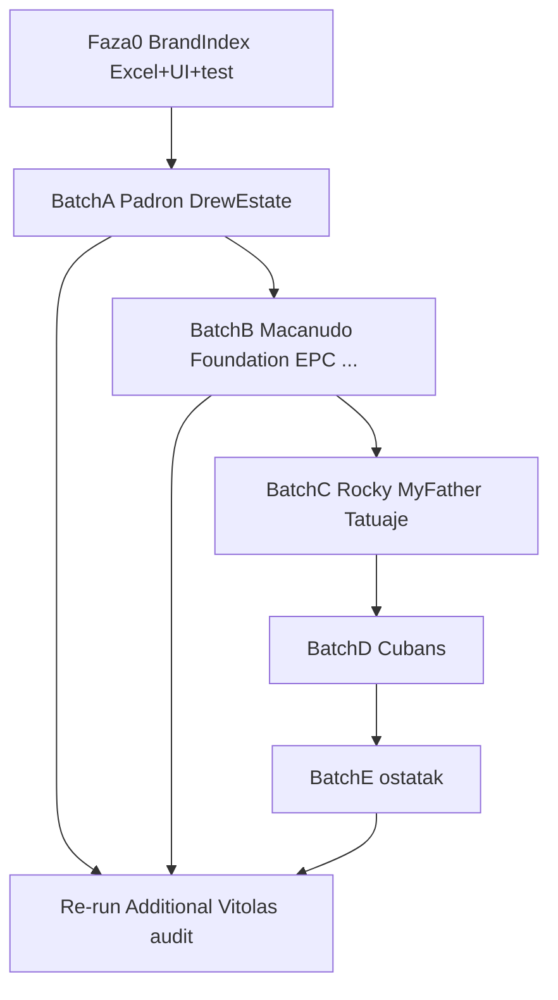

# Plan: indeks brendova + Additional Vitolas za sve brendove

**Datum:** 2026-07-20  
**Status:** predloženo (čeká approval za implementaciju)

## Što već imamo

| Sloj | Stanje |
|------|--------|
| `app/src/data/brands.json` | **71/71** ključeva = brendovi u `cigars.json` (nema rupa ni orphana) |
| `ALL_BRANDS` u `app/src/data/index.ts` | Izvedeno iz cigara; sort A–Z |
| UI | `BrandSheet.tsx` + autocomplete (max 4) u `CatalogPage.tsx` |
| Excel | `export-indexes.py` → `Cigare_Index.xlsx` = **linije**, ne brendovi |
| Audit | `docs/superpowers/specs/2026-07-20-cigar-additional-vitolas-audit.md`: 28 brendova, 221 vitola, 92 remap predloga |

**Zaključak:** meta-podaci brenda (`brands.json` + `brandInfo`) postoje i pokrivaju sve cigare, ali **nema indeksom vođenog pregleda brendova** (Excel sheet + katalog UI lista + integrity guard). To treba ugraditi prije / paralelno s masovnim Additional Vitolas popravcima.

## Faza 0 — Brand Index (ugradnja u katalog)

### 0a. Generirani indeks (izvor istine = JSON)

Proširiti `app/scripts/export-indexes.py` da proizvede sheet **Brendovi** u `Cigare_Index.xlsx` (ili zasebno `Cigare_Brand_Index.xlsx`):

- Brand | Zemlja | Founded | # linija | # vitola | ima Additional Vitolas? | # search-only URL | najjeftinija € | blurb HR (kratko)

Runtime helper u `app/src/data/index.ts` (derivacija, bez novog JSON-a ako nije potreban):

- `brandCatalogStats(brand)` → `{ info, lineCount, vitolaCount, hasAdditionalVitolas, minPriceEUR }`

### 0b. UI u katalogu cigara

U `CatalogPage` (tab cigars):

- Chip / toggle **„Brendovi“** koji prikazuje listu svih `ALL_BRANDS` (ne samo 4 autocomplete pogodaka).
- Redak: ime, zemlja (iz `brandInfo`), broj linija; tap → postojeći `BrandSheet`.
- Filter/pretraga i dalje preko `norm(brand)`.

### 0c. Integrity test

U `cigars.data.test.ts`:

- svaki `c.brand` postoji u `brands.json`
- svaki ključ u `brands.json` ima ≥1 cigaru

## Faza 1–N — Additional Vitolas remap (svi brendovi)

**Metodologija po brendu** (ista kao AJ Fernandez):

1. Crawl Humidor brand category / search (product pages, ne `?s=`).
2. Remap vitole iz Additional → postojeće linije (`remap_to:` iz audita).
3. Nove linije gdje audit kaže `possible_own_line` i SKU postoji na humidoru.
4. Product URL + cijena; `null` samo ako nema product page.
5. Isprazniti ili obrisati Additional Vitolas bucket kad nema orphan stavki.
6. `LINE_RULES` / enrich MAP prefixi za taj brend.
7. Vitest guardovi po brendu (kao AJF).
8. Re-run `app/scripts/_audit_additional_vitolas.py` → score pada.

**Batch redoslijed** (iz audita; ne jedan mega-PR):

| Batch | Brendovi | Score | Status |
|-------|----------|-------|--------|
| A | Padrón, Drew Estate | 14 | done |
| B | Macanudo, Foundation, E.P. Carrillo, Davidoff, Camacho, CAO, Alec Bradley | 13 | done |
| C | Rocky Patel, My Father, Tatuaje | 11–12 | done |
| D | Trinidad, Punch, Hoyo, Cohiba, Partagás, Montecristo, Quai d'Orsay, Juan López, Bolívar | 8–10 | done (strukturalni remap; Humidor brand kategorije 404) |
| E | Perdomo, Ashton, Plasencia, La Aurora, Oliva, H. Upmann, Romeo y Julieta | 1–9 | done (audit 0 Additional Vitolas) |

Po batchu: 2–3 brenda po implementacijskom prolazu. Batch A prvi nakon Faze 0.

## Pravila

- Izvor cijene/URL: humidor.hr product page; Havana Shop samo kad se točno poklopi.
- Ne izmišljati cijene; search URL nije zamjena za product URL.
- Jedna linija = podbrend; Additional Vitolas samo za prave orphan SKU-ove.
- Kanonski edit samo u `cigars.json` / `brands.json`.

## Deliverables

1. Brand Index Excel + UI lista brendova + integrity testovi.
2. Batch A (Padrón + Drew Estate) kao prvi remap.
3. Ostali batchevi redom; nakon svakog audita update dokumenta.

## Non-goals

- Live scraping u runtimeu.
- Potpuni remap svih 28 u jednom PR-u.
- Ponovno pisanje svih brand blurba (trenutačno nema rupa u `brands.json`).
