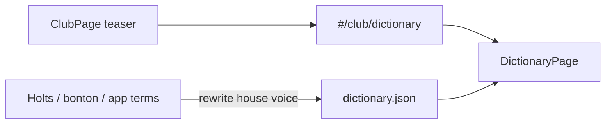

# Club dictionary (Rječnik) — design

**Date:** 2026-07-27  
**Status:** draft — awaiting user review of written spec  
**Related:** Club lexicon (`app/src/data/lexicon.json`) stays separate; Holts glossary scrape is inventory only (`01_work/output/holts-clubhouse/cigar-101_glossary-of-terms.json`)

## Goal

Add a Club **dictionary** of table expressions: not a tag translator (`TAG_LABELS`), and not the pairing-language lexicon essays. Each entry is a short bilingual dictionary article (definition + explanation) covering **cigars + drinks + pairing + table/salon** vocabulary.

Success:

1. User opens Club → **Rječnik** → searches / filters / browses A–Ž → reads a full entry.
2. Catalog ships **expansive** first (encyclopedia ambition, ~300+ entries); pruning happens later by editing JSON.
3. Lexicon remains its own Club card and route.

## Decisions (from brainstorm)

| Topic | Choice |
|-------|--------|
| Scope domains | Cigars + drinks + pairing (+ table) |
| vs Lexicon | Separate Club feature (lexicon = essays; dictionary = A–Ž terms) |
| Scale | Encyclopedia (300+); multi-pass content OK, but **first ship is already broad** — trim later |
| Entry shape | Dictionary article (not 1-line gloss, not mini-essay) |
| Language | Full bilingualism from day one (`hr` + `en` on all prose fields) |
| Architecture | New Club view + JSON catalog (approach 1) |

## Non-goals (v1)

- Deep-link from Pairing flavor chips → dictionary entry.
- Machine translation / Holts prose paste.
- Quiz or audio generated from dictionary.
- Merging or deleting the pairing lexicon.
- Expanding `TAG_LABELS` into a glossary (rejected).

## Current state (verified)

| Asset | Reality |
|-------|---------|
| `ClubView` | `101` \| `bonton` \| `lexicon` \| `hr-guide` \| `archetypes` — no dictionary |
| `lexicon.json` | 9 essay entries about pairing speech |
| `TAG_LABELS` in `rules.ts` | HR/EN labels only — no explanations |
| Bonton draft | Short gloss lists (“Rječnik stolnih riječi”, “Prošireni rječnik”) |
| Holts Clubhouse glossary | Large EN term dump (scrape) — candidate inventory only |

**Gap:** users meet terms in catalog/101/pairing without a place that *explains* them in house voice.

---

## Approaches (summary)

### A — New `dictionary` Club view + JSON (chosen)

Route `#/club/dictionary`, `DictionaryPage`, `dictionary.json`, i18n teasers, tests.

### B — Enrich `TAG_LABELS` / engine rules

Rejected: remains a translator; wrong home for vitola/VSOP/canoeing encyclopedia.

### C — Autogen from Holts + MT

Rejected as content source. Allowed only as **term inventory** for coverage checklists.

---

## Data model

File: `app/src/data/dictionary.json`

```ts
type DictionaryCategory = "cigar" | "drink" | "pairing" | "table";

interface DictionaryEntry {
  id: string; // stable slug
  term: LocalizedText;
  def: LocalizedText; // 1–2 sentences
  body: LocalizedText; // short explanation for the table / catalog
  aliases: string[]; // search tokens (any language / slang)
  seeAlso: string[]; // other entry ids
  category: DictionaryCategory;
  doNotConfuse?: Array<{
    with: string; // entry id
    note: LocalizedText;
  }>;
}

interface DictionaryFile {
  title: LocalizedText;
  intro: LocalizedText;
  entries: DictionaryEntry[];
}
```

**Content rules**

- Own prose; bonton tone; no Holts copy-paste.
- No fabricated technical claims; align RH / vitola / serve facts with Club101 / existing club facts where those already state a number.
- Pairing terms in the dictionary are **short articles**; the Lexicon keeps the longer “how to speak” essays (bridge, rhythm, exercises).
- Ship expansive coverage immediately; delete or merge entries later rather than starting thin.

**Coverage sources (inventory)**

1. Holts glossary term list (titles only as checklist).
2. Bonton glossary sections.
3. App surface vocabulary: wrappers, vitola families, shopping/pairing drink labels, `TAG_LABELS` ids (as *topics* that need explanations, not as the UI).
4. Spirits/wine/coffee/tequila/gin terms users already see in catalog and 101.

**Optional later:** split into `dictionary/*.json` if a single file becomes unwieldy; v1 prefers one file for simpler review/prune.

---

## UI / routing

| Piece | Detail |
|-------|--------|
| Route | `#/club/dictionary` — extend `ClubView` + `CLUB_VIEWS` + `route.test.ts` |
| Club home | New card next to Lexicon: title + teaser + open CTA |
| Page | `DictionaryPage.tsx` (mirror Lexicon list→detail pattern) |
| List | Search over `term.hr/en` + `aliases`; category chips; A–Ž jump by active-language `term` |
| Detail | term → def → body; optional doNotConfuse; seeAlso links; back to list |
| i18n | `club.dictionary`, `club.dictionaryTeaser`, `club.dictionaryOpen`, subtitle, back labels, category labels, empty-search copy |

Body rendering: prefer existing `LessonBody` if bodies use the same section/bullet conventions; otherwise plain paragraphs — pick one convention in implementation and stick to it for all entries.

---

## Architecture



**Files likely touched**

- `app/src/data/dictionary.json` — new
- `app/src/data/dictionary.test.ts` — new
- `app/src/pages/DictionaryPage.tsx` — new
- `app/src/pages/ClubPage.tsx` — teaser + view branch
- `app/src/store/route.ts` + `route.test.ts` — `dictionary` view
- `app/src/i18n/index.tsx` — strings

Lexicon / `TAG_LABELS` unchanged in behavior.

---

## Testing

`dictionary.test.ts`:

- `title` / `intro` bilingual non-empty.
- Every entry: non-empty `id`, bilingual `term`/`def`/`body`, valid `category`.
- Unique `id`s.
- Every `seeAlso` and `doNotConfuse[].with` resolves to an existing `id`.
- Floor on entry count for the expansive ship (suggested ≥250; adjust only if honest inventory cannot reach it without invention — then document actual count in PR, do not pad with fluff).

`route.test.ts`: hash round-trip for `#/club/dictionary`.

---

## Implementation phases (engineering, not “thin content”)

1. **Scaffold** — route, page shell (search/filter/A–Ž), i18n, empty or seed JSON, tests green on schema.
2. **Content fill** — write expansive bilingual entries from inventory checklists; link `seeAlso` / `doNotConfuse` as terms land.
3. **Prune pass** (user-driven) — remove weak, duplicate, or off-voice entries after reading in-app.

Content is intentionally front-loaded; engineering scaffold can land in the same PR or immediately before the bulk JSON.

---

## Success criteria

1. Spec records separate dictionary vs lexicon and rejects translator/autogen approaches.
2. Schema and UI are explicit enough to implement without re-scoping.
3. Expansive-first content policy is stated (ship broad, trim later).
4. After implementation: Club dictionary usable; lexicon intact; bilingual entries test-locked.

## Open questions (none blocking)

- Exact minimum entry count if inventory honesty caps below 250 — prefer fewer honest entries over padded stubs.
- Whether Pairing chip deep-links become a follow-up spec.

---

## Spec self-review

- No TBD placeholders for core schema/UI.
- Approach A chosen; B/C rejected with reasons.
- Lexicon coexistence and Holts-as-inventory-only are explicit.
- Scope is large by design; prune is a later editorial pass, not a reason to delay scaffold.
