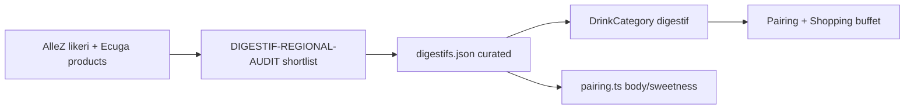

# Digestifs & regional specialties — design

**Date:** 2026-07-27  
**Status:** draft — awaiting user review  
**Research:** [`01_work/output/DIGESTIF-REGIONAL-AUDIT.md`](../../01_work/output/DIGESTIF-REGIONAL-AUDIT.md) · [`01_work/output/DRINKS-WS-DRINKOLOGY-AUDIT.md`](../../01_work/output/DRINKS-WS-DRINKOLOGY-AUDIT.md) (Wine-Searcher + Drinkology, all drink categories)  
**Branch:** `research/digestifs-regional-liqueurs`

## Goal

Give the app a deliberate home for **neat, regionally iconic herbal / bitter bottles** that AlleZ and Ecuga already sell (Becherovka, Agwa, Fernet, Chartreuse, pelinkovac, …) and that **do not belong** in rum, whisky, brandy, wine, coffee, tequila, or gin.

Success for a later pilot (not this research phase):

1. User can discover a small curated set of such bottles in Shopping / Pairing.
2. Buffet “petorka” can recommend a coherent five across style segments.
3. Pairing does not pretend every cream/punch liqueur is a cigar partner — inclusion is curated.

## Non-goals (this design)

- No vermouth / aperitivo wine layer (explicitly excluded).
- No dumping of the full AlleZ likeri aisle (cream, RTD, seasonal gin liqueurs stay out).
- No full brandy-pipeline rewrite to “accept all liqueurs”.
- No Club101 lesson until catalog shape is agreed (education already mentions the styles in Club facts).

## Current state (verified)

| Asset | Reality |
|-------|---------|
| [`app/src/types.ts`](../../app/src/types.ts) `DrinkCategory` | 7 categories; no digestif/herbal |
| [`app/src/lib/shoppingPicks.ts`](../../app/src/lib/shoppingPicks.ts) | Brandy has residual `liqueur` bucket only |
| [`app/scripts/brandy_shared.py`](../../app/scripts/brandy_shared.py) | `liqueur`, `absinthe`, `pisco`, `sake` in `NON_PAIRABLE_*` |
| Drink JSON | No Becherovka / Agwa / Fernet / Unicum / pelinkovac / Chartreuse entries |
| Club facts | Already teach herbal liqueurs, aquavit, pastis |

**Gap:** shops stock the domain; pipelines discard it; UI has nowhere to put it.

## Constraints from research

- Shortlist ≈ **12 bottles** across five style families (see audit).
- HR availability is split: **Central/SE Europe bitters mostly Ecuga**; **monastic / Strega / Galliano / Nonino Amaro on AlleZ** (and often Ecuga too).
- Body/sweetness for pairing exist as numbers on `Drink`; herbal bitters need careful body (often 3–4) and sweetness (often 2–4) — not zero sweetness.
- User intent is **buffet identity**, not cocktail mixer encyclopedia.

---

## Approaches

### A — New top-level category `digestif` (recommended)

Add `digestif` to `DrinkCategory`, curated JSON (`digestifs.json`), shopping buckets, Pairing chip, i18n labels, and a **curated** scrape/seed (not the whole likeri aisle).

**Pros**

- Matches user mental model (“bife od jedinstvenih boca”).
- Buffet five works like rum/whisky without overloading brandy.
- Keeps brandy pipeline honest (cognac stays cognac; Nonino Amaro does not pretend to be VSOP).
- Club / Club101 can later point at a real catalog.

**Cons**

- Touches types, `index.ts`, Pairing filters, Shopping, i18n, tests — larger than content-only.
- Naming: EU “digestif” vs “herbal liqueur” vs HR “biljni likeri / digestiivi” — needs one label pair.

**Suggested styles (5 buffet segments)**

| Bucket id | Styles | Example bottles |
|-----------|--------|-----------------|
| `central-bitter` | `herbal-bitter-central` | Becherovka, Unicum |
| `italian-bitter` | `herbal-bitter-italian`, `fernet` | Fernet Branca, Averna, Nonino Amaro |
| `monastic` | `herbal-monastic` | Chartreuse Verte/Jaune, Benedictine |
| `yellow-herbal` | `herbal-saffron-yellow` | Strega, Galliano |
| `local-unique` | `pelinkovac`, `specialty-botanical` | Aura Pelinkovac, Agwa |

**Data path (pilot):** hand-curated JSON from audit shortlist + shop URLs (like wine/coffee), **not** full Excel MASTER first. Optional later: `scrape-digestif-catalog.py` targeting AlleZ `likeri` + Ecuga product list with an allowlist of brands.

**Pairing (pilot):** reuse generic body/sweetness engine; mark all shortlist `pairable: true` except any cream/low-ABV aperitivo that sneaks in. Soft band / category-specific rules can wait for a second iteration once scores look sensible.

### B — Expand brandy `liqueur` + stop discarding herbal SKUs

Relax `NON_PAIRABLE` for selected herbal names; grow brandy’s `liqueur` bucket into multi-style herbal.

**Pros**

- Smaller type surface (no new `DrinkCategory`).
- Reuses brandy shopping UI.

**Cons**

- Cognac shoppers see Becherovka next to Hennessy — wrong aisle.
- Brandy quality heuristics / age tiers do not apply; risk of junk scores.
- Buffet five for brandy already has five segments; squeezing Chartreuse + Fernet + pelinkovac into one `liqueur` bucket collapses the experiment.

**Verdict:** reject for the intended “unique buffet” goal.

### C — Content / shopping-only layer (no pairing category)

Club101 lesson + static “buffet curiosities” list in Shopping or Club, without `Drink` catalog entries / pairing scores.

**Pros**

- Fastest; zero engine risk.
- Aligns with existing Club facts.

**Cons**

- No ownership in Kolekcija as a real drink.
- No scored pairing, no wishlist/buy-link pipeline.
- Does not answer “should this bottle be in my buffet?” with the same machinery as rum.

**Verdict:** useful as **phase 0 education**, insufficient as the end state.

---

## Recommendation

**Ship approach A** as an experimental category, with **C as optional companion content** (one Club101 card after catalog exists).

Do **not** use B.

### Naming

| Code | HR label | EN label |
|------|----------|----------|
| `digestif` | Biljni digestiivi | Herbal digestifs |

Avoid bare “Liker” — AlleZ’s likeri aisle is mostly dessert/cocktail noise. “Biljni digestiivi” signals neat, regional, after-smoke intent.

(If HR copy-edit prefers “digestivi” / “biljni likeri”, keep the code id `digestif` stable.)

### Pilot scope (when implementing)

1. Branch already: `research/digestifs-regional-liqueurs` (docs only so far).
2. Add ~12 curated drinks from the audit shortlist.
3. Wire category through types → data index → Shopping buckets → Pairing filter → i18n.
4. Buy links: prefer verified `priceUrl` from AlleZ/Ecuga product pages; no fabricated prices.
5. Tests: category present in DRINKS; buffet five returns 5 distinct buckets; pairable filter includes digestifs.
6. Defer: absinthe, pisco, sake, pastis, Tatratea line, full scrape pipeline.

### Explicit exclusions (stay out of pilot JSON)

Cream, punch, seasonal gin liqueurs, Disaronno, Fireball, Licor 43 family, Grand Marnier (already brandy), vermouth, Angostura, Cynar (unless later “amaro light” expansion).

---

## Architecture (approach A)

### Files likely touched in implementation (not this research commit)

- `app/src/types.ts` — add `"digestif"`
- `app/src/data/digestifs.json` — new
- `app/src/data/index.ts` — register
- `app/src/lib/shoppingPicks.ts` — `BUCKETS.digestif`
- `app/src/pages/PairingPage.tsx` / Shopping chips — category list
- `app/src/i18n/index.tsx` — labels + style names
- Tests under `shoppingPicks`, pairing, data smoke

### Pairing note

Do not invent brand-specific cigar rankings in v1. Use the same body/sweetness/flavorTags contract as other drinks. Prefer tags such as `bilje`, `gorcina`, `cimet`, `menta`, `pelin`, `safran` where evidence exists from shop copy, [Wine-Searcher](https://www.wine-searcher.com/spirits) / [Drinkology](https://www.drinkology.de) style pages, or known style — no fabricated tasting notes. Cross-check ABV on those pages when seeding JSON; treat disputed botanical counts as non-authoritative.

---

## Success criteria (research phase — this doc)

1. Audit lists verified AlleZ + Ecuga candidates and a 12-bottle shortlist.  
2. Spec compares A/B/C with a clear recommendation (A).  
3. Exclusions and pilot boundaries are explicit enough to implement without re-scoping.

## Success criteria (later implementation — out of scope until approved)

1. New category visible in Pairing + Shopping.  
2. Buffet five covers five digestif segments.  
3. Shortlist bottles have real shop URLs.  
4. Existing brandy/whisky/gin catalogs unchanged in behavior.

## Open questions for user

1. Prefer HR label **“Biljni digestiivi”** vs **“Biljni likeri”** vs **“Digestivi”**?  
2. Include **Agwa** in the core five buffet segments (local-unique) even though it is more “party botanical” than classic digestif?  
3. After catalog: add a Club101 lesson in the same PR or later?

---

## Spec self-review

- No placeholders left for shop evidence (audit linked).  
- A/B/C trade-offs stated; B rejected with reason.  
- Scope capped at curated ~12 bottles; vermouth excluded.  
- Implementation file list is provisional until user approves A.
